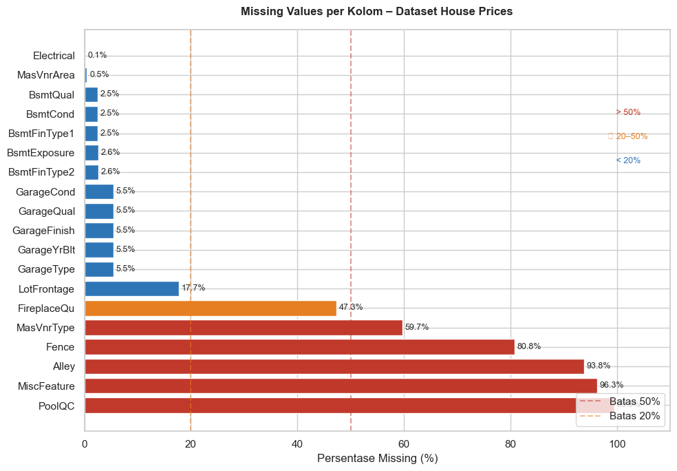
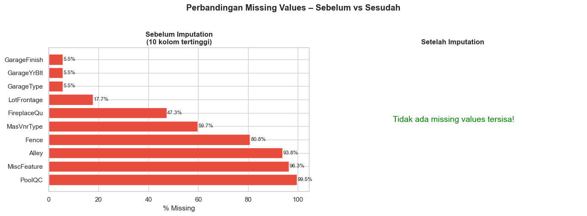
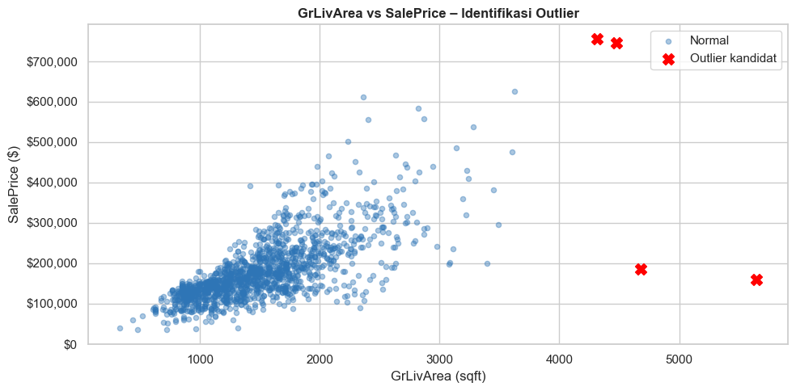
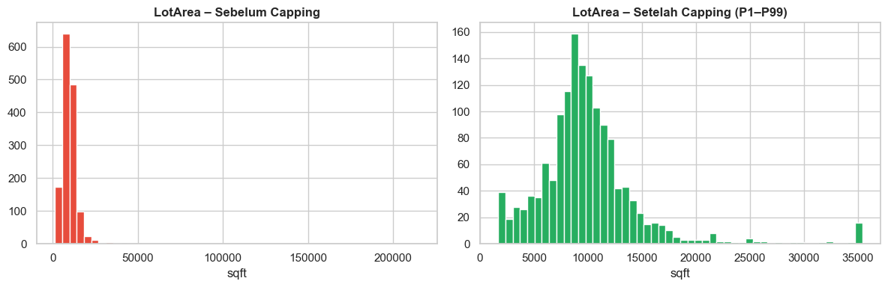
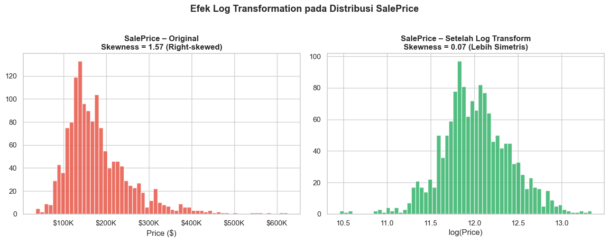

+++
date = '2026-04-12T06:00:00+08:00'
draft = false
title = 'Data Cleaning'
translationKey = "data-cleaning"
languages = 'id'
tags = ['Python', 'Pemula']
featuredImage = ""
featuredImagePreview = ""
series = ['Pengantar Sains Data']
weight = 2
# categories = ['Tutorial']
description = "Data mentah di dunia nyata hampir tidak pernah datang dalam kondisi bersih. Ada banyak masalah kualitas data yang mungkin terjadi, misalnya data hilang, data inkonsisten, atau data rusak. Oleh karena itu, *data cleaning* merupakan satu tahapan penting untuk memastikan kualitas data yang akan dianalisis atau dimodelkan."
summary = 'Data mentah di dunia nyata hampir tidak pernah datang dalam kondisi bersih. Ada banyak masalah kualitas data yang mungkin terjadi, misalnya data hilang, data inkonsisten, atau data rusak. Oleh karena itu, *data cleaning* merupakan satu tahapan penting untuk memastikan kualitas data yang akan dianalisis atau dimodelkan.'
+++

## 1. Definisi dan Tujuan *Data Cleaning*
*Data cleaning* (atau *data cleansing*) merupakan salah satu tahapan penting dalam analisis data yang bertujuan untuk memperbaiki atau menghapus data yang bermasalah, seperti data yang salah, rusak, tidak akurat, tidak lengkap, atau duplikat. Tahapan ini dilakukan untuk memastikan kualitas data yang digunakan dalam analisis atau pemodelan memiliki kualitas yang memadai.

*Data cleaning* penting untuk dilakukan sebab data mentah di dunia nyata hampir tidak pernah hadir dalam kondisi bersih dan siap pakai.Dalam konteks analisis data dikenal prinsip "*Garbage In, Garbage Out*" (GIGO). Prinsip ini menyatakan bahwa model yang dibangun menggunakan data kotor (*garbage in*) akan menghasilkan output berupa analisis atau prediksi yang tidak dapat diandalkan (*garbage out*). 


Photo by <a href="https://unsplash.com/@pray4bokeh?utm_source=unsplash&utm_medium=referral&utm_content=creditCopyText">Bruno Guerrero</a> on <a href="https://unsplash.com/photos/a-trash-can-sitting-on-the-side-of-a-road-18khQoanuEQ?utm_source=unsplash&utm_medium=referral&utm_content=creditCopyText">Unsplash</a>
      
Dalam konteks profesional, hasil analisis data dan model prediksi sering digunakan sebagai dasar pengambilan keputusan. Oleh karena itu, apabila analisis atau prediksi tersebut bersumber dari data yang tidak bersih, maka keputusan yang diambil berisiko tinggi mengalami kesalahan. Pemahaman yang baik tentang *data cleaning* menjadi krusial untuk meminimalkan risiko kesalahan pengambilan keputusan di dunia nyata.

Secara umum, *data cleaning* dilakukan setelah tahap [*exploratory data analysis*](../exploratory-data-analysis/). Namun, dalam praktiknya, kedua tahapan ini jarang bersifat linear. EDA dan *data cleaning* sering kali dilakukan secara berulang karena tidak semua masalah kualitas data dapat terdeteksi sejak awal analisis. Beberapa masalah kualitas data bisa jadi baru terdeteksi setelah beberapa iterasi eksplorasi dan pembersihan data.


## ️ 2. Ilustrasi: Data Harga Rumah

Untuk mengilustrasikan konsep data cleaning, tutorial ini akan menggunakan data harga rumah. Data tersebut dapat diperoleh dari [kompetisi kaggle](https://www.kaggle.com/competitions/home-data-for-ml-course). Berikut adalah gambaran singkat terkait data yang digunakan. Silakan rujuk [laman data](https://www.kaggle.com/competitions/home-data-for-ml-course/data) dari kompetisi kaggle tersebut untuk memahami detail setiap peubahnya.


```python
import pandas as pd
import numpy as np
import matplotlib.pyplot as plt
import matplotlib.ticker as mticker
import seaborn as sns
from scipy import stats
from sklearn.preprocessing import StandardScaler, MinMaxScaler
from sklearn.model_selection import train_test_split

# Pengaturan tampilan
pd.set_option('display.max_columns', 50)
pd.set_option('display.float_format', '{:.2f}'.format)
plt.rcParams['figure.figsize'] = (12, 5)
plt.rcParams['axes.titlesize'] = 13
sns.set_theme(style='whitegrid')

# Muat dataset
df = pd.read_csv('data-cleaning-sample.csv')
print(f' Dataset berhasil dimuat')
print(f' Jumlah baris : {df.shape[0]:,}')
print(f' Jumlah kolom : {df.shape[1]:,}')
df.head(3)
```

     Dataset berhasil dimuat
     Jumlah baris : 1,460
     Jumlah kolom : 81
    


<div>
<style scoped>
    .dataframe tbody tr th:only-of-type {
        vertical-align: middle;
    }

    .dataframe tbody tr th {
        vertical-align: top;
    }

    .dataframe thead th {
        text-align: right;
    }
</style>
<table border="1" class="dataframe">
  <thead>
    <tr style="text-align: right;">
      <th></th>
      <th>Id</th>
      <th>MSSubClass</th>
      <th>MSZoning</th>
      <th>LotFrontage</th>
      <th>LotArea</th>
      <th>Street</th>
      <th>Alley</th>
      <th>LotShape</th>
      <th>LandContour</th>
      <th>Utilities</th>
      <th>LotConfig</th>
      <th>LandSlope</th>
      <th>Neighborhood</th>
      <th>Condition1</th>
      <th>Condition2</th>
      <th>BldgType</th>
      <th>HouseStyle</th>
      <th>OverallQual</th>
      <th>OverallCond</th>
      <th>YearBuilt</th>
      <th>YearRemodAdd</th>
      <th>RoofStyle</th>
      <th>RoofMatl</th>
      <th>Exterior1st</th>
      <th>Exterior2nd</th>
      <th>...</th>
      <th>Fireplaces</th>
      <th>FireplaceQu</th>
      <th>GarageType</th>
      <th>GarageYrBlt</th>
      <th>GarageFinish</th>
      <th>GarageCars</th>
      <th>GarageArea</th>
      <th>GarageQual</th>
      <th>GarageCond</th>
      <th>PavedDrive</th>
      <th>WoodDeckSF</th>
      <th>OpenPorchSF</th>
      <th>EnclosedPorch</th>
      <th>3SsnPorch</th>
      <th>ScreenPorch</th>
      <th>PoolArea</th>
      <th>PoolQC</th>
      <th>Fence</th>
      <th>MiscFeature</th>
      <th>MiscVal</th>
      <th>MoSold</th>
      <th>YrSold</th>
      <th>SaleType</th>
      <th>SaleCondition</th>
      <th>SalePrice</th>
    </tr>
  </thead>
  <tbody>
    <tr>
      <th>0</th>
      <td>1</td>
      <td>60</td>
      <td>RL</td>
      <td>65.00</td>
      <td>8450</td>
      <td>Pave</td>
      <td>NaN</td>
      <td>Reg</td>
      <td>Lvl</td>
      <td>AllPub</td>
      <td>Inside</td>
      <td>Gtl</td>
      <td>CollgCr</td>
      <td>Norm</td>
      <td>Norm</td>
      <td>1Fam</td>
      <td>2Story</td>
      <td>7</td>
      <td>5</td>
      <td>2003</td>
      <td>2003</td>
      <td>Gable</td>
      <td>CompShg</td>
      <td>VinylSd</td>
      <td>VinylSd</td>
      <td>...</td>
      <td>0</td>
      <td>NaN</td>
      <td>Attchd</td>
      <td>2003.00</td>
      <td>RFn</td>
      <td>2</td>
      <td>548</td>
      <td>TA</td>
      <td>TA</td>
      <td>Y</td>
      <td>0</td>
      <td>61</td>
      <td>0</td>
      <td>0</td>
      <td>0</td>
      <td>0</td>
      <td>NaN</td>
      <td>NaN</td>
      <td>NaN</td>
      <td>0</td>
      <td>2</td>
      <td>2008</td>
      <td>WD</td>
      <td>Normal</td>
      <td>208500</td>
    </tr>
    <tr>
      <th>1</th>
      <td>2</td>
      <td>20</td>
      <td>RL</td>
      <td>80.00</td>
      <td>9600</td>
      <td>Pave</td>
      <td>NaN</td>
      <td>Reg</td>
      <td>Lvl</td>
      <td>AllPub</td>
      <td>FR2</td>
      <td>Gtl</td>
      <td>Veenker</td>
      <td>Feedr</td>
      <td>Norm</td>
      <td>1Fam</td>
      <td>1Story</td>
      <td>6</td>
      <td>8</td>
      <td>1976</td>
      <td>1976</td>
      <td>Gable</td>
      <td>CompShg</td>
      <td>MetalSd</td>
      <td>MetalSd</td>
      <td>...</td>
      <td>1</td>
      <td>TA</td>
      <td>Attchd</td>
      <td>1976.00</td>
      <td>RFn</td>
      <td>2</td>
      <td>460</td>
      <td>TA</td>
      <td>TA</td>
      <td>Y</td>
      <td>298</td>
      <td>0</td>
      <td>0</td>
      <td>0</td>
      <td>0</td>
      <td>0</td>
      <td>NaN</td>
      <td>NaN</td>
      <td>NaN</td>
      <td>0</td>
      <td>5</td>
      <td>2007</td>
      <td>WD</td>
      <td>Normal</td>
      <td>181500</td>
    </tr>
    <tr>
      <th>2</th>
      <td>3</td>
      <td>60</td>
      <td>RL</td>
      <td>68.00</td>
      <td>11250</td>
      <td>Pave</td>
      <td>NaN</td>
      <td>IR1</td>
      <td>Lvl</td>
      <td>AllPub</td>
      <td>Inside</td>
      <td>Gtl</td>
      <td>CollgCr</td>
      <td>Norm</td>
      <td>Norm</td>
      <td>1Fam</td>
      <td>2Story</td>
      <td>7</td>
      <td>5</td>
      <td>2001</td>
      <td>2002</td>
      <td>Gable</td>
      <td>CompShg</td>
      <td>VinylSd</td>
      <td>VinylSd</td>
      <td>...</td>
      <td>1</td>
      <td>TA</td>
      <td>Attchd</td>
      <td>2001.00</td>
      <td>RFn</td>
      <td>2</td>
      <td>608</td>
      <td>TA</td>
      <td>TA</td>
      <td>Y</td>
      <td>0</td>
      <td>42</td>
      <td>0</td>
      <td>0</td>
      <td>0</td>
      <td>0</td>
      <td>NaN</td>
      <td>NaN</td>
      <td>NaN</td>
      <td>0</td>
      <td>9</td>
      <td>2008</td>
      <td>WD</td>
      <td>Normal</td>
      <td>223500</td>
    </tr>
  </tbody>
</table>
<p>3 rows × 81 columns</p>
</div>


## 3. Jenis Masalah Kualitas Data

Secara garis besar, terdapat empat jenis masalah kualitas data yang mungkin terjadi, yaitu nilai hilang (*missing values*), data duplikat, inkonsistensi format, serta data pencilan (*outlier*).

### 3.1 Nilai Hilang (*Missing Values*)

*Missing values* adalah kondisi di mana satu atau lebih nilai pada kolom tertentu kosong atau tidak tersedia. Kondisi ini dapat dinyatakan menggunakan beberapa notasi, misalnya:
- `None` (python) atau `NA` (*Not Available*, R), notasi standar untuk nilai hilang pada bahasa pemrograman python dan R
- `NaN` (*Not a Number*), notasi nilai hilang untuk variabel numerik
- `NaT` (*Not a Time*), notasi nilai hilang untuk variabel waktu
- `NULL`, notasi yang merepresentasikan list kosong pada R, serta digunakan pula dalam bahasa pemrograman lain seperti SQL, C/C++, dan JavaScript.

Selain keempat notasi di atas, sumber data primer yang Anda gunakan bisa jadi menggunakan notasi tertentu untuk menyatakan data hilang. Beberapa contoh notasi yang mungkin digunakan adalah:
- nilai mustahil, misalnya pada data cuaca, sumber data Anda bisa jadi menggunakan nilai -9999 atau 9999 untuk mengindikasikan nilai hilang pada variabel temperatur. Contoh lainnya adalah 0 pada variabel tinggi atau berat badan.
- teks penanda seperti `Unknown`, `missing`, `?`, `.`, `@@` dan semacamnya. Penanda semacam ini cocok digunakan pada variabel karakter.

Umumnya data hilang terjadi karena satu atau kombinasi dari alasan-alasan berikut ini.
- **Data tidak dikumpulkan saat pencatatan awal.** Ini terjadi ketika kolom bersifat opsional atau hanya diisi dalam kondisi tertentu. Pada dataset *House Prices*, kolom `LotFrontage` (panjang sisi rumah yang berbatasan dengan jalan) memiliki 259 nilai kosong (17,7%). Kemungkinan besar kolom ini tidak selalu diukur atau dicatat secara konsisten oleh surveyor properti di setiap transaksi.
- **Kesalahan sistem atau proses saat pengumpulan data.** Satu-satunya nilai kosong pada kolom `Electrical` hampir pasti bukan karena rumah tersebut tidak memiliki instalasi listrik, melainkan karena terjadi kelalaian pencatatan pada satu transaksi tersebut.
- **Data memang tidak relevan karena kondisi objek yang diamati.** Ini adalah jenis data hilang yang paling banyak ditemui pada dataset *House Prices* dan sering disalahartikan sebagai error. Kolom `PoolQC` kosong pada 1.453 dari 1.460 baris bukan karena datanya hilang, melainkan karena memang hampir tidak ada rumah yang memiliki kolam renang. Hal serupa berlaku untuk `FireplaceQu` (kualitas perapian) yang kosong pada 690 baris. Rumah-rumah tersebut memang tidak memiliki perapian.
- **Penggabungan dataset dari sumber berbeda.** Ketika data properti digabungkan dari beberapa sumber, misalnya catatan pemerintah kota, data agen properti, dan laporan inspeksi bangunan, setiap sumber memiliki variabel yang berbeda-beda. Kolom yang ada di satu sumber belum tentu tersedia di sumber lain, sehingga menghasilkan pola missing values yang bersifat sistematis pada subset data tertentu.


Pemahaman tentang penyebab data hilang penting untuk dilakukan sebab setiap jenis data hilang memiliki penanganan yang berbeda. Contoh, nilai kosong pada kasus `PoolQC` dan `FireplaceQu` harusnya diisi dengan label bermakna seperti "*NoPool*" atau "*NoFireplace*", bukan diimputasi (diestimasi) dengan nilai statistik.



Tabel dan barplot berikut ini menunjukkan jumlah dan proporsi data hilang dari masing-masing peubah data *House Prices*.
```python
missing_count = df.isnull().sum()
missing_pct = (missing_count / len(df) * 100).round(1)

missing_df = pd.DataFrame({
 'Jumlah Kosong' : missing_count,
 'Persen (%)' : missing_pct,
 'Tipe Data' : df.dtypes
})

missing_df = missing_df[missing_df['Jumlah Kosong'] > 0].sort_values('Persen (%)', ascending=False)
print(f'Kolom dengan missing values: {len(missing_df)} dari {df.shape[1]} kolom\n')
missing_df
```

    Kolom dengan missing values: 19 dari 81 kolom
    
    


<div>
<style scoped>
    .dataframe tbody tr th:only-of-type {
        vertical-align: middle;
    }

    .dataframe tbody tr th {
        vertical-align: top;
    }

    .dataframe thead th {
        text-align: right;
    }
</style>
<table border="1" class="dataframe">
  <thead>
    <tr style="text-align: right;">
      <th></th>
      <th>Jumlah Kosong</th>
      <th>Persen (%)</th>
      <th>Tipe Data</th>
    </tr>
  </thead>
  <tbody>
    <tr>
      <th>PoolQC</th>
      <td>1453</td>
      <td>99.50</td>
      <td>object</td>
    </tr>
    <tr>
      <th>MiscFeature</th>
      <td>1406</td>
      <td>96.30</td>
      <td>object</td>
    </tr>
    <tr>
      <th>Alley</th>
      <td>1369</td>
      <td>93.80</td>
      <td>object</td>
    </tr>
    <tr>
      <th>Fence</th>
      <td>1179</td>
      <td>80.80</td>
      <td>object</td>
    </tr>
    <tr>
      <th>MasVnrType</th>
      <td>872</td>
      <td>59.70</td>
      <td>object</td>
    </tr>
    <tr>
      <th>FireplaceQu</th>
      <td>690</td>
      <td>47.30</td>
      <td>object</td>
    </tr>
    <tr>
      <th>LotFrontage</th>
      <td>259</td>
      <td>17.70</td>
      <td>float64</td>
    </tr>
    <tr>
      <th>GarageType</th>
      <td>81</td>
      <td>5.50</td>
      <td>object</td>
    </tr>
    <tr>
      <th>GarageYrBlt</th>
      <td>81</td>
      <td>5.50</td>
      <td>float64</td>
    </tr>
    <tr>
      <th>GarageFinish</th>
      <td>81</td>
      <td>5.50</td>
      <td>object</td>
    </tr>
    <tr>
      <th>GarageQual</th>
      <td>81</td>
      <td>5.50</td>
      <td>object</td>
    </tr>
    <tr>
      <th>GarageCond</th>
      <td>81</td>
      <td>5.50</td>
      <td>object</td>
    </tr>
    <tr>
      <th>BsmtFinType2</th>
      <td>38</td>
      <td>2.60</td>
      <td>object</td>
    </tr>
    <tr>
      <th>BsmtExposure</th>
      <td>38</td>
      <td>2.60</td>
      <td>object</td>
    </tr>
    <tr>
      <th>BsmtFinType1</th>
      <td>37</td>
      <td>2.50</td>
      <td>object</td>
    </tr>
    <tr>
      <th>BsmtCond</th>
      <td>37</td>
      <td>2.50</td>
      <td>object</td>
    </tr>
    <tr>
      <th>BsmtQual</th>
      <td>37</td>
      <td>2.50</td>
      <td>object</td>
    </tr>
    <tr>
      <th>MasVnrArea</th>
      <td>8</td>
      <td>0.50</td>
      <td>float64</td>
    </tr>
    <tr>
      <th>Electrical</th>
      <td>1</td>
      <td>0.10</td>
      <td>object</td>
    </tr>
  </tbody>
</table>
</div>


```python
# ── Visualisasi missing values ─────────────────────────────────────────────
fig, ax = plt.subplots(figsize=(10, 7))

colors = ['#C0392B' if p > 50 else '#E67E22' if p > 20 else '#2E75B6'
 for p in missing_df['Persen (%)']]

bars = ax.barh(missing_df.index, missing_df['Persen (%)'], color=colors, edgecolor='white')

for bar, pct in zip(bars, missing_df['Persen (%)']):
 ax.text(bar.get_width() + 0.5, bar.get_y() + bar.get_height()/2,
 f'{pct}%', va='center', fontsize=9)

ax.axvline(50, color='#C0392B', linestyle='--', alpha=0.5, label='Batas 50%')
ax.axvline(20, color='#E67E22', linestyle='--', alpha=0.5, label='Batas 20%')
ax.set_xlabel('Persentase Missing (%)')
ax.set_title('Missing Values per Kolom – Dataset House Prices', fontweight='bold', pad=15)
ax.legend(loc='lower right')
ax.set_xlim(0, 110)

# Tambahkan label kategori
fig.text(0.92, 0.75, ' > 50%', ha='center', color='#C0392B', fontsize=9)
fig.text(0.92, 0.70, '🟠 20–50%', ha='center', color='#E67E22', fontsize=9)
fig.text(0.92, 0.65, ' < 20%', ha='center', color='#2E75B6', fontsize=9)

plt.tight_layout()
plt.show()
```
    

    

Berdasarkan tabel dan barplot di atas, dapat dilihat bahwa 19 dari 81 variabel pada dataset *House Prices* memiliki setidaknya satu data hilang. Dari 19 variabel tersebut, beberapa variabel memiliki proporsi data hilang sekitar 50%. Anda patut curiga, apakah data hilang pada variabel-variabel dengan proporsi besar tersebut benar-benar "hilang" atau karena variabel tersebut memang tidak relevan. 

Misalnya, variabel `Alley` (gang) dengan 93.8% data hilang. Berdasarkan [dokumentasi datanya](https://www.kaggle.com/competitions/home-data-for-ml-course/data), kolom `Alley` memiliki tiga kemungkinan nilai: `Grvl` (*Gravel*), `Pave` (*Paved*), dan NA (*No Alley Access*). Maka dari itu, nilai NA pada kolom `Alley` bukanlah data hilang, melainkan kondisi di mana 93.8% rumah pada data tidak memiliki gang. Karenanya, "data hilang" pada kolom `Alley` tidak perlu ditangani, cukup diganti dengan nilai yang lebih sesuai, misalnya dari *NA* menjadi *No Alley*.


### 3.2 Duplikat


Data duplikat adalah kondisi di mana satu baris data muncul lebih dari sekali dalam dataset dengan nilai yang identik atau hampir identik pada sebagian besar kolomnya. Keberadaan duplikat berbahaya karena dapat membuat model machine learning "belajar lebih keras" pada observasi tertentu hanya karena observasi tersebut muncul berulang (bukan karena observasi itu memang lebih penting) sehingga menghasilkan bias pada hasil analisis maupun prediksi.

Terdapat dua jenis duplikat yang perlu dibedakan. 
- Duplikat eksak adalah baris yang benar-benar identik pada seluruh kolomnya. 
- Duplikat parsial adalah baris yang merujuk pada entitas yang sama namun memiliki sedikit perbedaan nilai, misalnya perbedaan kapitalisasi teks, spasi ekstra, atau perbedaan kecil pada satu kolom akibat kesalahan input. Jenis kedua ini lebih sulit dideteksi karena tidak tertangkap oleh df.duplicated() secara langsung.

Data duplikat dapat terjadi karena berbagai macam faktor, diantaranya:
- **Penggabungan dataset**. Ketika dua atau lebih tabel digabungkan menggunakan operasi merge atau join, baris yang memiliki lebih dari satu kecocokan di tabel lain akan menghasilkan baris baru yang redundan. Pada konteks dataset properti, ini bisa terjadi jika data transaksi digabungkan dengan data inspeksi yang memiliki lebih dari satu entri per properti.
- **Kesalahan proses ETL (*Extract, Transform, Load*)**. Pipeline pengolahan data yang berjalan lebih dari sekali tanpa mekanisme pengecekan duplikat akan mengakumulasi baris yang sama setiap kali pipeline dieksekusi ulang.
- **Kesalahan pengguna**. Operator yang meng-input data secara manual kerap memasukkan entri yang sama dua kali, terutama jika sistem tidak memiliki validasi unik pada level baris.

Berikut adalah ilustrasi pengecekan data duplikat pada data *House Prices*.
```python
n_dup = df.duplicated().sum()
print(f'Jumlah baris duplikat: {n_dup}')

if n_dup > 0:
 print('\nBaris yang duplikat:')
 display(df[df.duplicated(keep=False)])
 
 # Cara menghapus duplikat
 df_no_dup = df.drop_duplicates()
 print(f'Shape setelah drop duplikat: {df_no_dup.shape}')
else:
 print(' Tidak ditemukan baris duplikat pada dataset ini.')
```

    Jumlah baris duplikat: 0
     Tidak ditemukan baris duplikat pada dataset ini.

Pada dataset *House Prices*, tidak ditemukan duplikat. Hal ini wajar mengingat setiap baris merepresentasikan satu transaksi jual-beli properti yang unik dengan kolom `Id` sebagai identifiernya. Namun dalam praktik nyata, memanggil df.duplicated().sum() tetap harus menjadi salah satu langkah pertama dalam setiap proses *data cleaning*, karena duplikat yang tidak terdeteksi sejak awal dapat mengontaminasi seluruh tahapan analisis berikutnya.
    

### 3.3 Pencilan (*Outlier*)

Pencilan (*outlier*) adalah nilai yang jauh menyimpang dari sebagian besar data lainnya sehingga berpotensi mendistorsi hasil analisis statistik maupun performa model. Meskipun begitu, keberadaan *outlier* tidak selalu berarti data tersebut salah. Misalnya mayoritas rumah pada data *House Prices* memiliki `LotArea` (luas tanah) kurang dari 12,000 $ft^2$ ($Q_3=11,600$), tetapi ada juga rumah dengan luas hingga 215,000 $ft^2$ (*outlier*). Nilai besar ini masuk akal dalam konteks masalah yang sedang dibahas, sebab rentang kekayaan di dunia nyata memang tidak simestris, hanya ada beberapa orang dengan kekayaan di atas rata-rata.

Outlier umumnya berasal dari dua sumber yang berbeda dan memerlukan penanganan yang berbeda pula. 
- Pertama, kesalahan pengukuran atau input, misalnya operator yang salah mengetik 14.000 menjadi 140.000, atau sensor yang menghasilkan pembacaan tidak wajar akibat gangguan teknis. Pada dataset *House Prices*, dua rumah dengan `GrLivArea` di atas 4.000 $ft^2$ namun memiliki `SalePrice` yang sangat rendah adalah kandidat kuat untuk kategori ini. Kombinasi luas bangunan sangat besar dengan harga sangat murah tidak konsisten dengan pola data lainnya dan kemungkinan merupakan kesalahan pencatatan.
- Kedua, observasi yang sah namun ekstrem, seperti rumah mewah dengan harga `$755.000$ atau properti komersial dengan lahan sangat luas. Nilai ini bukan error, rumah tersebut memang ada dan terjual dengan harga setinggi itu, namun tetap perlu diperhatikan karena dapat menarik garis regresi ke arah yang tidak representatif bagi mayoritas data.

Oleh karena itu, penting untuk mendeteksi *outlier* sedini mungkin. Terdapat dua metode deteksi yang paling umum digunakan. 

Metode pertama adalah dengan menggunakan IQR (*Interquartile Range*) bekerja dengan menghitung selisih antara kuartil ketiga (Q3) dan kuartil pertama (Q1), lalu menetapkan batas bawah dan batas atas sebagai zona "normal". Nilai yang jatuh di luar rentang [Q1 − 1,5×IQR, Q3 + 1,5×IQR] diklasifikasikan sebagai *outlier*. Metode ini tidak mengasumsikan distribusi tertentu sehingga cocok digunakan pada data yang tidak berdistribusi normal. Pada kolom SalePrice di dataset House Prices, IQR menghasilkan batas atas sekitar `$340.000`, sehingga 61 rumah yang terjual di atas angka tersebut terdeteksi sebagai outlier.


```python
def detect_outliers_iqr(df, column):
 Q1 = df[column].quantile(0.25)
 Q3 = df[column].quantile(0.75)
 IQR = Q3 - Q1
 lower = Q1 - 1.5 * IQR
 upper = Q3 + 1.5 * IQR
 n_outliers = ((df[column] < lower) | (df[column] > upper)).sum()
 return {
 'Q1': Q1, 'Q3': Q3, 'IQR': IQR,
 'Batas Bawah': lower, 'Batas Atas': upper,
 'Jml Outlier': n_outliers
 }

key_cols = ['SalePrice', 'GrLivArea', 'LotArea', 'GarageArea', 'TotalBsmtSF']
iqr_results = pd.DataFrame({col: detect_outliers_iqr(df, col) for col in key_cols}).T
iqr_results = iqr_results.astype(float).round(0)
print('Ringkasan Outlier (Metode IQR):')
iqr_results
```

    Ringkasan Outlier (Metode IQR):
    


<div>
<style scoped>
    .dataframe tbody tr th:only-of-type {
        vertical-align: middle;
    }

    .dataframe tbody tr th {
        vertical-align: top;
    }

    .dataframe thead th {
        text-align: right;
    }
</style>
<table border="1" class="dataframe">
  <thead>
    <tr style="text-align: right;">
      <th></th>
      <th>Q1</th>
      <th>Q3</th>
      <th>IQR</th>
      <th>Batas Bawah</th>
      <th>Batas Atas</th>
      <th>Jml Outlier</th>
    </tr>
  </thead>
  <tbody>
    <tr>
      <th>SalePrice</th>
      <td>129975.00</td>
      <td>214000.00</td>
      <td>84025.00</td>
      <td>3938.00</td>
      <td>340038.00</td>
      <td>61.00</td>
    </tr>
    <tr>
      <th>GrLivArea</th>
      <td>1130.00</td>
      <td>1777.00</td>
      <td>647.00</td>
      <td>159.00</td>
      <td>2748.00</td>
      <td>31.00</td>
    </tr>
    <tr>
      <th>LotArea</th>
      <td>7554.00</td>
      <td>11602.00</td>
      <td>4048.00</td>
      <td>1482.00</td>
      <td>17674.00</td>
      <td>69.00</td>
    </tr>
    <tr>
      <th>GarageArea</th>
      <td>334.00</td>
      <td>576.00</td>
      <td>242.00</td>
      <td>-28.00</td>
      <td>938.00</td>
      <td>21.00</td>
    </tr>
    <tr>
      <th>TotalBsmtSF</th>
      <td>796.00</td>
      <td>1298.00</td>
      <td>502.00</td>
      <td>42.00</td>
      <td>2052.00</td>
      <td>61.00</td>
    </tr>
  </tbody>
</table>
</div>


```python
fig, axes = plt.subplots(1, len(key_cols), figsize=(16, 5))

for ax, col in zip(axes, key_cols):
 ax.boxplot(df[col].dropna(), vert=True, patch_artist=True,
 boxprops=dict(facecolor='#D6E4F0', color='#1F4E79'),
 medianprops=dict(color='#C0392B', linewidth=2),
 flierprops=dict(marker='o', markerfacecolor='#E67E22', markersize=4, alpha=0.5))
 ax.set_title(col, fontsize=10, fontweight='bold')
 ax.yaxis.set_major_formatter(mticker.FuncFormatter(lambda x, _: f'{x:,.0f}'))

fig.suptitle('Deteksi Outlier – Boxplot Kolom Numerik Utama', fontweight='bold', y=1.02)
plt.tight_layout()
plt.show()
```


    

    
Selain menggunakan IQR, Anda juga dapat menggunakan metode Z-Score, yaitu mengukur seberapa jauh sebuah nilai dari rata-rata dalam satuan standar deviasi. Nilai dengan $|z| > 3$ dianggap *outlier* karena berada lebih dari tiga standar deviasi dari rata-rata, yang pada distribusi normal hanya mencakup sekitar 0,3% dari seluruh data. Metode ini lebih sensitif terhadap nilai ekstrem karena rata-rata dan standar deviasi itu sendiri dipengaruhi oleh *outlier*, sehingga lebih tepat digunakan pada data yang distribusinya mendekati normal. Pada kolom `LotArea` misalnya, beberapa properti dengan luas tanah di atas 100.000 $ft^2$ akan memiliki z-score yang sangat tinggi dan mudah teridentifikasi dengan metode ini.


```python
z_scores = np.abs(stats.zscore(df[key_cols].dropna()))
outliers_z = (z_scores > 3).sum()
print('Jumlah Outlier per Kolom (Metode Z-Score, |z| > 3):')
for col, n in zip(key_cols, outliers_z):
 print(f' {col:<15}: {n} outlier')
```

    Jumlah Outlier per Kolom (Metode Z-Score, |z| > 3):
     SalePrice      : 22 outlier
     GrLivArea      : 16 outlier
     LotArea        : 13 outlier
     GarageArea     : 7 outlier
     TotalBsmtSF    : 10 outlier
    

Sebagai panduan praktis, gunakan metode IQR ketika distribusi data menceng (*skewed*) atau belum diketahui bentuknya, dan gunakan z-score ketika data sudah cukup simetris. Dalam banyak kasus, menggunakan kedua metode secara bersamaan dan membandingkan hasilnya adalah pendekatan yang paling aman sebelum memutuskan tindakan selanjutnya.



## 4. Strategi Penanganan

### 4.1 Penanganan Nilai Hilang (*Missing Values*)
Setelah memahami pola dan penyebab nilai hilang, langkah berikutnya adalah memilih strategi penanganan yang tepat. Terdapat dua pendekatan utama: *drop* (menghapus) atau *imputation* (mengisi). Keduanya bukan pilihan yang saling bersaing, dalam satu dataset, kedua pendekatan ini hampir selalu digunakan secara bersamaan pada kolom yang berbeda.

Pilihan strategi untuk setiap kolom bergantung pada dua pertimbangan utama. Pertama, jumlah data yang hilang. Semakin besar proporsi nilai kosong, semakin berisiko jika kita mencoba mengisinya karena nilai imputasi akan mendominasi distribusi asli kolom tersebut. Kedua, pola nilai hilang, apakah hilang secara acak (*missing at random*) atau berpola sistematis. Kolom `PoolQC` yang kosong pada 99,5% baris bukan pola acak, melainkan konsekuensi langsung dari karakteristik properti. 

Berikut adalah rangkuman strategi yang tersedia beserta konteks penggunaannya.

| Strategi          | Kapan Digunakan                               | Risiko                                                    | Contoh pada House Prices                                            |
| ----------------- | --------------------------------------------- | --------------------------------------------------------- | ------------------------------------------------------------------- |
| **Drop kolom**    | Missing > 60–70%, atau kolom tidak informatif | Kehilangan fitur potensial                                | `Alley` (93,8%), `PoolQC` (99,5%), `MiscFeature` (96,3%)            |
| **Drop baris**    | Missing < 5%, berpola acak                    | Dataset mengecil, beberapa baris penting mungkin terbuang | Kolom `Electrical` (hanya 1 baris)                                  |
| **Constant fill** | NaN bermakna "tidak ada fitur"                | Minimal, justru menambah informasi                        | `FireplaceQu` → `"NoFireplace"`, `GarageType` → `"NoGarage"`        |
| **Median fill**   | Numerik, distribusi skewed atau ada outlier   | Bias distribusi, mengurangi variansi                      | `LotFrontage` (median = 69 feet)                                    |
| **Mean fill**     | Numerik, distribusi mendekati normal          | Sensitif terhadap outlier                                 | Tidak direkomendasikan untuk dataset ini karena banyak kolom skewed |
| **Mode fill**     | Kategorikal, data hilang acak                 | Bias ke kategori dominan                                  | `Electrical` → `"SBrkr"` (kategori paling umum)                     |
| **Derived fill**  | Nilai dapat dideduksi dari kolom lain         | Bergantung pada asumsi relasi antar kolom                 | `GarageYrBlt` → diisi dengan nilai `YearBuilt`                      |


#### 4.1.1 *Drop* (Menghapus kolom/baris)
Karena kolom `PoolQC`, `MiscFeature`, `Alley`, dan `Fence` memiliki proporsi data hilang yang lebih dari 80%, maka opsi menghapus kolom merupakan opsi yang valid untuk dipertimbangkan.

```python
high_missing_cols = missing_df[missing_df['Persen (%)'] > 80].index.tolist()
print(f'Kolom yang akan di-drop (missing > 80%): {high_missing_cols}')

df_demo_drop = df.drop(columns=high_missing_cols)
print(f'Shape sebelum drop kolom : {df.shape}')
print(f'Shape setelah drop kolom : {df_demo_drop.shape}')
```

    Kolom yang akan di-drop (missing > 80%): ['PoolQC', 'MiscFeature', 'Alley', 'Fence']
    Shape sebelum drop kolom : (1460, 81)
    Shape setelah drop kolom : (1460, 77)


Hati-hati dalam menggunakan pendekatan "drop". Dalam kasus ini, Anda tahu bahwa NA pada kolom `PoolQC` tidak bermakna nilai hilang, melainkan bermakna bahwa rumah tersebut tidak memiliki kolam renang. Fakta ini seharusnya memengaruhi harga rumah, sehingga menghapus `PoolQC` secara keseluruhan berarti membuang-buang informasi penting.
    

Selain menghapus kolom, Anda juga dapat menghapus baris. Tentu saja, resikonya sama seperti menghapus kolom secara keseluruhan.

```python
# PERHATIAN: dropna() tanpa parameter bisa menghapus sangat banyak baris!
df_dropna_all = df.dropna() # hapus baris yang memiliki APAPUN NaN
print(f'Shape setelah dropna() penuh : {df_dropna_all.shape}')
print(f'Baris yang terhapus : {df.shape[0] - df_dropna_all.shape[0]}')
print()

# Lebih bijak: drop hanya baris yang missing di kolom tertentu
df_dropna_specific = df.dropna(subset=['Electrical']) # hanya 1 baris
print(f'Shape setelah dropna(Electrical): {df_dropna_specific.shape}')
print('→ Hanya 1 baris yang dihapus, lebih aman.')
```

    Shape setelah dropna() penuh : (0, 81)
    Baris yang terhapus : 1460
    
    Shape setelah dropna(Electrical): (1459, 81)
    → Hanya 1 baris yang dihapus, lebih aman.


#### 4.1.2 *Imputation* (Mengisi)
*Imputation* dapat dilakukan dengan berbagai metode. Beberapa metode sederhana yang dapat dilakukan adalah imputasi menggunakan nilai median, mean, dan modus. Tentu saja, metode imputasi ini hanya berlaku untuk variabel numerik.

Selain itu, Anda juga dapat menggunakan konteks data lain untuk mengisi nilai hilang. Berikut adalah ilustrasi beberapa metode imputasi yang dapat Anda gunakan dalam konteks data `House Prices`.

```python
df_clean = df.copy()

# ── STRATEGI 1: Konstanta bermakna untuk kolom kategorikal ────────────────
# Kolom yang NaN-nya berarti 'tidak ada fitur tersebut'
fill_none = {
 'Alley' : 'NoAlley',
 'PoolQC' : 'NoPool',
 'Fence' : 'NoFence',
 'MiscFeature' : 'None',
 'FireplaceQu' : 'NoFireplace',
 'GarageType' : 'NoGarage',
 'GarageFinish': 'NoGarage',
 'GarageQual' : 'NoGarage',
 'GarageCond' : 'NoGarage',
 'BsmtQual' : 'NoBsmt',
 'BsmtCond' : 'NoBsmt',
 'BsmtExposure': 'NoBsmt',
 'BsmtFinType1': 'NoBsmt',
 'BsmtFinType2': 'NoBsmt',
 'MasVnrType' : 'None',
}
for col, val in fill_none.items():
 df_clean[col] = df_clean[col].fillna(val)
print(f' Strategi 1 (konstanta): {len(fill_none)} kolom diisi')

# ── STRATEGI 2: Median untuk numerik (robust terhadap outlier) ─────────────
median_lot = df_clean['LotFrontage'].median()
df_clean['LotFrontage'] = df_clean['LotFrontage'].fillna(median_lot)
print(f' Strategi 2 (median): LotFrontage diisi dengan median = {median_lot:.1f} feet')

# MasVnrArea: isi dengan 0 (tidak ada veneer = 0 area)
df_clean['MasVnrArea'] = df_clean['MasVnrArea'].fillna(0)
print(f' Strategi 2 (konstanta numerik): MasVnrArea diisi dengan 0')

# ── STRATEGI 3: Isi GarageYrBlt dengan YearBuilt ──────────────────────────
df_clean['GarageYrBlt'] = df_clean['GarageYrBlt'].fillna(df_clean['YearBuilt'])
print(f' Strategi 3 (kolom lain): GarageYrBlt diisi dengan YearBuilt')

# ── STRATEGI 4: Mode untuk kategorikal (1 nilai missing) ──────────────────
mode_elec = df_clean['Electrical'].mode()[0]
df_clean['Electrical'] = df_clean['Electrical'].fillna(mode_elec)
print(f' Strategi 4 (mode): Electrical diisi dengan "{mode_elec}"')

# ── Verifikasi ─────────────────────────────────────────────────────────────
sisa = df_clean.isnull().sum().sum()
print(f'\n Total missing values tersisa: {sisa}')
```

     Strategi 1 (konstanta): 15 kolom diisi
     Strategi 2 (median): LotFrontage diisi dengan median = 69.0 feet
     Strategi 2 (konstanta numerik): MasVnrArea diisi dengan 0
     Strategi 3 (kolom lain): GarageYrBlt diisi dengan YearBuilt
     Strategi 4 (mode): Electrical diisi dengan "SBrkr"
    
     Total missing values tersisa: 0
    


```python
# ── Visualisasi perbandingan sebelum vs sesudah imputation ─────────────────
fig, axes = plt.subplots(1, 2, figsize=(14, 5))

# Sebelum
miss_before = (df.isnull().sum() / len(df) * 100)
miss_before = miss_before[miss_before > 0].sort_values(ascending=False).head(10)
axes[0].barh(miss_before.index, miss_before.values, color='#E74C3C')
axes[0].set_title('Sebelum Imputation\n(10 kolom tertinggi)', fontweight='bold')
axes[0].set_xlabel('% Missing')
for i, v in enumerate(miss_before.values):
 axes[0].text(v + 0.3, i, f'{v:.1f}%', va='center', fontsize=9)

# Sesudah
miss_after = (df_clean.isnull().sum() / len(df_clean) * 100)
miss_after = miss_after[miss_after > 0].sort_values(ascending=False)
if len(miss_after) == 0:
 axes[1].text(0.5, 0.5, ' Tidak ada missing values tersisa!',
 ha='center', va='center', fontsize=14, color='green',
 transform=axes[1].transAxes)
 axes[1].axis('off')
else:
 axes[1].barh(miss_after.index, miss_after.values, color='#27AE60')
axes[1].set_title('Setelah Imputation', fontweight='bold')

plt.suptitle('Perbandingan Missing Values – Sebelum vs Sesudah', fontweight='bold', y=1.02)
plt.tight_layout()
plt.show()
```


    

    


### 4.2 Penanganan *Outlier*

Setelah *missing values* tertangani, langkah berikutnya adalah memutuskan cara menangani *outlier *yang telah teridentifikasi sebelumnya. Berbeda dengan *missing values* yang solusinya relatif jelas, penanganan *outlier* menuntut pertimbangan yang lebih hati-hati, karena keputusan yang salah dapat menghapus informasi berharga atau justru membiarkan *noise* yang merusak model. Terdapat tiga strategi utama: *remove*, *cap/winsorization*, dan *transform*.


#### 4.2.1 Remove

Hapus baris yang mengandung *outlier*. Digunakan ketika outlier diduga akibat error data, bukan observasi valid. Pada dataset House Prices, strategi ini diterapkan pada dua rumah dengan `GrLivArea` > 4.000 $ft^2$ namun `SalePrice` sangat rendah, yang mana merupkaan kombinasi yang tidak konsisten.

```python
# ── Identifikasi outlier ekstrem pada GrLivArea ────────────────────────────
# Rumah dengan luas > 4000 sqft namun harga sangat rendah → kemungkinan error
suspected_outliers = df_clean[df_clean['GrLivArea'] > 4000][['GrLivArea', 'SalePrice', 'Neighborhood']]
print('Kandidat outlier (GrLivArea > 4000):')
print(suspected_outliers)

# Visualisasi
fig, ax = plt.subplots(figsize=(10, 5))
ax.scatter(df_clean['GrLivArea'], df_clean['SalePrice'],
 alpha=0.4, color='#2E75B6', s=20, label='Normal')
ax.scatter(suspected_outliers['GrLivArea'], suspected_outliers['SalePrice'],
 color='red', s=100, marker='X', zorder=5, label='Outlier kandidat')
ax.set_xlabel('GrLivArea (sqft)')
ax.set_ylabel('SalePrice ($)')
ax.set_title('GrLivArea vs SalePrice – Identifikasi Outlier', fontweight='bold')
ax.yaxis.set_major_formatter(mticker.FuncFormatter(lambda x, _: f'${x:,.0f}'))
ax.legend()
plt.tight_layout()
plt.show()
```

    Kandidat outlier (GrLivArea > 4000):
          GrLivArea  SalePrice Neighborhood
    523        4676     184750      Edwards
    691        4316     755000      NoRidge
    1182       4476     745000      NoRidge
    1298       5642     160000      Edwards
    


    

    


```python
# ── Remove outlier ────────────────────────────────────────────────────────
print(f'Shape sebelum remove outlier: {df_clean.shape}')
df_clean = df_clean[df_clean['GrLivArea'] <= 4000]
print(f'Shape setelah remove outlier: {df_clean.shape}')
print(f'Baris yang dihapus : {1460 - len(df_clean)}')
```

    Shape sebelum remove outlier: (1460, 81)
    Shape setelah remove outlier: (1456, 81)
    Baris yang dihapus : 4
    

#### 4.2.2 Cap / Winsorization
Tidak menghapus data, tapi membatasi nilai ekstrem ke persentil tertentu (misal P1–P99). Digunakan ketika outlier valid secara bisnis namun terlalu ekstrem untuk dimodelkan. Pada dataset *House Prices*, strategi ini diterapkan pada `LotArea`. Beberapa properti dengan lahan sangat luas dibatasi ke persentil ke-99 agar tidak menarik skala distribusi.

```python
# ── Capping LotArea pada persentil ke-1 dan ke-99 ─────────────────────────
p1 = df_clean['LotArea'].quantile(0.01)
p99 = df_clean['LotArea'].quantile(0.99)

print(f'LotArea asli – Min: {df_clean["LotArea"].min():>10,.0f} Max: {df_clean["LotArea"].max():>10,.0f}')
df_clean['LotArea'] = df_clean['LotArea'].clip(lower=p1, upper=p99)
print(f'LotArea capped – Min: {df_clean["LotArea"].min():>10,.0f} Max: {df_clean["LotArea"].max():>10,.0f}')
print(f'\nBatas capping: P1 = {p1:,.0f} | P99 = {p99:,.0f}')

# Visualisasi efek capping
fig, axes = plt.subplots(1, 2, figsize=(12, 4))
df['LotArea'].hist(bins=50, ax=axes[0], color='#E74C3C', edgecolor='white')
axes[0].set_title('LotArea – Sebelum Capping', fontweight='bold')
axes[0].set_xlabel('sqft')

df_clean['LotArea'].hist(bins=50, ax=axes[1], color='#27AE60', edgecolor='white')
axes[1].set_title('LotArea – Setelah Capping (P1–P99)', fontweight='bold')
axes[1].set_xlabel('sqft')

plt.tight_layout()
plt.show()
```

    LotArea asli – Min:      1,300 Max:    215,245
    LotArea capped – Min:      1,680 Max:     35,415
    
    Batas capping: P1 = 1,680 | P99 = 35,415
    


    

    


### 4.3 Transform (Log Transformation)
Terapkan transformasi matematis seperti log atau akar kuadrat. Digunakan ketika data skewed ke kanan dan akan digunakan pada model yang mengasumsikan distribusi normal. Pada dataset *House Prices*, strategi ini diterapkan pada `SalePrice`. Distribusi aslinya sangat *skewed* (*skewness* > 1), log transform menghasilkan distribusi yang jauh lebih simetris.

```python
# ── Log transformation pada SalePrice ─────────────────────────────────────
# np.log1p(x) = log(1 + x) → aman untuk nilai 0
df_clean['SalePrice_log'] = np.log1p(df_clean['SalePrice'])

print('Statistik SalePrice (Asli):')
print(df_clean['SalePrice'].describe().round(0))
print()
print('Statistik SalePrice setelah Log Transform:')
print(df_clean['SalePrice_log'].describe().round(4))

# Hitung skewness
sk_before = df_clean['SalePrice'].skew()
sk_after = df_clean['SalePrice_log'].skew()
print(f'\nSkewness sebelum transform : {sk_before:.4f}')
print(f'Skewness setelah transform : {sk_after:.4f}')
print(f'(Nilai mendekati 0 = lebih simetris)')
```

    Statistik SalePrice (Asli):
    count     1456.00
    mean    180151.00
    std      76697.00
    min      34900.00
    25%     129900.00
    50%     163000.00
    75%     214000.00
    max     625000.00
    Name: SalePrice, dtype: float64
    
    Statistik SalePrice setelah Log Transform:
    count   1456.00
    mean      12.02
    std        0.40
    min       10.46
    25%       11.77
    50%       12.00
    75%       12.27
    max       13.35
    Name: SalePrice_log, dtype: float64
    
    Skewness sebelum transform : 1.5660
    Skewness setelah transform : 0.0655
    (Nilai mendekati 0 = lebih simetris)
    


```python
# ── Visualisasi distribusi sebelum dan sesudah log transform ────────────────
fig, axes = plt.subplots(1, 2, figsize=(13, 5))

# Sebelum
axes[0].hist(df_clean['SalePrice'], bins=60, color='#E74C3C', edgecolor='white', alpha=0.8)
axes[0].set_title(f'SalePrice – Original\nSkewness = {sk_before:.2f} (Right-skewed)', fontweight='bold')
axes[0].set_xlabel('Price ($)')
axes[0].xaxis.set_major_formatter(mticker.FuncFormatter(lambda x, _: f'${x/1000:.0f}K'))

# Sesudah
axes[1].hist(df_clean['SalePrice_log'], bins=60, color='#27AE60', edgecolor='white', alpha=0.8)
axes[1].set_title(f'SalePrice – Setelah Log Transform\nSkewness = {sk_after:.2f} (Lebih Simetris)', fontweight='bold')
axes[1].set_xlabel('log(Price)')

plt.suptitle('Efek Log Transformation pada Distribusi SalePrice', fontweight='bold', y=1.02)
plt.tight_layout()
plt.show()
```


    

    


## 5. Normalisasi dan Standarisasi

Banyak algoritma pemodelan yang sensitif terhadap perbedaan skala antar fitur. Tanpa penyeragaman skala, fitur dengan rentang nilai besar akan secara tidak proporsional mendominasi fitur dengan rentang nilai kecil, bukan karena fitur tersebut lebih penting, melainkan semata-mata karena skalanya lebih besar. Pada dataset *House Prices* misalnya, kolom `LotArea` memiliki rentang nilai hingga ratusan ribu $ft^2$, sementara kolom `FullBath` hanya bernilai 0 hingga 3. Jika keduanya dimasukkan ke dalam algoritma berbasis jarak seperti KNN tanpa *scaling*, perbedaan satu unit pada `LotArea` akan jauh lebih "terasa" oleh model dibandingkan perbedaan satu unit pada `FullBath`, meskipun keduanya sama-sama relevan secara domain.

Untuk mengatasi ini, kita perlu memastikan seluruh fitur numerik berada dalam skala yang sebanding sebelum dimasukkan ke dalam model. Terdapat dua teknik utama yang digunakan untuk tujuan ini: normalisasi (*min-max scaling*) dan standarisasi (*z-score standardization*). Keduanya mencapai tujuan yang sama, yaitu menyeragamkan skala, namun dengan pendekatan dan asumsi yang berbeda.

### 7.4.1 Normalisasi (*Min-Max Scaling*)

Normalisasi (min-max scaling) mengubah semua nilai ke dalam rentang [0, 1]. Formula yang digunakan adalah sebagai berikut.

$$X_{norm} = \frac{X - X_{min}}{X_{max} - X_{min}}$$

Pendekatan ini sensitif terhadap *outlier* dikarenakan nilai \$X_{max}$ dan \$X_{min}$ pada formula dapat tertarik oleh *outlier*.


### 7.4.2 Standarisasi (*Z-Score Standardization*)

Standarisasi (*z-score standardization*) mengubah data sehingga memiliki rata-rata 0 dan standar deviasi 1. Pendekatan ini lebih *robust* terhadap *outlier*. Formula yang digunakan adalah sebagai berikut.

$$X_{std} = \frac{X - \mu}{\sigma}$$

Contoh berikut mengilustrasikan penggunaan normalisasi dan standarisasi menggunakan python.

```python
# ── Pilih kolom numerik untuk scaling ─────────────────────────────────────
num_features = ['GrLivArea', 'LotArea', 'TotalBsmtSF', 'GarageArea', 'LotFrontage']

print('Statistik SEBELUM scaling:')
display(df_clean[num_features].describe().loc[['min', 'max', 'mean', 'std']].round(1))
```

    Statistik SEBELUM scaling:
    


<div>
<style scoped>
    .dataframe tbody tr th:only-of-type {
        vertical-align: middle;
    }

    .dataframe tbody tr th {
        vertical-align: top;
    }

    .dataframe thead th {
        text-align: right;
    }
</style>
<table border="1" class="dataframe">
  <thead>
    <tr style="text-align: right;">
      <th></th>
      <th>GrLivArea</th>
      <th>LotArea</th>
      <th>TotalBsmtSF</th>
      <th>GarageArea</th>
      <th>LotFrontage</th>
    </tr>
  </thead>
  <tbody>
    <tr>
      <th>min</th>
      <td>334.00</td>
      <td>1680.00</td>
      <td>0.00</td>
      <td>0.00</td>
      <td>21.00</td>
    </tr>
    <tr>
      <th>max</th>
      <td>3627.00</td>
      <td>35415.20</td>
      <td>3206.00</td>
      <td>1390.00</td>
      <td>313.00</td>
    </tr>
    <tr>
      <th>mean</th>
      <td>1506.50</td>
      <td>9993.30</td>
      <td>1050.70</td>
      <td>471.60</td>
      <td>69.60</td>
    </tr>
    <tr>
      <th>std</th>
      <td>496.80</td>
      <td>4845.00</td>
      <td>412.20</td>
      <td>212.00</td>
      <td>20.90</td>
    </tr>
  </tbody>
</table>
</div>


```python
# ── Min-Max Scaling ───────────────────────────────────────────────────────
scaler_mm = MinMaxScaler()
df_minmax = pd.DataFrame(
 scaler_mm.fit_transform(df_clean[num_features]),
 columns=num_features
)

print('Statistik SETELAH Min-Max Scaling:')
display(df_minmax.describe().loc[['min', 'max', 'mean', 'std']].round(4))
print('→ Semua nilai berada dalam rentang [0, 1]')
```

    Statistik SETELAH Min-Max Scaling:
    


<div>
<style scoped>
    .dataframe tbody tr th:only-of-type {
        vertical-align: middle;
    }

    .dataframe tbody tr th {
        vertical-align: top;
    }

    .dataframe thead th {
        text-align: right;
    }
</style>
<table border="1" class="dataframe">
  <thead>
    <tr style="text-align: right;">
      <th></th>
      <th>GrLivArea</th>
      <th>LotArea</th>
      <th>TotalBsmtSF</th>
      <th>GarageArea</th>
      <th>LotFrontage</th>
    </tr>
  </thead>
  <tbody>
    <tr>
      <th>min</th>
      <td>0.00</td>
      <td>0.00</td>
      <td>0.00</td>
      <td>0.00</td>
      <td>0.00</td>
    </tr>
    <tr>
      <th>max</th>
      <td>1.00</td>
      <td>1.00</td>
      <td>1.00</td>
      <td>1.00</td>
      <td>1.00</td>
    </tr>
    <tr>
      <th>mean</th>
      <td>0.36</td>
      <td>0.25</td>
      <td>0.33</td>
      <td>0.34</td>
      <td>0.17</td>
    </tr>
    <tr>
      <th>std</th>
      <td>0.15</td>
      <td>0.14</td>
      <td>0.13</td>
      <td>0.15</td>
      <td>0.07</td>
    </tr>
  </tbody>
</table>
</div>


    → Semua nilai berada dalam rentang [0, 1]
    


```python
# ── Z-Score Standardization ───────────────────────────────────────────────
scaler_std = StandardScaler()
df_standardized = pd.DataFrame(
 scaler_std.fit_transform(df_clean[num_features]),
 columns=num_features
)

print('Statistik SETELAH Standarisasi (Z-Score):')
display(df_standardized.describe().loc[['min', 'max', 'mean', 'std']].round(4))
print('→ Mean ≈ 0, Std ≈ 1 untuk semua kolom')
```

    Statistik SETELAH Standarisasi (Z-Score):
    


<div>
<style scoped>
    .dataframe tbody tr th:only-of-type {
        vertical-align: middle;
    }

    .dataframe tbody tr th {
        vertical-align: top;
    }

    .dataframe thead th {
        text-align: right;
    }
</style>
<table border="1" class="dataframe">
  <thead>
    <tr style="text-align: right;">
      <th></th>
      <th>GrLivArea</th>
      <th>LotArea</th>
      <th>TotalBsmtSF</th>
      <th>GarageArea</th>
      <th>LotFrontage</th>
    </tr>
  </thead>
  <tbody>
    <tr>
      <th>min</th>
      <td>-2.36</td>
      <td>-1.72</td>
      <td>-2.55</td>
      <td>-2.23</td>
      <td>-2.32</td>
    </tr>
    <tr>
      <th>max</th>
      <td>4.27</td>
      <td>5.25</td>
      <td>5.23</td>
      <td>4.33</td>
      <td>11.65</td>
    </tr>
    <tr>
      <th>mean</th>
      <td>0.00</td>
      <td>0.00</td>
      <td>0.00</td>
      <td>-0.00</td>
      <td>-0.00</td>
    </tr>
    <tr>
      <th>std</th>
      <td>1.00</td>
      <td>1.00</td>
      <td>1.00</td>
      <td>1.00</td>
      <td>1.00</td>
    </tr>
  </tbody>
</table>
</div>


    → Mean ≈ 0, Std ≈ 1 untuk semua kolom
    


```python
# ── Visualisasi perbandingan tiga kondisi: asli, min-max, z-score ──────────
col_demo = 'GrLivArea'
fig, axes = plt.subplots(1, 3, figsize=(15, 4))

data_dict = {
 f'Original\n(skala asli, {df_clean[col_demo].min():.0f}–{df_clean[col_demo].max():.0f})': df_clean[col_demo],
 'Min-Max Scaling\n(rentang [0, 1])': df_minmax[col_demo],
 'Z-Score Standardization\n(mean=0, std=1)': df_standardized[col_demo],
}
colors_demo = ['#E74C3C', '#2E75B6', '#27AE60']

for ax, (title, data), color in zip(axes, data_dict.items(), colors_demo):
 ax.hist(data, bins=40, color=color, edgecolor='white', alpha=0.85)
 ax.set_title(title, fontweight='bold', fontsize=10)
 ax.set_xlabel(f'Nilai {col_demo}')
 ax.axvline(data.mean(), color='black', linestyle='--', linewidth=1.5, label=f'Mean={data.mean():.2f}')
 ax.legend(fontsize=9)

plt.suptitle(f'Perbandingan Scaling – Kolom: {col_demo}', fontweight='bold', y=1.02)
plt.tight_layout()
plt.show()
```


    

    


```python
# ── Contoh interpretasi Z-Score ────────────────────────────────────────────
mean_gr = df_clean['GrLivArea'].mean()
std_gr = df_clean['GrLivArea'].std()

contoh_values = [1000, 1710, 2500, 4000]
print('Contoh Interpretasi Z-Score untuk GrLivArea:')
print(f' Mean GrLivArea = {mean_gr:.0f} sqft')
print(f' Std GrLivArea = {std_gr:.0f} sqft')
print()
print(f' {"Nilai (sqft)":>12} {"Z-Score":>10} Interpretasi')
print(f' {"-"*50}')
for v in contoh_values:
 z = (v - mean_gr) / std_gr
 if z < -1.5:
  interp = '← Jauh di bawah rata-rata'
 elif z < -0.5:
  interp = '← Di bawah rata-rata'
 elif z < 0.5:
  interp = '← Sekitar rata-rata'
 elif z < 1.5:
  interp = '← Di atas rata-rata'
 else:
  interp = '← Jauh di atas rata-rata'
 print(f' {v:>12,.0f} {z:>+10.3f} {interp}')
```

    Contoh Interpretasi Z-Score untuk GrLivArea:
     Mean GrLivArea = 1507 sqft
     Std GrLivArea = 497 sqft
    
     Nilai (sqft)    Z-Score Interpretasi
     --------------------------------------------------
            1,000     -1.019 ← Di bawah rata-rata
            1,710     +0.410 ← Sekitar rata-rata
            2,500     +2.000 ← Jauh di atas rata-rata
            4,000     +5.019 ← Jauh di atas rata-rata
    

