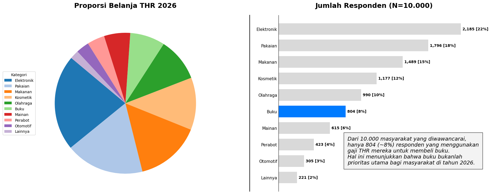
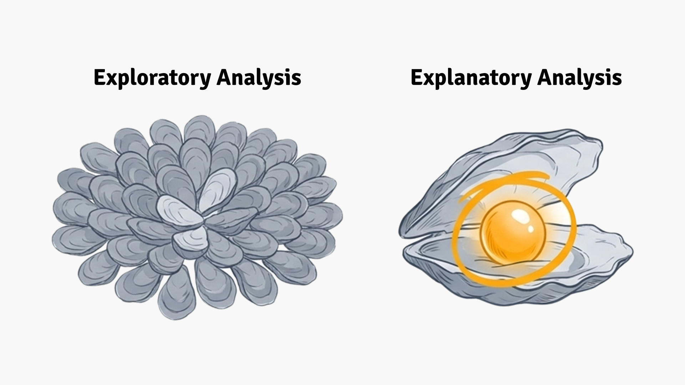
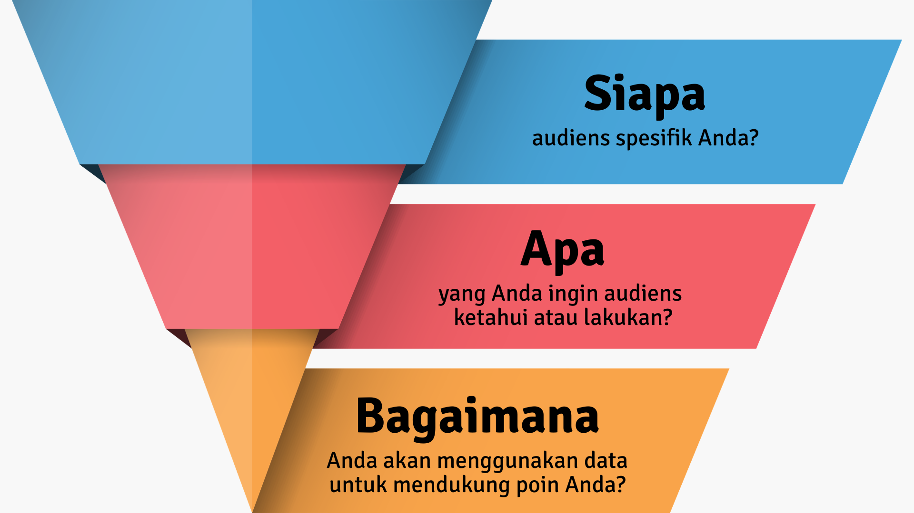
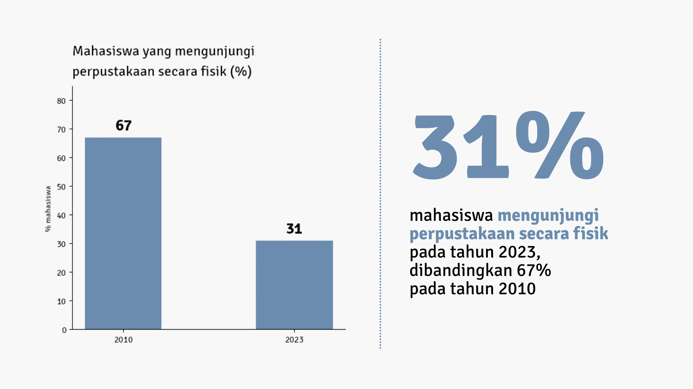
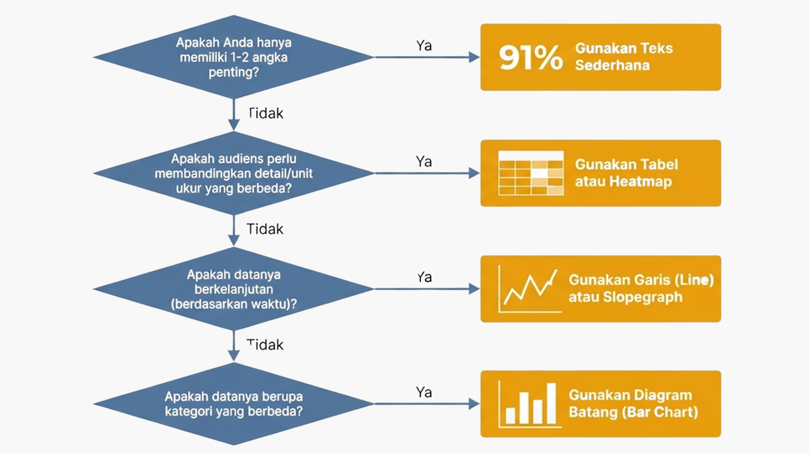
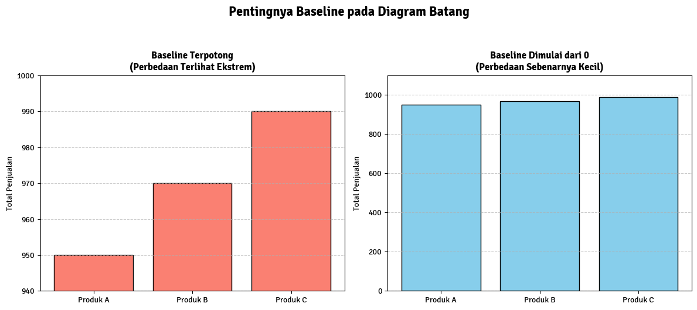

+++
date = '2026-05-12T06:00:00+08:00'
draft = false
title = 'Pengantar Visualisasi dan Storytelling'
translationKey = "pengantar-visualisasi-dan-storytelling"
languages = 'id'
tags = ['Visualisasi Data', 'Storytelling', 'Pemula']
# featuredImage = "images/thumbnail.png"
featuredImagePreview = "images/thumbnail.png"
# series = ['']
# weight = 4
categories = ['Konsep']
description = "Memilih jenis grafik bukan sekedar masalah estetika, melainkan kejelasan komunikasi. Postingan ini akan membahas prinsip dasar visualisasi data: apa yang membedakan visualisasi data yang bagus dan yang buruk, serta pentingnya storytelling dalam visualisasi data."
summary = "Memilih jenis grafik bukan sekedar masalah estetika, melainkan kejelasan komunikasi. Postingan ini akan membahas prinsip dasar visualisasi data: apa yang membedakan visualisasi data yang bagus dan yang buruk, serta pentingnya storytelling dalam visualisasi data."
seo_description = "Memilih jenis grafik bukan sekedar masalah estetika, melainkan kejelasan komunikasi. Postingan ini akan membahas prinsip dasar visualisasi data: apa yang membedakan visualisasi data yang bagus dan yang buruk, serta pentingnya storytelling dalam visualisasi data."
+++

## 1. Pendahuluan

Kedua chart berikut ini dibuat berdasarkan data yang sama. Silakan perhatikan kedua chart tersebut, kemudian tentukan chart mana yang menurut Anda lebih mudah untuk dipahami.

Apakah Anda sudah menentukan jawaban Anda? Jika Anda masih ragu, coba pertimbangkan beberapa pertanyaan singkat berikut:
1. Kategori apa yang paling banyak proporsi belanjanya?
2. Kategori apa yang paling sedikit?
3. Kategori apa yang lebih besar proporsi belanjanya, kosmetik atau makanan?
4. Berapa banyak responden yang membeli buku?

Berdasarkan pertanyaan di atas, menurut Anda, chart mana yang lebih informatif dan mudah dipahami?

Memilih jenis grafik bukan sekedar masalah estetika, melainkan kejelasan komunikasi. Postingan ini akan membahas prinsip dasar visualisasi data: apa yang membedakan visualisasi data yang bagus dan yang buruk, serta pentingnya storytelling dalam visualisasi data. 

Materi yang dibahas merupakan pengantar untuk pemula, dan sebagian poin-poin pentingnya merujuk pada buku [Storytelling with Data](https://www.storytellingwithdata.com/) oleh [Cole Nussbaumer Knaflic](https://www.linkedin.com/in/colenussbaumer). Untuk eksplorasi yang lebih mendalam, saya menyarankan untuk merujuk langsung pada buku tersebut.

## 2. Berhenti Menyajikan "Tiram", Mulailah Memberikan "Mutiara"

Salah satu hambatan terbesar dalam komunikasi data yang efektif adalah ketidakmampuan penyaji untuk membedakan antara analisis eksploratori dan eksplanatori.

Analisis **eksploratori** (***exploratory*** *analysis*) adalah proses internal di mana Anda "menyelami" data untuk menemukan *insight* menarik. Proses ini ibarat membuka 100 tiram untuk menemukan dua mutiara. Masalah muncul ketika penyaji merasa perlu menunjukkan seluruh proses kerja keras mereka kepada audiens sebagai bukti dedikasi.

Bagi audiens profesional, melihat proses "membuka tiram" ini hanyalah kebisingan. Mereka hanya menginginkan mutiaranya, yaitu wawasan utama yang dapat ditindaklanjuti oleh mereka. Menampilkan terlalu banyak data mentah atau proses kerja yang tidak relevan justru melemahkan pesan Anda. Sebagai *data analyst/scientist*, tugas Anda adalah melakukan kurasi. Saringlah data Anda hingga hanya mutiara yang tersisa agar pesan utama tidak terkubur dalam tumpukan informasi yang tidak perlu. Proses menyajikan dua mutiara inilah yang disebut sebagai analisis eksplanatory (***explanatory*** *analysis*).

Oleh karena itu, sebelum menentukan visualisasi seperti apa yang Anda perlu sajikan di hadapan audiens, Anda harus mampu menjawab tiga pertanyaan fundamental berikut ini.

### 2.1 *WHO*: Siapa audiens kamu?

Semakin spesifik, semakin baik. "Semua orang" adalah jawaban yang paling buruk. Hindari pula target umum seperti "pemangku kepentingan internal". Identifikasi siapa **pengambil keputusan** yang perlu kamu pengaruhi.
- Apakah mereka familier dengan data ini?
- Seberapa baik kemampuan teknis mereka?
- Apa yang mereka pedulikan?
- Apakah mereka sudah mempercayai kamu, atau kamu perlu membangun kredibilitas?

### 2.2 *WHAT*: Apa yang kamu ingin mereka ketahui atau lakukan?

Ini bukan tentang apa yang *kamu* temukan. Ini tentang apa yang *mereka* perlu tahu untuk mengambil tindakan. Jika kamu tidak bisa menjawab pertanyaan ini dalam satu kalimat, kamu belum siap membuat visualisasi.

### 2.3 *HOW*: Bagaimana data mendukung pesanmu?

Baru setelah *WHO* dan *WHAT* jelas, kamu boleh memikirkan data apa yang akan digunakan sebagai bukti. Pikirkan bagaimana Anda akan menggunakan data untuk mendukung poin yang ingin Anda sampaikan. Ingat! Data adalah bukti pendukung, bukan tujuan akhir

## 3. Tidak Semua Data Perlu Grafik

Banyak orang beranggapan bahwa memiliki data angka secara otomatis mewajibkan penggunaan grafik. Padahal, penggunaan grafik yang dipaksakan sering kali menjadi pemborosan ruang dan perhatian. Sebagai ilustrasi, bandingkan kedua visualisasi berikut ini.

Kedua visualisasi di atas menunjukkan data yang sama. Namun, dalam kasus sesederhana ini, sebuah kalimat yang jernih memiliki dampak yang jauh lebih kuat daripada visualisasi yang dipaksakan:

> "Pada tahun 2023, hanya 31% mahasiswa yang mengunjungi perpustakaan secara fisik, angka ini turun drastis dibandingkan 67% pada tahun 2010."

Dengan menggunakan teks langsung, Anda meminimalkan gangguan visual dan memberikan sorotan penuh pada angka kunci yang ingin Anda tonjolkan.

Jadi, bagaimana menentukan kapan menggunakan grafik atau tidak? Dan jika perlu menggunakan grafik, grafik jenis apa yang perlu Anda gunakan? Sebagai panduan praktis, Anda dapat merujuk bagan berikut ini. Pertanyaan utamanya adalah **"apa yang ingin Anda bandingkan atau tunjukkan?"**

## 4. Beberapa Hal yang Perlu Dihindari

### 4.1 *Pie Chart*

Manusia sangat buruk dalam memperkirakan ukuran area lingkaran. Ini merupakan fakta psikologi kognitif. Sebagai eksperimen, coba Anda perhatikan *pie chart* di awal postingan ini. 

Bisakah Anda langsung tahu bagian mana yang terbesar? Bagaimana jika 3 bagian memiliki ukuran yang mirip?

Penggunaan pie chart bermasalah karena mata kita buruk dalam membandingkan area 2D. Apalagi dalam kasus di mana pie chart memiliki banyak segmen, warna-warna saling bersaing dan membingungkan. 

### 4.2 *Baseline* Bar Chart tidak dimulai dari 0
Sebagai alternatif *pie chart*, Anda dapat menggunakan bar chart. Bar chart sederhana, tapi selalu lebih mudah dibaca. Meskipun begitu, perhatikan bahwa *baseline* sebuah bar chart bisa mengubah interpretasi pembaca. Sebagai ilustrasi, perhatikan dua bar chart berikut yang dibuat dari data yang sama.

Kedua bar chart dibuat dari data yang sama, tetapi bar chart kiri terlihat seakan-akan terdapat perbedaan signifikan antara produk A, B, dan C. Walaupun pada kenyataannya, ketiga produk tersebut tidak begitu berbeda jauh, sebagaimana terlihat pada bar chart kanan.

### 4.3 Grafik 3D

3D terlihat keren secara estetika, tapi sulit untuk diinterpretasikan. Perspektif 3D mendistorsi ukuran relatif elemen-elemen dalam grafik. Penggunaan grafik 3D tidak berguna dalam menyampaikan data Anda, jadi hindari penggunaan grafik 3D sepenuhnya.

### 4.4 Sumbu Y Ganda

Dua sumbu Y di kiri dan kanan seringkali membingungkan audiens tentang data mana yang mengacu ke sumbu mana. Jika Anda butuh dua sumbu Y, pertimbangkan membuat dua grafik terpisah.

### 4.5 Hindari *Cluttering*

Setiap elemen yang kamu tambahkan dalam sebuah grafik memakan **beban kognitif** audiens, entah garis, angka, warna, maupun teks. Otak manusia harus memproses semuanya. Jika sebuah elemen tidak membantu audiens memahami pesan Anda, sebaiknya hapus saja elemen itu.

Untuk memahami cara otak manusia memproses informasi visual, Anda bisa mempelajari Psikologi Gestalt. Ada beberapa prinsip yang sangat relevan untuk desain grafik:
1. Kedekatan (*Proximity*): elemen yang berdekatan dianggap satu kelompok. Beri jarak antar kelompok data yang berbeda. Legenda yang ditempatkan dekat dengan datanya lebih efektif daripada legenda yang diletakkan jauh di pojok.
2. Kesamaan (*Similarity*): elemen yang terlihat mirip (warna, bentuk, ukuran sama) dianggap satu kelompok. Gunakan warna yang sama untuk kategori yang sama di seluruh dashboard atau laporan. Konsistensi visual membantu audiens tidak perlu belajar ulang setiap kali melihat grafik baru.
3. Penutupan (*Closure*): otak kita cenderung "melengkapi" bentuk yang tidak sempurna. Kamu tidak selalu butuh border/kotak di sekeliling grafik. Otak audiens sudah bisa memahami batas grafik dari konteks. Hapus border yang tidak perlu.
4. Kesinambungan (*Continuity*): mata kita mengikuti garis dan kurva. Gunakan *alignment* (keselarasan) elemen secara konsisten. Teks, judul, dan label yang sejajar menciptakan alur pandang yang natural.

Selain itu, terdapat juga beberapa elemen yang sering jadi *clutter*. Beberapa elemen tersebut diantaranya adalah
* Gridlines tebal, seringkali bersaing dengan data. Hilangkan atau buat sangat tipis dan terang
* Border grafik, cukup gunakan *white space* saja
* Background berwarna gelap, mengurangi kontras, mempersulit keterbacaan. Gunakan background putih/terang.
* Legenda jauh dari data, memaksa mata bolak-balik. Label langsung di garis/bar
* Teks diagonal, 52% lebih lambat dibaca daripada teks horizontal. Rotasi label ke horizontal.
* Terlalu banyak warna, tidak ada yang menonjol. Maksimal 1–2 warna aksen.
* Data label di semua titik, kacau dan padat. Tampilkan hanya di titik yang penting.

## 5. "The Big Idea": Saring Pesan Anda Menjadi Satu Kalimat Tunggal

Kejujuran visual melalui grafik yang tepat hanyalah fondasi; untuk benar-benar menggerakkan audiens, Anda membutuhkan pesan inti yang tak tertandingi. Mengadopsi konsep dari pakar komunikasi Nancy Duarte, setiap visualisasi yang sukses harus berakar pada satu "*Big Idea*". Konsep ini menuntut Anda untuk merangkum pesan utama menjadi satu kalimat lengkap yang memenuhi tiga kriteria:

1. Artikulasikan sudut pandang unik Anda.
2. Sampaikan apa yang menjadi taruhannya (*what’s at stake*).
3. Tersaji dalam struktur kalimat lengkap.

Sebagai contoh, alih-alih memberikan judul klise seperti "Hasil Survei Program Sains," sebuah Big Idea yang kuat untuk program tersebut adalah: "Program pilot sains musim panas berhasil meningkatkan minat positif siswa; kita harus mengamankan pendanaan berkelanjutan untuk menjaga antusiasme sains generasi mendatang."

## 6. Storyboarding: Perencanaan "Low-Tech" Sebelum Eksekusi Digital

Kesalahan yang sering dilakukan oleh profesional adalah langsung membuka perangkat lunak presentasi saat mulai bekerja. Secara psikologis, begitu kita mulai menghabiskan waktu untuk "mengutak-atik" jenis huruf, warna, dan posisi elemen di komputer, kita akan membentuk ikatan emosional terhadap slide tersebut. Hal ini membuat kita resisten terhadap perubahan, meskipun slide tersebut ternyata tidak efektif bagi narasi keseluruhan.

[Cole Nussbaumer Knaflic](https://www.linkedin.com/in/colenussbaumer) melalui [Storytelling with Data](https://www.storytellingwithdata.com/)  merekomendasikan pendekatan "*low-tech*" seperti penggunaan papan tulis atau Post-it notes. Metode ini memungkinkan Anda untuk:

* Membangun struktur narasi visual (*storyboard*) tanpa beban teknis.
* Mengatur ulang alur cerita dengan fleksibel tanpa rasa bersalah saat harus membuang ide.
* Fokus sepenuhnya pada logika cerita sebelum terdistraksi oleh estetika digital.

Langkah ini jauh lebih hemat waktu dan memastikan bahwa setiap elemen visual yang Anda buat nantinya memiliki peran strategis dalam alur narasi Anda.