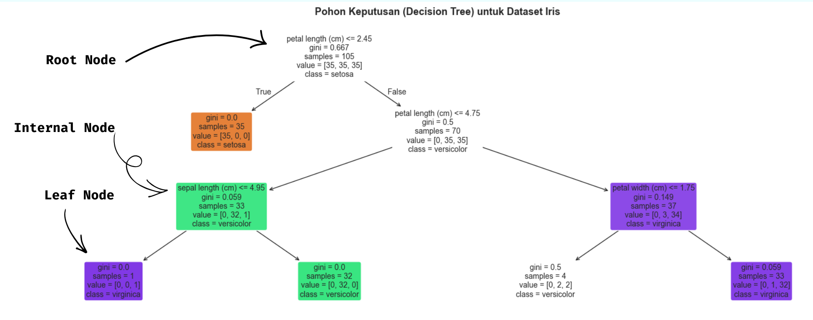
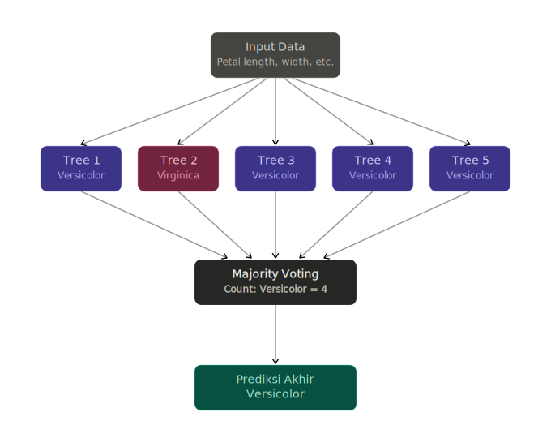
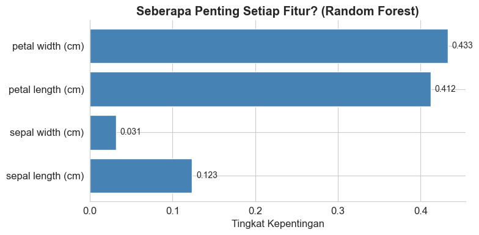
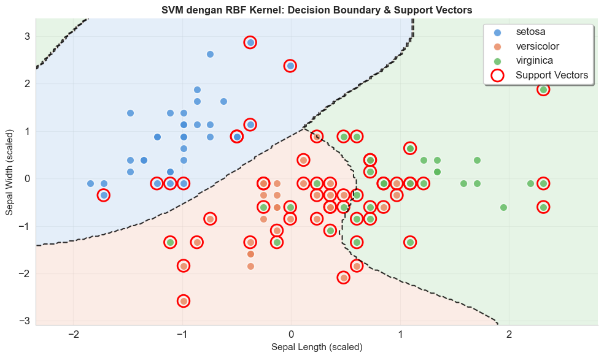
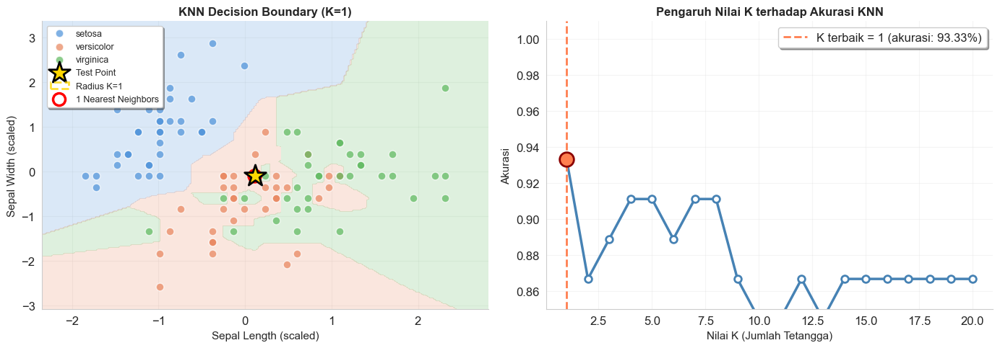
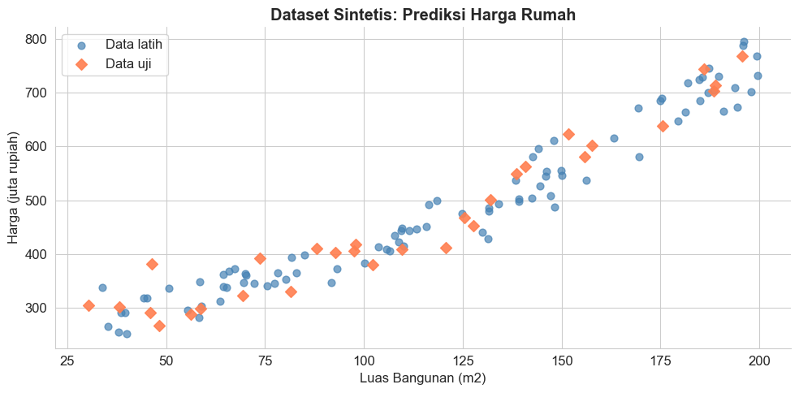
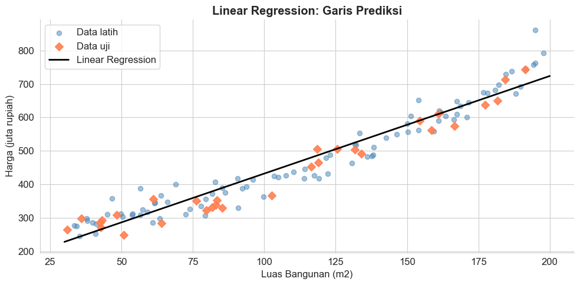
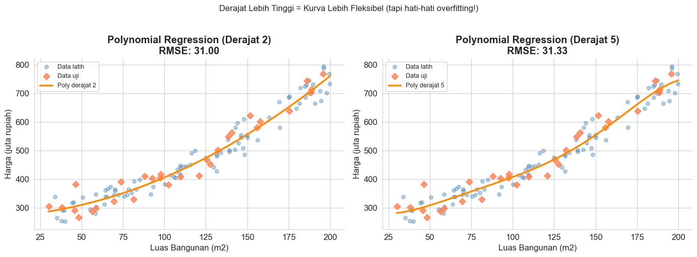
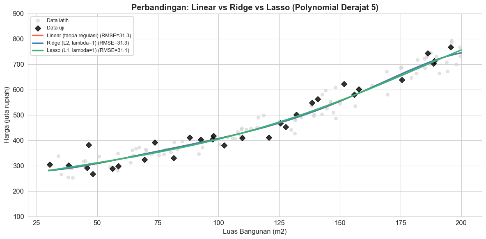

+++
date = '2026-05-03T06:00:00+08:00'
draft = false
title = 'Supervised Learning'
translationKey = "supervised-learning"
languages = 'id'
tags = ['Machine Learning', 'Pemula']
# featuredImage = "images/thumbnail-pivot-table.png"
# featuredImagePreview = "images/thumbnail-pivot-table.png"
series = ['Pengantar Machine Learning']
weight = 2
categories = ['Konsep']
description = "*"
summary = ""
seo_description = ""
+++

Pada artikel sebelumnya, kita sudah membedah [konsep dasar machine learning](https://frge.top/rualytics_intro_ml). Selanjutnya, perlu dipahami bahwa jenis pembelajaran yang dapat dilakukan oleh mesin terbagi atas beberapa jenis. Pada artikel ini, kita akan fokus pada [*supervised learning*](https://frge.top/rualytics_supervised_learning). Pada post selanjutnya akan dibahas terkait jenis [*unsupervised learning* dan *reinforcement learning*](https://frge.top/rualytics_unsup_reinforcement).

Artikel ini akan membahas konsep dasar *supervised learning*, perbedaan regresi dan klasifikasi, pengantar *feature engineering*, disertai dengan contoh sederhana. Oleh karena itu, jika Anda berminat untuk mengikuti tutorial di artikel ini, maka pastikan terlebih dahulu bahwa library seperti numpy, pandas, matplotlib, seaborn, dan scikit-learn sudah terinstall di device Anda.

```python
# Library umum untuk manipulasi data
import numpy as np
import pandas as pd

# Library untuk visualisasi
import matplotlib.pyplot as plt
import matplotlib.patches as mpatches
import seaborn as sns

# Library machine learning
from sklearn.datasets import load_iris, make_regression, make_classification
from sklearn.model_selection import train_test_split
from sklearn.preprocessing import StandardScaler
from sklearn.metrics import accuracy_score, classification_report, mean_squared_error

# Algoritma Klasifikasi
from sklearn.linear_model import LogisticRegression
from sklearn.tree import DecisionTreeClassifier, plot_tree
from sklearn.ensemble import RandomForestClassifier
from sklearn.svm import SVC
from sklearn.neighbors import KNeighborsClassifier

# Algoritma Regresi
from sklearn.linear_model import LinearRegression, Ridge, Lasso
from sklearn.preprocessing import PolynomialFeatures
from sklearn.pipeline import Pipeline

# Agar plot lebih rapi
plt.rcParams['figure.figsize'] = (10, 5)
plt.rcParams['font.size'] = 12
sns.set_style("whitegrid")

import warnings
warnings.filterwarnings('ignore')
```

---

## 1. Apa Itu Supervised Learning?

Sesuai namanya, *supervised learning* merupakan jenis *machine learning* yang bersifat "terbimbing" (*supervised*). Dikatakan "terbimbing" sebab proses belajarnya bergantung pada dataset berlabel yang berfungsi sebagai "bimbingan" bagi algoritma.

Sebagai analogi, bayangkan diri Anda sebagai seorang guru TK yang sedang mengenalkan buah apel dan mangga kepada siswa-siswi Anda. Untuk "membimbing" siswa-siswi Anda dalam belajar, Anda menunjukkan gambar apel sambil berkata "ini apel", kemudian menunjukkan gambar mangga dan berkata "ini mangga". Setelah dirasa cukup memberikan "bimbingan", Anda tentu ingin mengecek sejauh mana pemahaman mereka dengan cara memberikan tes berisi gambar-gambar buah tanpa keterangan untuk mereka tebak.

Dalam konteks *supervised learning*, gambar apel dan mangga yang Anda tunjukkan di awal merupakan data berlabel yang berperan sebagai "bimbingan" agar algoritma dapat belajar mengenali pola. Contoh-contoh ini disebut sebagai data berlabel karena disertai keterangan jawaban yang pasti, sehingga siswa-siswi (algoritma ML) Anda memiliki panduan atau *ground truth* yang menjadi patokan selama proses bimbingan berlangsung. 


*Supervised learning* merupakan jenis pembelajaran yang menggunakan data berlabel. Label yang dimaksud merupakan *ground truth* yang berfungsi sebagai "bimbingan" bagi algoritma ML dalam proses pembelajarannya.


---

## 2. Regresi vs Klasifikasi

*Supervised learning* terbagi lagi atas dua jenis: regresi dan klasifikasi. Perbedaan keduanya terletak pada jenis labelnya. Jika labelnya bersifat numerik, maka kasusnya disebut sebagai kasus regresi. Sebaliknya, jika labelnya bersifat numerik, maka kasusnya disebut sebagai kasus klasifikasi.

Sebagai contoh, data [*house prices*](https://frge.top/kaggle_house_prices) merupakan contoh kasus regresi, sebab tujuan utamanya adalah memprediksi harga rumah. Tentu saja, harga rumah yang 
dimaksud bersifat numerik. Di sisi lain, [data titanic](https://frge.top/rualytics_titanic) pada [postingan sebelumnya](https://frge.top/rualytics_intro_ml) merupakan contoh kasus klasifikasi, sebab tujuan utamanya adalah memprediksi apakah penumpang tertentu selamat atau tidak. "Selamat atau tidak" ini bersifat kategorik. 

Tidak hanya data tabular, *supervised learning* juga bisa mencakup [tipe data lain](https://frge.top/rualytics_tipe_data), misalnya klasifikasi pada [data gambar](https://frge.top/kaggle_digit_recognizer) yang bertujuan untuk mengklasifikasikan gambar tulisan tangan menjadi digit 0 hingga 9. Contoh lain, misalnya klasifikasi pada [data teks](https://frge.top/kaggle_movie_review) yang bertujuan untuk mengklasifikasikan review film menjadi dua kategori: positif atau negatif.


Label numerik → regresi<br>
Label kategori → klasifikasi



---

## 3. Algoritma Klasifikasi Populer

Selanjutnya akan diuraikan secara singkat beberapa contoh algoritma klasifikasi populer. Sebagai ilustrasi, pemodelan klasifikasi akan dilakukan pada [data iris](https://frge.top/rualytics_eda_iris). Tujuan utama dari data ini adalah mengelompokkan 3 spesies bunga iris berdasarkan empat variabel, yaitu panjang daun, lebar daun, panjang kelopak, dan lebar kelopak.


```python
# Memuat dataset Iris
iris = load_iris()
X = iris.data          # Fitur: 4 kolom (ukuran kelopak)
y = iris.target        # Label: 0=Setosa, 1=Versicolor, 2=Virginica

# Membagi data: 80% untuk latih, 20% untuk uji
X_train, X_test, y_train, y_test = train_test_split(
    X, y, test_size=0.3, random_state=2026
)

# Normalisasi fitur (penting untuk beberapa algoritma)
scaler = StandardScaler()
X_train_scaled = scaler.fit_transform(X_train)
X_test_scaled  = scaler.transform(X_test)

print(f"Total data   : {len(X)} baris")
print(f"Data latih   : {len(X_train)} baris")
print(f"Data uji     : {len(X_test)} baris")
print(f"\nKelas bunga  : {iris.target_names}")
print(f"Fitur        : {iris.feature_names}")
print(f"\nContoh 5 data pertama:")
df_iris = pd.DataFrame(X[:5], columns=iris.feature_names)
df_iris["Jenis Bunga"] = [iris.target_names[i] for i in y[:5]]
print(df_iris.to_string(index=False))

```

    Total data   : 150 baris
    Data latih   : 105 baris
    Data uji     : 45 baris
    
    Kelas bunga  : ['setosa' 'versicolor' 'virginica']
    Fitur        : ['sepal length (cm)', 'sepal width (cm)', 'petal length (cm)', 'petal width (cm)']
    
    Contoh 5 data pertama:
     sepal length (cm)  sepal width (cm)  petal length (cm)  petal width (cm) Jenis Bunga
                   5.1               3.5                1.4               0.2      setosa
                   4.9               3.0                1.4               0.2      setosa
                   4.7               3.2                1.3               0.2      setosa
                   4.6               3.1                1.5               0.2      setosa
                   5.0               3.6                1.4               0.2      setosa
  



Tidak perlu khawatir jika ada beberapa detail dari contoh code di section ini yang Anda belum pahami. Artikel ini ditujukan untuk pemula, dan karenanya, ada beberapa detail yang tidak dijelaskan secara rinci untuk memastikan pembahasan tidak terlalu lebar. Beberapa tahapan di atas akan dijelaskan secara lebih rinci pada beberapa postingan ke depan.



### 3.1 Multinomial Logistic Regression

Meskipun namanya menggunakan kata *regression*, *logistic regression* digunakan untuk kasus klasifikasi, khususnya untuk kasus klasifikasi biner. Klasifikasi biner adalah sub-kasus dimana peubah target hanya memiliki dua kemungkinan nilai (*binary*/biner). [Data titanic](https://frge.top/rualytics_titanic) merupakan contoh klasik dari kasus klasifikasi biner, dimana *outome* yang ingin diprediksi hanya ada dua kemungkinan: selamat atau tidak selamat.

Namun, perlu diingat bahwa data iris memiliki lebih dari dua kategori *outcome*, yaitu tiga spesies iris: setosa, versicolor, dan virginica. Oleh karena itu, algoritma yang lebih tepat adalah varian dari logistic regression yang disebut sebagai multinomial logistic regression. Algoritma ini dapat didefinisikan secara matematis sebagai fungsi berikut:

$$
P(Y_i = j) =
\frac{
e^{\beta_{0j} + \beta_{1j} X_{1i} + \dots + \beta_{mj} X_{mi}}
}{
\sum_{l=1}^{K}
e^{\beta_{0l} + \beta_{1l} X_{1i} + \dots + \beta_{ml} X_{mi}}
}
$$

dimana $j=1,2,...,K$ adalah indeks kategori *outcome*, $K=3$ adalah jumlah kategori *outcome* dalam data iris, dan $\eta_j = \beta_{0j} + \beta_{1j} X_1 + \dots + \beta_{mj} X_m$ adalah prediktor linear untuk tiap kategori $j$.

Adapun implementasinya menggunakan python dapat dilakukan dengan menggunakan fungsi [`LogisticRegression()`](https://frge.top/sklearn_LogisticRegression) dari library sklearn.linear_model.


```python
# Logistic Regression
lr_model = LogisticRegression(max_iter=500, random_state=2026)
lr_model.fit(X_train_scaled, y_train)

y_pred_lr = lr_model.predict(X_test_scaled)
acc_lr = accuracy_score(y_test, y_pred_lr)

print(f"Logistic Regression - Akurasi: {acc_lr:.2%}")
print("\nLaporan Detail:")
print(classification_report(y_test, y_pred_lr, target_names=iris.target_names))
```

    Logistic Regression - Akurasi: 95.56%
    
    Laporan Detail:
                  precision    recall  f1-score   support
    
          setosa       1.00      1.00      1.00        15
      versicolor       0.88      1.00      0.94        15
       virginica       1.00      0.87      0.93        15
    
        accuracy                           0.96        45
       macro avg       0.96      0.96      0.96        45
    weighted avg       0.96      0.96      0.96        45 
    


### 3.2 Decision Tree

*Decision tree* merupakan algoritma *supervised learning* yang dapat digunakan untuk klasifikasi dan regresi. Algoritma ini menghasilkan cabang-cabang keputusan sehingga terlihat seperti pohon. Sebagai contoh, gambar berikut merupakan model decision tree yang telah dilatih pada data iris.

```python
# Decision Tree
dt_model = DecisionTreeClassifier(max_depth=3, random_state=2026)
dt_model.fit(X_train, y_train)   # Decision Tree tidak perlu scaling

y_pred_dt = dt_model.predict(X_test)
acc_dt = accuracy_score(y_test, y_pred_dt)

print(f"Decision Tree - Akurasi: {acc_dt:.2%}")

# Visualisasi pohon keputusan
fig, ax = plt.subplots(figsize=(16, 6))
plot_tree(dt_model,
          feature_names=iris.feature_names,
          class_names=iris.target_names,
          filled=True, rounded=True, fontsize=10, ax=ax)
ax.set_title("Pohon Keputusan (Decision Tree) untuk Dataset Iris",
             fontsize=13, fontweight='bold')
plt.tight_layout()
plt.show()

```

    Decision Tree - Akurasi: 93.33%
    


    

    


Model *decision tree* mudah dipahami dan divisualisasikan. Sebagai contoh, dari ilustrasi di atas dapat dengan mudah dipahami bahwa, jika terdapat bunga iris dengan $\text{petal length} <= 2.45  \text{cm}$, maka model akan mengklasifikasikan bunga tersebut sebagai spesies iris setosa. Sebaliknya, jika ada bungan yang memiliki $2.45 \text{cm} < \text{petal length} <= 4.45  \text{cm} $, tapi $\text{petal width} <= 1.75  \text{cm}$, maka model akan mengklasifikan bunga tersebut sebagai iris versicolor.

Meskipun begitu, perlu diingat bahwa *decision tree* merupakan algoritma yang rentan *overfitting*, yaitu sebuah kondisi dimana algoritma terlalu menghafal pola dalam sebuah data sehingga tidak mampu memprediksi data baru. Kondisi ini tentu saja kurang ideal ketika membangun model prediktif, mengingat tujuan utama sebuah model prediktif adalah untuk memprediksi data baru.


### 3.3 Random Forest

Salah satu algoritma alternatif yang dapat digunakan untuk mengatasi masalah *overfitting* pada *decision tree* adalah dengan menggunakan algoritma *random forest*. Dinamakan *random forest* sebab algoritma ini dibangun dari ratusan, ribuan, bahkan jutaan *decision **tree*** sehingga membentuk ***forest***. Prediksi akhir ditentukan oleh **voting mayoritas**, yaitu jika mayoritas *tree* memprediksi kategori A, maka prediksi akhir adalah kategori A. Voting mayoritas dapat diilustrasikan seperti gambar berikut ini.




```python
# Random Forest
rf_model = RandomForestClassifier(n_estimators=100, random_state=2026)
rf_model.fit(X_train, y_train)

y_pred_rf = rf_model.predict(X_test)
acc_rf = accuracy_score(y_test, y_pred_rf)

print(f"Random Forest - Akurasi: {acc_rf:.2%}")

# Visualisasi Feature Importance
importances = rf_model.feature_importances_
feat_names = iris.feature_names

fig, ax = plt.subplots(figsize=(8, 4))
bars = ax.barh(feat_names, importances, color='steelblue', edgecolor='white')
ax.set_xlabel('Tingkat Kepentingan')
ax.set_title('Seberapa Penting Setiap Fitur? (Random Forest)', fontweight='bold')
for bar, val in zip(bars, importances):
    ax.text(val + 0.005, bar.get_y() + bar.get_height()/2,
            f'{val:.3f}', va='center', fontsize=10)
ax.spines[['top', 'right']].set_visible(False)
plt.tight_layout()
plt.show()

print("\nFitur terpenting:", feat_names[np.argmax(importances)])
```

    Random Forest - Akurasi: 95.56%
    


    

    


    
    Fitur terpenting: petal width (cm)
    


### 3.4 *Support Vector Machine* (SVM)

SVM merupakan algoritma *machine learning* untuk kasus klasifikasi dan regresi dengan mencari *hyperplane* (bidang pemisah) terbaik yang dapat memisahkan memaksimalkan jarak (*margin*) antara dua kelas atau lebih. *Support vector* dalam SVM merujuk pada titik-titik ekstrem yang posisinya paling dekat dengan *hyperplane*. Titik-titik data ini merupakan titik-titik paling krusial, sebab jika titik-titik data ini dihapus maka *hyperplane* akan bergeser.

```python
# SVM - Train pada 2 fitur pertama untuk visualisasi
X_train_2d = X_train_scaled[:, :2]
X_test_2d = X_test_scaled[:, :2]

svm_model_2d = SVC(kernel='rbf', C=1.0, random_state=2026)
svm_model_2d.fit(X_train_2d, y_train)

y_pred_svm_2d = svm_model_2d.predict(X_test_2d)
acc_svm_2d = accuracy_score(y_test, y_pred_svm_2d)


# SVM pada semua fitur
svm_model = SVC(kernel='rbf', C=1.0, random_state=2026)
svm_model.fit(X_train_scaled, y_train)

y_pred_svm = svm_model.predict(X_test_scaled)
acc_svm = accuracy_score(y_test, y_pred_svm)

print(f"\nSVM (2 fitur) - Akurasi: {acc_svm_2d:.2%}")
print(f"SVM (4 fitur) - Akurasi: {acc_svm:.2%}")

# Visualisasi dengan decision boundary
fig, ax = plt.subplots(figsize=(10, 6))

# Membuat mesh grid untuk decision boundary
x_min, x_max = X_train_2d[:, 0].min() - 0.5, X_train_2d[:, 0].max() + 0.5
y_min, y_max = X_train_2d[:, 1].min() - 0.5, X_train_2d[:, 1].max() + 0.5
xx, yy = np.meshgrid(np.linspace(x_min, x_max, 200),
                     np.linspace(y_min, y_max, 200))

# Prediksi untuk setiap titik di mesh
Z = svm_model_2d.predict(np.c_[xx.ravel(), yy.ravel()])
Z = Z.reshape(xx.shape)

# Plot decision boundary dengan warna transparan
colors_decision = ['#4A90D9', '#E8835A', '#5CB85C']
ax.contourf(xx, yy, Z, alpha=0.15, levels=[-0.5, 0.5, 1.5, 2.5], 
            colors=colors_decision)

# Plot decision boundary lines (garis pemisah)
ax.contour(xx, yy, Z, colors='black', linewidths=1.5, 
           levels=[0.5, 1.5], linestyles='--', alpha=0.8)

# Plot data points
colors_map = {0: '#4A90D9', 1: '#E8835A', 2: '#5CB85C'}
for cls in [0, 1, 2]:
    mask = y_train == cls
    ax.scatter(X_train_2d[mask, 0], X_train_2d[mask, 1],
               c=colors_map[cls], label=iris.target_names[cls],
               s=80, edgecolors='white', linewidth=1, alpha=0.8)

# Highlight support vectors
sv_indices = svm_model_2d.support_
ax.scatter(X_train_2d[sv_indices, 0], X_train_2d[sv_indices, 1],
           s=200, linewidths=2, facecolors='none', 
           edgecolors='red', label='Support Vectors')

ax.set_xlabel('Sepal Length (scaled)', fontsize=11)
ax.set_ylabel('Sepal Width (scaled)', fontsize=11)
ax.set_title('SVM dengan RBF Kernel: Decision Boundary & Support Vectors', 
             fontweight='bold', fontsize=12)
ax.legend(loc='best', frameon=True, shadow=True)
ax.spines[['top', 'right']].set_visible(False)
ax.grid(True, alpha=0.2)
plt.tight_layout()
plt.show()
```

    SVM (2 fitur) - Akurasi: 68.89%
    SVM (4 fitur) - Akurasi: 95.56%
    


    

    
Algoritma ini efektif untuk data dengan banyak variabel, tetapi bisa jadi sangat lambat jika ukuran data besar.


### 3.5 K-Nearest Neighbors (KNN)

KNN mengklasifikasikan data baru berdasarkan **K tetangga terdekat** di data latih. $K$ merupakan *hyperparameter*, sehingga tidak terdapat satu nilai optimal untuk semua kasus. Untuk memperoleh nilai $K$ optimal, perlu dilakukan *hyperparameter tuning*. Sebagai ilustrasi, jika $K$ optimal adalah $K=5$, maka KNN ini akan melihat 5 data latih yang terdekat dengan data baru, lalu mengambil kelas yang paling banyak muncul di antara 5 tetangga itu. Oleh karena itulah, nilai K direkomendasikan berupa nilai ganjil untuk mengurangi kemungkinan dua kelas memiliki frekuensi yang sama.

```python
# KNN
knn_model = KNeighborsClassifier(n_neighbors=5)
knn_model.fit(X_train_scaled, y_train)

y_pred_knn = knn_model.predict(X_test_scaled)
acc_knn = accuracy_score(y_test, y_pred_knn)

print(f"KNN (K=5) - Akurasi: {acc_knn:.2%}")

# Mencari K terbaik
k_values = range(1, 21)
k_scores = []
for k in k_values:
    m = KNeighborsClassifier(n_neighbors=k)
    m.fit(X_train_scaled, y_train)
    k_scores.append(accuracy_score(y_test, m.predict(X_test_scaled)))

best_k = k_values[np.argmax(k_scores)]
print(f"K terbaik = {best_k} dengan akurasi: {max(k_scores):.2%}")

# ===== VISUALISASI BARU: KNN Decision Boundary & Neighbors =====
fig, axes = plt.subplots(1, 2, figsize=(14, 5))

# Plot 1: Decision Boundary KNN
ax1 = axes[0]
X_train_2d = X_train_scaled[:, :2]
X_test_2d = X_test_scaled[:, :2]

knn_model_2d = KNeighborsClassifier(n_neighbors=best_k)
knn_model_2d.fit(X_train_2d, y_train)

# Mesh grid untuk decision boundary
x_min, x_max = X_train_2d[:, 0].min() - 0.5, X_train_2d[:, 0].max() + 0.5
y_min, y_max = X_train_2d[:, 1].min() - 0.5, X_train_2d[:, 1].max() + 0.5
xx, yy = np.meshgrid(np.linspace(x_min, x_max, 200),
                     np.linspace(y_min, y_max, 200))

Z = knn_model_2d.predict(np.c_[xx.ravel(), yy.ravel()])
Z = Z.reshape(xx.shape)

# Plot decision regions
colors_decision = ['#4A90D9', '#E8835A', '#5CB85C']
ax1.contourf(xx, yy, Z, alpha=0.2, levels=[-0.5, 0.5, 1.5, 2.5], 
             colors=colors_decision)

# Plot training data
colors_map = {0: '#4A90D9', 1: '#E8835A', 2: '#5CB85C'}
for cls in [0, 1, 2]:
    mask = y_train == cls
    ax1.scatter(X_train_2d[mask, 0], X_train_2d[mask, 1],
                c=colors_map[cls], label=iris.target_names[cls],
                s=60, edgecolors='white', linewidth=1, alpha=0.7)

# Pilih satu test point untuk demonstrasi
test_point_idx = 5
test_point = X_test_2d[test_point_idx].reshape(1, -1)
test_label = y_test[test_point_idx]

# Plot test point (bintang besar)
ax1.scatter(test_point[0, 0], test_point[0, 1], 
           marker='*', s=500, c='gold', edgecolors='black', 
           linewidth=2, zorder=10, label='Test Point')

# Cari K nearest neighbors
distances, indices = knn_model_2d.kneighbors(test_point)
neighbors = X_train_2d[indices[0]]

# Gambar lingkaran radius ke neighbor terjauh
max_dist = distances[0][-1]
circle = plt.Circle((test_point[0, 0], test_point[0, 1]), 
                    max_dist, color='gold', fill=False, 
                    linewidth=2, linestyle='--', alpha=0.8, 
                    label=f'Radius K={best_k}')
ax1.add_patch(circle)

# Highlight K nearest neighbors
ax1.scatter(neighbors[:, 0], neighbors[:, 1], 
           s=150, facecolors='none', edgecolors='red', 
           linewidth=2.5, zorder=9, label=f'{best_k} Nearest Neighbors')

# Garis dari test point ke neighbors
for neighbor in neighbors:
    ax1.plot([test_point[0, 0], neighbor[0]], 
            [test_point[0, 1], neighbor[1]], 
            'r--', linewidth=1, alpha=0.4, zorder=1)

ax1.set_xlabel('Sepal Length (scaled)', fontsize=11)
ax1.set_ylabel('Sepal Width (scaled)', fontsize=11)
ax1.set_title(f'KNN Decision Boundary (K={best_k})', fontweight='bold', fontsize=12)
ax1.legend(loc='best', frameon=True, shadow=True, fontsize=9)
ax1.spines[['top', 'right']].set_visible(False)
ax1.grid(True, alpha=0.2)

# Plot 2: Pengaruh K terhadap Akurasi
ax2 = axes[1]
ax2.plot(k_values, k_scores, marker='o', color='steelblue',
         linewidth=2.5, markersize=7, markerfacecolor='white', 
         markeredgewidth=2)
ax2.axvline(best_k, color='coral', linestyle='--', linewidth=2,
            label=f'K terbaik = {best_k} (akurasi: {max(k_scores):.2%})')
ax2.scatter([best_k], [max(k_scores)], s=200, c='coral', 
           edgecolors='darkred', linewidth=2, zorder=10)

ax2.set_xlabel('Nilai K (Jumlah Tetangga)', fontsize=11)
ax2.set_ylabel('Akurasi', fontsize=11)
ax2.set_title('Pengaruh Nilai K terhadap Akurasi KNN', fontweight='bold', fontsize=12)
ax2.legend(loc='best', frameon=True, shadow=True)
ax2.spines[['top', 'right']].set_visible(False)
ax2.grid(True, alpha=0.2)
ax2.set_ylim([0.85, 1.01])

plt.tight_layout()
plt.show()
```

    KNN (K=5) - Akurasi: 91.11%
    K terbaik = 1 dengan akurasi: 93.33%
    


    

    

KNN merupakan model yang sederhana dan intuitif, tetapi lambat pada dataset yang besar sebab harus menghitung jarak ke semua data latih.

---

## 4. Algoritma Regresi Populer

Ilustrasi untuk kasus regresi akan dilakukan dengan membangkitkan data sintesis. Data yang dibangkitkan merupakan simulasi harga rumah berdasarkan satu fitur, misalnya luas bangunan dalam meter persegi. Berikut ini adalah *scatter plot* dari data bangkitan


```python
# Membuat dataset regresi sintetis
np.random.seed(2026)
n = 120
X_base = np.sort(np.random.uniform(30, 200, n))

# Simulasi harga rumah: ada hubungan non-linier + noise
y_reg = 150 + 2.5 * X_base + 0.012 * (X_base - 100)**2 + np.random.randn(n) * 30

X_reg = X_base.reshape(-1, 1)

# Split data
X_tr, X_te, y_tr, y_te = train_test_split(X_reg, y_reg, test_size=0.25, random_state=42)

print(f"Dataset regresi sintetis:")
print(f"  Total data    : {n} baris")
print(f"  Data latih    : {len(X_tr)} baris")
print(f"  Data uji      : {len(X_te)} baris")
print(f"  Fitur         : Luas Bangunan (m2)")
print(f"  Target        : Harga Rumah (dalam juta rupiah)")

fig, ax = plt.subplots(figsize=(10, 5))
ax.scatter(X_tr, y_tr, color='steelblue', alpha=0.7, label='Data latih', s=40)
ax.scatter(X_te, y_te, color='coral', alpha=0.9, label='Data uji', s=50, marker='D')
ax.set_xlabel('Luas Bangunan (m2)')
ax.set_ylabel('Harga (juta rupiah)')
ax.set_title('Dataset Sintetis: Prediksi Harga Rumah', fontweight='bold')
ax.legend()
ax.spines[['top', 'right']].set_visible(False)
plt.tight_layout()
plt.show()

```

    Dataset regresi sintetis:
      Total data    : 120 baris
      Data latih    : 90 baris
      Data uji      : 30 baris
      Fitur         : Luas Bangunan (m2)
      Target        : Harga Rumah (dalam juta rupiah)
    


    

    


### 4.1 Linear Regression

Linear regression merupakan algoritma yang mencari garis lurus (linear) terbaik yang melewati data latih. Untuk mendapatkan garis lurus terbaik, model ini mencari kemiringan (*slope*) dan titik potong (*intercept*) optimal. Model ini didefinisikan secara matematis menggunakan formula berikut.

$$\hat{y} = w_0 + w_1 x_1 + w_2 x_2 + \ldots + w_n x_n$$

Dimana:
- $\hat{y}$ = nilai yang diprediksi
- $w_0$ = intercept (nilai awal saat semua fitur = 0)
- $w_1, w_2, \ldots, w_n$ = bobot tiap fitur (seberapa besar pengaruh fitur tersebut)
- $x_1, x_2, \ldots, x_n$ = variabel ke $1, 2, \ldots, n$. Dalam kasus ini, hanya ada $x_1$ saja (Luas bangunan).

**Cara model belajar:** Meminimalkan **Mean Squared Error (MSE)**:

$$MSE = \frac{1}{n} \sum_{i=1}^{n} (y_i - \hat{y}_i)^2$$

Semakin kecil MSE, semakin dekat prediksi ke nilai aslinya.

**Cocok untuk:** Hubungan yang mendekati linier antara fitur dan target.


```python
# Linear Regression
lin_model = LinearRegression()
lin_model.fit(X_tr, y_tr)

y_pred_lin = lin_model.predict(X_te)
rmse_lin = np.sqrt(mean_squared_error(y_te, y_pred_lin))

print(f"Linear Regression:")
print(f"  Persamaan : y = {lin_model.coef_[0]:.2f} * luas + {lin_model.intercept_:.2f}")
print(f"  RMSE      : {rmse_lin:.2f} juta rupiah")
print(f"  (rata-rata selisih prediksi vs aktual = {rmse_lin:.0f} juta)")

fig, ax = plt.subplots(figsize=(10, 5))
X_plot = np.linspace(30, 200, 300).reshape(-1, 1)

ax.scatter(X_tr, y_tr, color='steelblue', alpha=0.5, label='Data latih', s=35)
ax.scatter(X_te, y_te, color='coral', alpha=0.9, label='Data uji', s=50, marker='D')
ax.plot(X_plot, lin_model.predict(X_plot), 'k-', linewidth=2, label='Linear Regression')

ax.set_xlabel('Luas Bangunan (m2)')
ax.set_ylabel('Harga (juta rupiah)')
ax.set_title('Linear Regression: Garis Prediksi', fontweight='bold')
ax.legend()
ax.spines[['top', 'right']].set_visible(False)
plt.tight_layout()
plt.show()

```

    Linear Regression:
      Persamaan : y = 2.92 * luas + 140.35
      RMSE      : 36.33 juta rupiah
      (rata-rata selisih prediksi vs aktual = 36 juta)
    


    

    


### 4.2 Polynomial Regression

Tidak semua data memiliki pola berupa garis lurus. Dalam kasus data bangkitan ini, terlihat bahwa titik-titik datanya sedikit berbelok. Dalam kasus ini, model *linear regression* bisa jadi kurang sesuai. Alternatif yang dapat digunakan adalah varian lain dari model regresi, yaitu *polynomial regression*. Model ini didefinisikan secara matematis menggunakan formula berikut.

$$\hat{y} = w_0 + w_1 x + w_2 x^2$$

```python
# Polynomial Regression (derajat 2 dan 5)
fig, axes = plt.subplots(1, 2, figsize=(14, 5))

for idx, degree in enumerate([2, 5]):
    poly_model = Pipeline([
        ('poly', PolynomialFeatures(degree=degree)),
        ('lin', LinearRegression())
    ])
    poly_model.fit(X_tr, y_tr)
    y_pred_poly = poly_model.predict(X_te)
    rmse_poly = np.sqrt(mean_squared_error(y_te, y_pred_poly))

    if degree == 2:
        rmse_poly2 = rmse_poly

    ax = axes[idx]
    ax.scatter(X_tr, y_tr, color='steelblue', alpha=0.4, s=30, label='Data latih')
    ax.scatter(X_te, y_te, color='coral', alpha=0.8, s=45, marker='D', label='Data uji')
    ax.plot(X_plot, poly_model.predict(X_plot),
            color='darkorange', linewidth=2.5, label=f'Poly derajat {degree}')
    ax.set_xlabel('Luas Bangunan (m2)')
    ax.set_ylabel('Harga (juta rupiah)')
    ax.set_title(f'Polynomial Regression (Derajat {degree})\nRMSE: {rmse_poly:.2f}',
                 fontweight='bold')
    ax.legend(fontsize=9)
    ax.spines[['top', 'right']].set_visible(False)

plt.suptitle('Derajat Lebih Tinggi = Kurva Lebih Fleksibel (tapi hati-hati overfitting!)',
             fontsize=12, y=1.02)
plt.tight_layout()
plt.show()

```


    

    


### 4.3 Ridge dan Lasso Regression

*Polynomial regression* memang lebih fleksibel dibandingkan *linear regression*, tetapi risiko *overfitting* juga meningkat. Jika model *overfitting*, maka model hanya menghafalkan data latih, namun buruk dalam memprediksi data baru. Alternatif solusi yang dapat dilakukan adalah dengan menambahkan regularisasi agar bobot model tidak terlalu besar. Model **ridge regression (L2)** didefinisikan secara matematis sebagai berikut.

$$\text{Loss} = MSE + \lambda \sum_{j} w_j^2$$

Bobot dikecilkan secara proporsional, tapi tidak pernah nol.

Sementara itu, **Lasso Regression (L1)** didefinisikan sebagai berikut.

$$\text{Loss} = MSE + \lambda \sum_{j} |w_j|$$

Bobot bisa dikecilkan hingga **tepat nol**, artinya Lasso bisa otomatis memilih fitur penting. Pada kedua formula di atas, $\lambda$ (lambda) adalah parameter yang menentukan seberapa kuat regularisasi diterapkan.


```python
# Perbandingan Linear, Ridge, dan Lasso dengan fitur polynomial
poly_features = PolynomialFeatures(degree=5)
X_tr_poly = poly_features.fit_transform(X_tr)
X_te_poly  = poly_features.transform(X_te)
X_plot_poly = poly_features.transform(X_plot)

models_reg = {
    'Linear (tanpa regulasi)': LinearRegression(),
    'Ridge (L2, lambda=1)' : Ridge(alpha=1.0),
    'Lasso (L1, lambda=1)' : Lasso(alpha=1.0, max_iter=10000),
}

colors_reg = ['tomato', 'steelblue', 'mediumseagreen']
fig, ax = plt.subplots(figsize=(12, 6))
ax.scatter(X_tr, y_tr, color='lightgray', s=30, alpha=0.6, label='Data latih', zorder=1)
ax.scatter(X_te, y_te, color='black', s=50, marker='D', alpha=0.8, label='Data uji', zorder=2)

for (name, model), color in zip(models_reg.items(), colors_reg):
    model.fit(X_tr_poly, y_tr)
    y_pred = model.predict(X_te_poly)
    rmse = np.sqrt(mean_squared_error(y_te, y_pred))
    y_line = model.predict(X_plot_poly)
    ax.plot(X_plot, y_line, linewidth=2.5, color=color, label=f'{name} (RMSE={rmse:.1f})')

ax.set_ylim(100, 900)
ax.set_xlabel('Luas Bangunan (m2)')
ax.set_ylabel('Harga (juta rupiah)')
ax.set_title('Perbandingan: Linear vs Ridge vs Lasso (Polynomial Derajat 5)', fontweight='bold')
ax.legend(fontsize=9)
ax.spines[['top', 'right']].set_visible(False)
plt.tight_layout()
plt.show()
```


    

    

