+++
date = '2026-05-04T06:00:00+08:00'
draft = false
title = 'Unsupervised dan Reinforcement Learning'
translationKey = "unsupervised-and-reinforcement-learning"
languages = 'id'
tags = ['Machine Learning', 'Pemula']
# featuredImage = "images/thumbnail-pivot-table.png"
# featuredImagePreview = "images/thumbnail-pivot-table.png"
series = ['Pengantar Machine Learning']
weight = 3
categories = ['Konsep']
description = "*"
summary = ""
seo_description = ""
+++

Pada postingan sebelumnya, kita sudah belajar tentang [konsep dasar *machine learning*](https://frge.top/rualytics_tipe_data) dan salah satu paradigma pembelajarannnya, yaitu [*supervised learning*](https://frge.top/rualytics_supervised_learning). Pada postingan ini, kita akan belajar tentang paradigma pembelajaran lain selain *supervised learning*, yaitu *unsupervised learning* dan *reinforcement learning*.

Artikel ini akan memberikan beberapa kode python sederhana untuk mengilustrasikan kedua konsep learning di atas. Jika Anda ingin mengikuti tutorial di artikel ini, pastikan Anda telah memuat library berikut ini.

```python
import numpy as np
import pandas as pd
import matplotlib.pyplot as plt
import matplotlib.patches as mpatches
import matplotlib.patheffects as pe
import seaborn as sns

from sklearn.datasets import load_iris, make_blobs, make_moons
from sklearn.preprocessing import StandardScaler
from sklearn.cluster import KMeans, AgglomerativeClustering, DBSCAN
from sklearn.decomposition import PCA
from sklearn.manifold import TSNE
from sklearn.metrics import silhouette_score
from scipy.cluster.hierarchy import dendrogram, linkage

plt.rcParams['figure.figsize'] = (10, 5)
plt.rcParams['font.size'] = 12
sns.set_style("whitegrid")

import warnings
warnings.filterwarnings('ignore')

print("Semua library berhasil diimpor!")
```

    Semua library berhasil diimpor!
    

---

## 1. Apa Itu Unsupervised Learning?

Pada postingan sebelumnya sudah dijelaskan bahwa *supervised learning* merupakan paradigma *machine learning* yang dilakukan pada data berlabel. Label inilah yang bertindak sebagai *ground truth* dan mengarahkan algoritma untuk menghasilkan model yang optimal. Tapi bagaimana jadinya jika suatu data tidak memiliki label? Pada kasus semacam ini, terdapat paradigma lain yang disebut sebagai *unsupervised learning*. Pada paradigma ini, algoritma ML bertugas menemukan pola tersebut secara mandiri tanpa panduan dari label.

Secara garis besar, *unsupervised learning* punya dua jenis utama. Pertama, algoritma *unsupervised learning* yang bertugas untuk melakukan ***clustering***, yaitu jenis analisis yang bertujuan untuk mengelompokkan data yang mirip. Kedua, algoritma *unsupervised learning* yang bertugas untuk melakukan ***dimensionality reduction***, yaitu analisis yang merangkum data dengan banyak fitur/variabel menjadi lebih sedikit.

```python
# Visualisasi perbedaan Supervised vs Unsupervised
fig, axes = plt.subplots(1, 2, figsize=(14, 5))

np.random.seed(42)
X, y = make_blobs(n_samples=120, centers=3, cluster_std=0.8, random_state=42)

# Panel kiri: Supervised (ada label)
palette_sup = {0: '#4A90D9', 1: '#E8835A', 2: '#5CB85C'}
for cls in [0, 1, 2]:
    mask = y == cls
    axes[0].scatter(X[mask, 0], X[mask, 1],
                    color=palette_sup[cls], s=60, edgecolors='white',
                    label=f'Kelas {cls} (sudah diberi label)')
axes[0].set_title('Supervised Learning\n(Data sudah memiliki label)', fontweight='bold')
axes[0].legend(fontsize=9)
axes[0].set_xlabel('Fitur 1'); axes[0].set_ylabel('Fitur 2')

# Panel kanan: Unsupervised (tanpa label)
axes[1].scatter(X[:, 0], X[:, 1], color='slategray', s=60,
                edgecolors='white', alpha=0.8)
axes[1].set_title('Unsupervised Learning\n(Data TANPA label, model mencari pola sendiri)',
                  fontweight='bold')
axes[1].set_xlabel('Fitur 1'); axes[1].set_ylabel('Fitur 2')

for ax in axes:
    ax.spines[['top', 'right']].set_visible(False)

plt.suptitle('Supervised vs Unsupervised: Perbedaan Utama',
             fontsize=13, fontweight='bold', y=1.02)
plt.tight_layout()
plt.show()

```


    
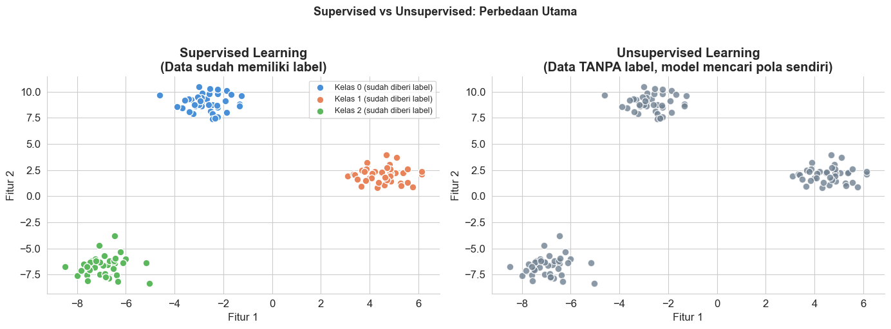
    


---

## 2. Pengantar Reinforcement Learning

Selain *supervised* dan *unsupervised learning*, ada paradigma ketiga yang
cara belajarnya paling berbeda, yaitu ***reinforcement learning* (RL)**. Tidak seperti *supervised learning* yang memiliki label, *reinforcement learning* justru belajar melalui interaksi dengan lingkungannya. *Reinforcement learning* belajar membuat pilihan optimal dengan serangkaian *trial-and-error*.

Analoginya kurang lebih sama seperti proses melatih anjing. Misalnya Anda seorang *trainer* yang sedang melatih anjing untuk duduk. Jika anjing yang Anda latih duduk saat diperintah, maka Anda sebagai *trainer* akan memberikan hadiah (*reward*). Namun, jika anjing yang Anda latih tidak duduk sesuai perintah, maka Anda tidak memberikan hadiah. Dari proses latihan ini, anjing akan belajar mengenai tindakan apa yang perlu ia lakukan untuk mendapatkan hadiah maksimal.


Paradigma *reinforcement learning* terdiri atas 5 komponen utama, yaitu 
* **agen (*agent*)**, program yang sedang menjalani proses *training*,
* **lingkungan (*environment*)** yang menjadi lokasi agen, 
* **tindakan (*action* $a_t$)** yang dapat dilakukan oleh agen, 
* **keadaan (*state* $s_t$)** dari kondisi lingkungan terkini,
* **hadiah (*reward* $r_t$)**, sinyal umpan balik berupa nilai +1, 0, atau -1 yang diperoleh agen berdasarkan tindakan yang dipilih. 

Adapun cara kerjanya terdiri atas beberapa tahapan berikut.
1. Agen mengamati keadaan lingkungan terkini dan memilih sebuah aksi berdasarkan kebijakannya, yaitu strategi yang telah dipelajari terkait aksi apa yang perlu dilakukan pada tiap situasi.
2. Lingkungan menerima aksi, transisi ke keadaan baru, dan mengirim kembali sinyal hadiah berupa angka yang memberitahu agen seberapa bagus atau buruknya *outcome* yang diperoleh.
3. Tujuan dari agen adalah untuk memaksimalkan *reward* kumulatif, yaitu total semua *reward* yang diterima, difaktorkan dengan $\gamma$ sehingga *reward* baru lebih penting dibandingkan *reward* yang sudah lama.
4. Setelah beberapa iterasi, agen menyesuaikan kebijakannya untuk memilih aksi yang dapat mengarah pada *reward* yang lebih tinggi. Proses perulangan *trial-and-error* ini merupakan esensi dari RL.

Saat ini, paradigma RL telah diterapkan pada banyak bidang. Beberapa diantaranya adalah:
- **AlphaGo/AlphaZero** (DeepMind): Menguasai permainan Go, Chess, dan Shogi melebihi juara dunia manusia.
- **ChatGPT**: Menggunakan RLHF (Reinforcement Learning from Human Feedback) untuk belajar merespons dengan baik.
- **Robotika**: Robot belajar berjalan, mengambil objek, atau melipat pakaian.
- **Rekomendasi konten**: Platform seperti YouTube mengoptimalkan waktu tonton pengguna.
- **Trading algoritmik**: Agen belajar kapan harus beli/jual aset untuk memaksimalkan profit.

RL berbeda dengan *supervised* dan *unsupervised learning* karena RL tidak belajar dari dataset tetap. Ia belajar dari **interaksi langsung** dengan lingkungan, sering kali melalui jutaan percobaan (*trial and error*).
Ini membuatnya sangat powerful tapi juga mahal secara komputasi.


RL membutuhkan pembahasan yang lebih dalam. Artikel ini hanya mengenal konsep dasarnya sebagai pelengkap paradigma *machine learning*.



---

## 3. Algoritma Clustering Populer

**Clustering** adalah tugas mengelompokkan data sehingga data dalam satu kelompok
(**cluster**) lebih mirip satu sama lain dibanding data di kelompok lain.

Kita akan menggunakan dua dataset untuk mendemonstrasikan algoritma yang berbeda:
- **Dataset blob**: Data berbentuk bola-bola rapi (cocok untuk K-Means)
- **Dataset bulan**: Data berbentuk melengkung/tidak beraturan (menantang untuk K-Means)


```python
# Membuat dua dataset untuk perbandingan
np.random.seed(42)

# Dataset 1: Blob (bulat, terpisah jelas)
X_blob, y_blob = make_blobs(n_samples=300, centers=4,
                             cluster_std=0.9, random_state=42)

# Dataset 2: Bulan (melengkung, tidak beraturan)
X_moon, y_moon = make_moons(n_samples=300, noise=0.08, random_state=42)

# Normalisasi
scaler = StandardScaler()
X_blob_s = scaler.fit_transform(X_blob)
X_moon_s = StandardScaler().fit_transform(X_moon)

fig, axes = plt.subplots(1, 2, figsize=(13, 5))

axes[0].scatter(X_blob_s[:, 0], X_blob_s[:, 1],
                color='slategray', s=40, alpha=0.7, edgecolors='none')
axes[0].set_title('Dataset 1: Blob (Bulat & Terpisah)', fontweight='bold')

axes[1].scatter(X_moon_s[:, 0], X_moon_s[:, 1],
                color='slategray', s=40, alpha=0.7, edgecolors='none')
axes[1].set_title('Dataset 2: Moon (Melengkung & Tidak Beraturan)', fontweight='bold')

for ax in axes:
    ax.set_xlabel('Fitur 1 (scaled)')
    ax.set_ylabel('Fitur 2 (scaled)')
    ax.spines[['top', 'right']].set_visible(False)

plt.suptitle('Dua Dataset untuk Menguji Algoritma Clustering',
             fontsize=13, fontweight='bold', y=1.02)
plt.tight_layout()
plt.show()

```


    
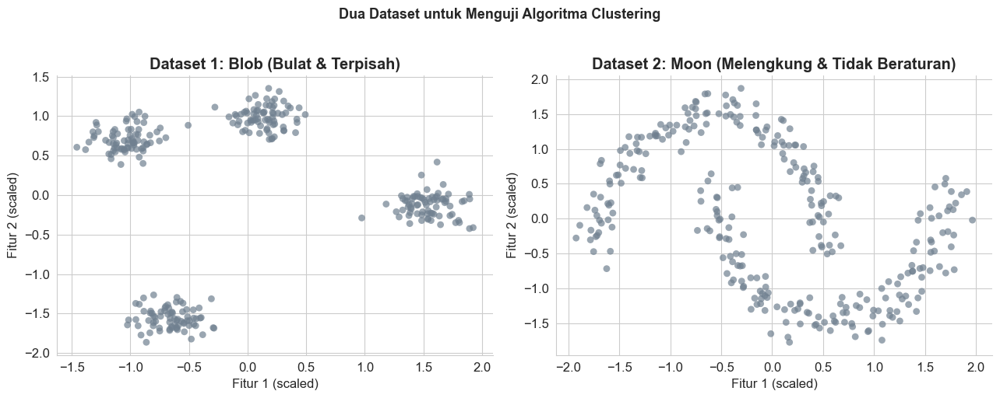
    


### 3.1 K-Means Clustering

**Intuisi:** K-Means bekerja seperti pemilihan ketua kelompok.
Tentukan dulu berapa banyak kelompok yang ingin dibuat (K), lalu algoritma:

1. Menempatkan K titik pusat (**centroid**) secara acak.
2. Setiap data "bergabung" ke centroid yang paling dekat.
3. Centroid dipindahkan ke rata-rata posisi anggotanya.
4. Langkah 2-3 diulang sampai centroid tidak bergerak lagi.

**Formula jarak (Euclidean):**

$$d(x, c) = \sqrt{\sum_{i=1}^{n} (x_i - c_i)^2}$$

**Yang dioptimalkan** (meminimalkan inertia):

$$J = \sum_{k=1}^{K} \sum_{x \in C_k} ||x - \mu_k||^2$$

Dimana $\mu_k$ adalah centroid cluster ke-$k$.

**Keterbatasan:** K-Means hanya bekerja baik untuk cluster berbentuk bulat dan berukuran mirip.


```python
# K-Means pada Dataset Blob
kmeans = KMeans(n_clusters=4, random_state=42, n_init=10)
labels_km = kmeans.fit_predict(X_blob_s)
centroids = kmeans.cluster_centers_

palette = ['#4A90D9', '#E8835A', '#5CB85C', '#9B59B6']

fig, axes = plt.subplots(1, 2, figsize=(14, 5))

# Hasil clustering
for k in range(4):
    mask = labels_km == k
    axes[0].scatter(X_blob_s[mask, 0], X_blob_s[mask, 1],
                    color=palette[k], s=45, alpha=0.8,
                    edgecolors='white', linewidth=0.4, label=f'Cluster {k}')
axes[0].scatter(centroids[:, 0], centroids[:, 1],
                color='black', marker='X', s=200, zorder=5, label='Centroid')
axes[0].set_title(f'K-Means (K=4) pada Dataset Blob\nSilhouette Score: {silhouette_score(X_blob_s, labels_km):.3f}',
                  fontweight='bold')
axes[0].legend(fontsize=9)

# Mencari K optimal: Elbow Method
inertias = []
sil_scores = []
K_range = range(2, 9)
for k in K_range:
    km = KMeans(n_clusters=k, random_state=42, n_init=10)
    km.fit(X_blob_s)
    inertias.append(km.inertia_)
    sil_scores.append(silhouette_score(X_blob_s, km.labels_))

ax2 = axes[1]
color1, color2 = '#4A90D9', '#E8835A'
ax2.plot(K_range, inertias, 'o-', color=color1, linewidth=2, markersize=7, label='Inertia (Elbow)')
ax2.set_xlabel('Jumlah Cluster (K)')
ax2.set_ylabel('Inertia', color=color1)
ax2.tick_params(axis='y', labelcolor=color1)

ax2b = ax2.twinx()
ax2b.plot(K_range, sil_scores, 's--', color=color2, linewidth=2, markersize=7, label='Silhouette Score')
ax2b.set_ylabel('Silhouette Score', color=color2)
ax2b.tick_params(axis='y', labelcolor=color2)

ax2.set_title('Elbow Method: Mencari K Optimal', fontweight='bold')
ax2.axvline(4, color='gray', linestyle=':', linewidth=1.5, alpha=0.7)
ax2.text(4.1, max(inertias)*0.85, 'K optimal = 4', color='gray', fontsize=9)
ax2.spines[['top']].set_visible(False)

lines1, labels1 = ax2.get_legend_handles_labels()
lines2, labels2 = ax2b.get_legend_handles_labels()
ax2.legend(lines1 + lines2, labels1 + labels2, fontsize=9)

plt.tight_layout()
plt.show()

print(f"K-Means Blob - Silhouette Score: {silhouette_score(X_blob_s, labels_km):.4f}")
print("(Silhouette Score mendekati 1.0 = cluster sangat terpisah dengan baik)")

```


    
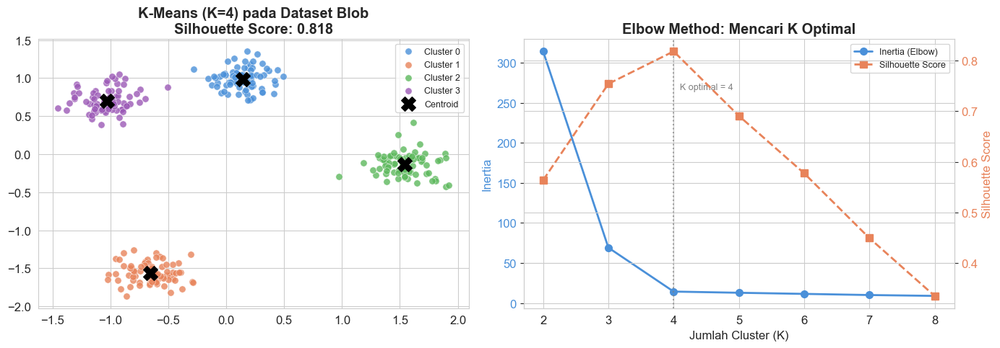
    


    K-Means Blob - Silhouette Score: 0.8179
    (Silhouette Score mendekati 1.0 = cluster sangat terpisah dengan baik)
    

> **Silhouette Score** mengukur seberapa baik setiap titik data cocok dengan cluster-nya
> dibanding cluster tetangga. Nilainya antara -1 hingga 1:
> - Mendekati **1**: Cluster terpisah dengan sangat baik.
> - Mendekati **0**: Data berada di batas antar cluster.
> - Mendekati **-1**: Data mungkin masuk ke cluster yang salah.


### 3.2 Hierarchical Clustering

**Intuisi:** Bayangkan kamu membangun pohon silsilah keluarga.
Hierarchical Clustering membangun sebuah **dendrogram** (pohon hierarki):

- **Agglomerative (Bottom-up):** Mulai dari setiap titik sebagai cluster sendiri,
  lalu gabungkan dua cluster yang paling dekat satu per satu, terus-menerus,
  hingga semua menjadi satu cluster besar.
- **Divisive (Top-down):** Kebalikannya, mulai dari satu cluster besar lalu pecah terus.

Pendekatan yang paling umum adalah **Agglomerative**.

**Cara membaca dendrogram:** Semakin tinggi garis horizontal tempat dua cabang bergabung,
semakin tidak mirip kedua cluster tersebut. Kita memotong dendrogram di ketinggian tertentu
untuk menentukan jumlah cluster.

**Kelebihan dibanding K-Means:** Tidak perlu menentukan K dari awal;
kita bisa melihat dendrogram dan memilih K belakangan.


```python
# Hierarchical Clustering
fig, axes = plt.subplots(1, 2, figsize=(14, 5))

# Dendrogram
Z = linkage(X_blob_s[:80], method='ward')  # Pakai subset agar dendrogram tidak terlalu padat
dendrogram(Z, ax=axes[0], leaf_rotation=90, leaf_font_size=7,
           color_threshold=3.5,
           above_threshold_color='lightgray')
axes[0].axhline(y=3.5, color='tomato', linestyle='--', linewidth=2, label='Garis potong (K=4)')
axes[0].set_title('Dendrogram (Hierarchical Clustering)', fontweight='bold')
axes[0].set_xlabel('Indeks Data')
axes[0].set_ylabel('Jarak Penggabungan')
axes[0].legend(fontsize=9)
axes[0].spines[['top', 'right']].set_visible(False)

# Hasil clustering
hier = AgglomerativeClustering(n_clusters=4, linkage='ward')
labels_hier = hier.fit_predict(X_blob_s)

for k in range(4):
    mask = labels_hier == k
    axes[1].scatter(X_blob_s[mask, 0], X_blob_s[mask, 1],
                    color=palette[k], s=45, alpha=0.8,
                    edgecolors='white', linewidth=0.4, label=f'Cluster {k}')
sil_hier = silhouette_score(X_blob_s, labels_hier)
axes[1].set_title(f'Hasil Hierarchical Clustering (K=4)\nSilhouette Score: {sil_hier:.3f}',
                  fontweight='bold')
axes[1].legend(fontsize=9)
axes[1].set_xlabel('Fitur 1 (scaled)')
axes[1].set_ylabel('Fitur 2 (scaled)')
axes[1].spines[['top', 'right']].set_visible(False)

plt.tight_layout()
plt.show()

```


    
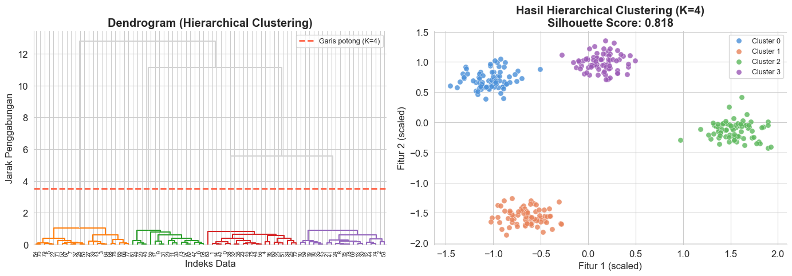
    


### 3.3 DBSCAN (Density-Based Spatial Clustering)

**Intuisi:** K-Means dan Hierarchical kesulitan menangani cluster yang bentuknya tidak beraturan.
DBSCAN menggunakan pendekatan berbeda: ia mendefinisikan cluster sebagai
**wilayah padat** yang dipisahkan oleh wilayah jarang.

Bayangkan kerumunan orang di pusat perbelanjaan. DBSCAN bisa menemukan
"kelompok kerumunan" yang bentuknya tidak perlu bulat, dan menandai
orang-orang yang berdiri sendiri sebagai **outlier (noise)**.

**Dua parameter kunci:**
- **eps** ($\varepsilon$): Radius tetangga. Seberapa jauh dua titik masih dianggap "dekat"?
- **min_samples**: Minimal berapa titik dalam radius eps agar sebuah area disebut "padat"?

**Tiga jenis titik dalam DBSCAN:**

| Tipe              | Penjelasan                                                    |
| ----------------- | ------------------------------------------------------------- |
| **Core Point**    | Memiliki minimal `min_samples` tetangga dalam radius `eps`    |
| **Border Point**  | Dalam radius `eps` dari core point, tapi tidak cukup tetangga |
| **Noise/Outlier** | Tidak termasuk cluster mana pun                               |

**Kelebihan utama:** Tidak perlu menentukan K, bisa menemukan cluster berbentuk sembarang,
dan otomatis mendeteksi outlier.


```python
# DBSCAN: perbandingan di dataset Blob dan Moon
fig, axes = plt.subplots(2, 3, figsize=(16, 10))

datasets = [('Blob', X_blob_s, y_blob), ('Moon', X_moon_s, y_moon)]
configs = [
    ('K-Means (K=2)',   None,  None),
    ('DBSCAN',          None,  None),
    ('Label Asli',      None,  None),
]

for row, (ds_name, X_ds, y_ds) in enumerate(datasets):
    # K-Means
    n_true = len(np.unique(y_ds))
    km_ds = KMeans(n_clusters=n_true, random_state=42, n_init=10)
    lbl_km = km_ds.fit_predict(X_ds)

    # DBSCAN
    eps_val = 0.3 if ds_name == 'Moon' else 0.5
    db = DBSCAN(eps=eps_val, min_samples=8)
    lbl_db = db.fit_predict(X_ds)

    for col, (labels, title) in enumerate([
        (lbl_km, f'K-Means'),
        (lbl_db, f'DBSCAN (eps={eps_val})'),
        (y_ds,   f'Label Asli'),
    ]):
        ax = axes[row][col]
        unique_labels = np.unique(labels)
        cmap = plt.cm.get_cmap('tab10', len(unique_labels))

        for i, lbl in enumerate(unique_labels):
            mask = labels == lbl
            if lbl == -1:
                ax.scatter(X_ds[mask, 0], X_ds[mask, 1],
                           color='black', s=30, marker='x',
                           linewidths=1.5, label='Noise/Outlier', zorder=5)
            else:
                ax.scatter(X_ds[mask, 0], X_ds[mask, 1],
                           color=cmap(i), s=40, alpha=0.8,
                           edgecolors='white', linewidth=0.3,
                           label=f'Cluster {lbl}')
        noise_count = np.sum(labels == -1)
        n_clusters = len([l for l in unique_labels if l != -1])
        ax.set_title(f'[{ds_name}] {title}\nCluster: {n_clusters} | Noise: {noise_count}',
                     fontweight='bold', fontsize=10)
        ax.set_xlabel('Fitur 1'); ax.set_ylabel('Fitur 2')
        ax.spines[['top', 'right']].set_visible(False)

plt.suptitle('Perbandingan K-Means vs DBSCAN vs Label Asli\npada Dataset Blob dan Moon',
             fontsize=13, fontweight='bold', y=1.01)
plt.tight_layout()
plt.show()

```


    
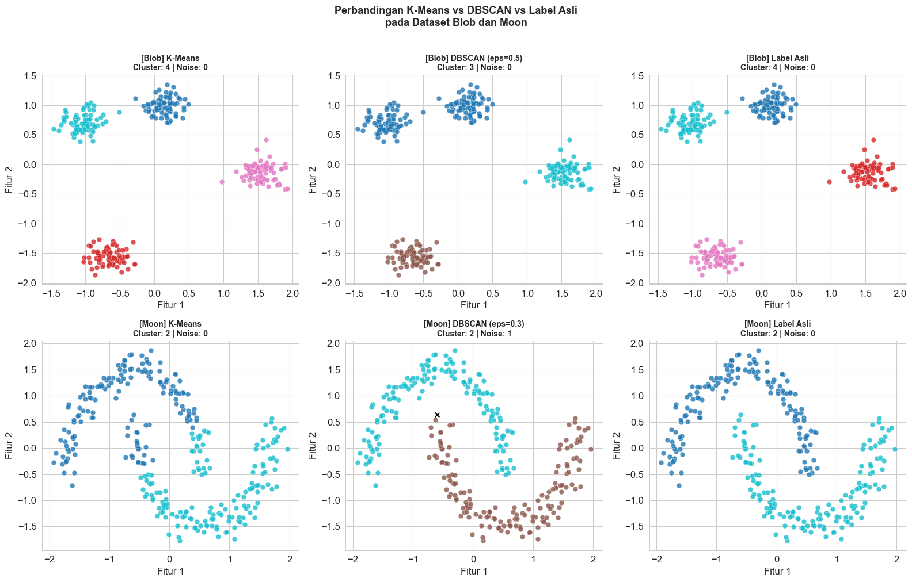
    


### 3.4 Use Case dan Perbandingan Algoritma Clustering

| Algoritma        | Kelebihan                                                     | Keterbatasan                                | Gunakan Saat...                                                     |
| ---------------- | ------------------------------------------------------------- | ------------------------------------------- | ------------------------------------------------------------------- |
| **K-Means**      | Cepat, mudah diinterpretasi, skalabel untuk data besar        | Perlu tentukan K, hanya untuk cluster bulat | Segmentasi pelanggan, kompresi warna gambar                         |
| **Hierarchical** | Tidak perlu tentukan K dari awal, menghasilkan dendrogram     | Lambat untuk data besar (O(n^3))            | Data kecil, analisis filogenetik, analisis dokumen                  |
| **DBSCAN**       | Tidak perlu K, bisa temukan bentuk sembarang, deteksi outlier | Sensitif terhadap eps dan min_samples       | Deteksi anomali, analisis data geospasial, data dengan noise tinggi |


```python
# Ringkasan performa ketiga algoritma pada dataset blob
results = []
for name, labels in [
    ('K-Means (K=4)',       KMeans(n_clusters=4, random_state=42, n_init=10).fit_predict(X_blob_s)),
    ('Hierarchical (K=4)',  AgglomerativeClustering(n_clusters=4).fit_predict(X_blob_s)),
    ('DBSCAN',              DBSCAN(eps=0.5, min_samples=8).fit_predict(X_blob_s)),
]:
    valid = labels[labels != -1]
    X_valid = X_blob_s[labels != -1]
    n_clusters = len(set(valid))
    n_noise = np.sum(labels == -1)
    sil = silhouette_score(X_valid, valid) if n_clusters > 1 else float('nan')
    results.append({'Algoritma': name, 'Jumlah Cluster': n_clusters,
                    'Noise Points': n_noise, 'Silhouette Score': f'{sil:.4f}'})

df_res = pd.DataFrame(results)
print("Ringkasan Performa pada Dataset Blob:")
print(df_res.to_string(index=False))

```

    Ringkasan Performa pada Dataset Blob:
             Algoritma  Jumlah Cluster  Noise Points Silhouette Score
         K-Means (K=4)               4             0           0.8179
    Hierarchical (K=4)               4             0           0.8179
                DBSCAN               3             0           0.7539
    

---

## 4. Dimensionality Reduction (Pengurangan Dimensi)

### Mengapa Ini Penting?

Data di dunia nyata sering kali memiliki **puluhan atau ratusan fitur**.
Ini menciptakan dua masalah besar:

1. **Curse of Dimensionality:** Semakin banyak fitur, data menjadi semakin "jarang"
   di ruang fitur, membuat algoritma ML sulit belajar.
2. **Visualisasi:** Kita tidak bisa memvisualisasikan data berdimensi tinggi secara langsung.

**Dimensionality reduction** memampatkan banyak fitur menjadi lebih sedikit
(biasanya 2 atau 3) tanpa kehilangan terlalu banyak informasi.

```
Data asli: 100 fitur    -->    Reduksi    -->    2 fitur (bisa divisualisasikan)
[f1, f2, f3, ..., f100]  -->  Algoritma  -->    [komponen_1, komponen_2]
```

Kita akan menggunakan dataset **Iris** (4 fitur) sebagai contoh.


```python
# Memuat dataset Iris sebagai data berdimensi lebih tinggi
iris = load_iris()
X_iris = iris.data      # 4 fitur
y_iris = iris.target
target_names = iris.target_names

print("Dataset Iris:")
print(f"  Jumlah data  : {X_iris.shape[0]}")
print(f"  Jumlah fitur : {X_iris.shape[1]}")
print(f"  Nama fitur   : {list(iris.feature_names)}")
print(f"  Nama kelas   : {list(target_names)}")
print(f"\nTantangan: Bagaimana memvisualisasikan 4 dimensi sekaligus?")
print("Solusi: Kurangi menjadi 2 dimensi menggunakan PCA atau t-SNE!")

```

    Dataset Iris:
      Jumlah data  : 150
      Jumlah fitur : 4
      Nama fitur   : ['sepal length (cm)', 'sepal width (cm)', 'petal length (cm)', 'petal width (cm)']
      Nama kelas   : ['setosa', 'versicolor', 'virginica']
    
    Tantangan: Bagaimana memvisualisasikan 4 dimensi sekaligus?
    Solusi: Kurangi menjadi 2 dimensi menggunakan PCA atau t-SNE!
    

### 4.1 PCA (Principal Component Analysis)

**Intuisi:** Bayangkan kamu punya data 3 dimensi (titik-titik mengambang di ruang).
PCA mencari **arah (komponen) yang merangkum variansi terbesar** dalam data,
lalu memproyeksikan data ke arah tersebut.

Analogi lebih sederhana: bayangkan kamu memotret sebuah patung dari berbagai sudut.
PCA memilih **sudut terbaik** yang menampilkan paling banyak detail patung tersebut.

**Dua konsep kunci:**
- **Principal Component (PC):** Arah baru yang merangkum variansi terbesar.
- **Explained Variance:** Berapa persen informasi asli yang dipertahankan oleh setiap PC.

**Formula PC pertama:**

$$PC_1 = w_1 x_1 + w_2 x_2 + \ldots + w_n x_n$$

Dimana $w$ adalah bobot (loadings) yang dipilih agar variansi di arah ini maksimal.

**Sifat PCA:** Linier dan deterministik. Hasilnya selalu sama untuk data yang sama.

**Catatan penting:** PCA tidak menjamin bahwa kelas yang berbeda akan terpisah secara visual.
Ia hanya mempertahankan variansi, bukan informasi tentang kelas.


```python
# Normalisasi data
scaler_iris = StandardScaler()
X_iris_s = scaler_iris.fit_transform(X_iris)

# PCA ke 2 komponen
pca = PCA(n_components=2, random_state=42)
X_pca = pca.fit_transform(X_iris_s)

fig, axes = plt.subplots(1, 2, figsize=(14, 5))

# Plot hasil PCA
palette_iris = ['#4A90D9', '#E8835A', '#5CB85C']
for i, name in enumerate(target_names):
    mask = y_iris == i
    axes[0].scatter(X_pca[mask, 0], X_pca[mask, 1],
                    color=palette_iris[i], label=name,
                    s=60, edgecolors='white', linewidth=0.5)
axes[0].set_xlabel(f'PC 1 ({pca.explained_variance_ratio_[0]*100:.1f}% variansi)')
axes[0].set_ylabel(f'PC 2 ({pca.explained_variance_ratio_[1]*100:.1f}% variansi)')
axes[0].set_title('Hasil PCA: Iris 4D -> 2D', fontweight='bold')
axes[0].legend()
axes[0].spines[['top', 'right']].set_visible(False)

# Scree Plot: Explained Variance
pca_full = PCA(random_state=42)
pca_full.fit(X_iris_s)
evr = pca_full.explained_variance_ratio_
cumulative = np.cumsum(evr)

axes[1].bar(range(1, len(evr)+1), evr*100, color='#4A90D9',
            edgecolor='white', label='Variansi per PC')
axes[1].plot(range(1, len(evr)+1), cumulative*100, 'o-',
             color='coral', linewidth=2, markersize=8, label='Variansi Kumulatif')
axes[1].axhline(95, color='gray', linestyle='--', linewidth=1, alpha=0.7)
axes[1].text(3.5, 96, '95% threshold', color='gray', fontsize=9)
axes[1].set_xlabel('Nomor Principal Component')
axes[1].set_ylabel('Explained Variance (%)')
axes[1].set_title('Scree Plot: Variansi yang Dijelaskan Tiap PC', fontweight='bold')
axes[1].legend(fontsize=9)
axes[1].spines[['top', 'right']].set_visible(False)
axes[1].set_xticks(range(1, len(evr)+1))

plt.tight_layout()
plt.show()

total_2pc = sum(pca.explained_variance_ratio_) * 100
print(f"Total variansi yang dipertahankan oleh 2 PC: {total_2pc:.1f}%")
print(f"Artinya: dengan hanya 2 fitur (dari 4), kita mempertahankan {total_2pc:.0f}% informasi asli.")

```


    
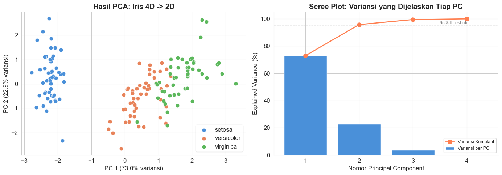
    


    Total variansi yang dipertahankan oleh 2 PC: 95.8%
    Artinya: dengan hanya 2 fitur (dari 4), kita mempertahankan 96% informasi asli.
    


```python
# Visualisasi: arti tiap PC (loading plot)
fig, ax = plt.subplots(figsize=(9, 5))

feature_names_short = ['Sepal Len', 'Sepal Wid', 'Petal Len', 'Petal Wid']
loadings = pca.components_.T

for i, (name, load) in enumerate(zip(feature_names_short, loadings)):
    ax.annotate('', xy=(load[0]*3, load[1]*3), xytext=(0, 0),
                arrowprops=dict(arrowstyle='->', color=palette_iris[i % 3], lw=2.5))
    ax.text(load[0]*3.2, load[1]*3.2, name, fontsize=11,
            color=palette_iris[i % 3], fontweight='bold')

ax.set_xlim(-2, 2); ax.set_ylim(-2, 2)
ax.axhline(0, color='gray', linewidth=0.5); ax.axvline(0, color='gray', linewidth=0.5)
ax.set_xlabel('PC 1'); ax.set_ylabel('PC 2')
ax.set_title('Loading Plot: Kontribusi Fitur Asli ke Setiap PC', fontweight='bold')
ax.spines[['top', 'right']].set_visible(False)
plt.tight_layout()
plt.show()

print("Interpretasi Loading Plot:")
print("  - Panah panjang = fitur tersebut sangat mempengaruhi PC tersebut.")
print("  - Panah searah = fitur berkorelasi positif.")
print("  - Panah berlawanan arah = fitur berkorelasi negatif.")

```


    
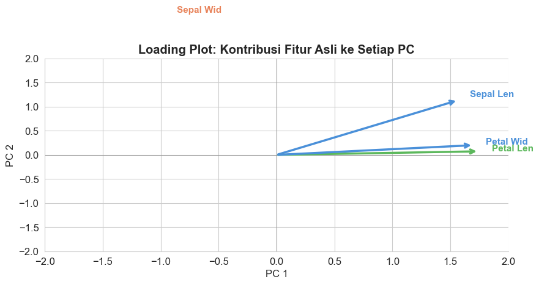
    


    Interpretasi Loading Plot:
      - Panah panjang = fitur tersebut sangat mempengaruhi PC tersebut.
      - Panah searah = fitur berkorelasi positif.
      - Panah berlawanan arah = fitur berkorelasi negatif.
    

### 4.2 t-SNE untuk Visualisasi

**Intuisi:** PCA bekerja secara linier: ia mencari kombinasi linier fitur terbaik.
Bagaimana jika pola dalam data **tidak linier**?

**t-SNE (t-distributed Stochastic Neighbor Embedding)** menggunakan pendekatan berbeda:
ia berusaha mempertahankan **hubungan ketetanggaan** data.
Jika dua titik berdekatan di ruang asli, mereka akan tetap berdekatan setelah reduksi.

**Analogi:** Bayangkan kamu memetakan posisi semua kota di Indonesia ke sebuah kertas 2D.
t-SNE berusaha menjaga agar kota-kota yang dekat satu sama lain di dunia nyata
juga berdekatan di peta kertas.

**Parameter kunci:**
- **perplexity**: Mengontrol berapa banyak "tetangga" yang dipertimbangkan tiap titik.
  Nilai tipikal: 5-50. Semakin besar, cluster terlihat lebih global.

**Kapan pakai PCA vs t-SNE?**

|                            | PCA                    | t-SNE                   |
| -------------------------- | ---------------------- | ----------------------- |
| Tujuan utama               | Reduksi fitur untuk ML | Visualisasi data saja   |
| Kecepatan                  | Sangat cepat           | Lambat untuk data besar |
| Deterministik              | Ya                     | Tidak (ada elemen acak) |
| Interpretasi komponen      | Bisa                   | Tidak mudah             |
| Data besar (>10.000 baris) | Ya                     | Tidak disarankan        |


```python
# t-SNE dengan berbagai nilai perplexity
perplexities = [5, 30, 50]
fig, axes = plt.subplots(1, 3, figsize=(16, 5))

for ax, perp in zip(axes, perplexities):
    tsne = TSNE(n_components=2, perplexity=perp, random_state=42, max_iter=1000)
    X_tsne = tsne.fit_transform(X_iris_s)

    for i, name in enumerate(target_names):
        mask = y_iris == i
        ax.scatter(X_tsne[mask, 0], X_tsne[mask, 1],
                   color=palette_iris[i], label=name,
                   s=55, edgecolors='white', linewidth=0.4)
    ax.set_title(f't-SNE (perplexity={perp})', fontweight='bold')
    ax.set_xlabel('Dimensi 1'); ax.set_ylabel('Dimensi 2')
    ax.legend(fontsize=8)
    ax.spines[['top', 'right']].set_visible(False)

plt.suptitle('t-SNE: Pengaruh Parameter Perplexity\n(Sumbu tidak memiliki makna interpretasi)',
             fontsize=12, fontweight='bold', y=1.02)
plt.tight_layout()
plt.show()

```


    
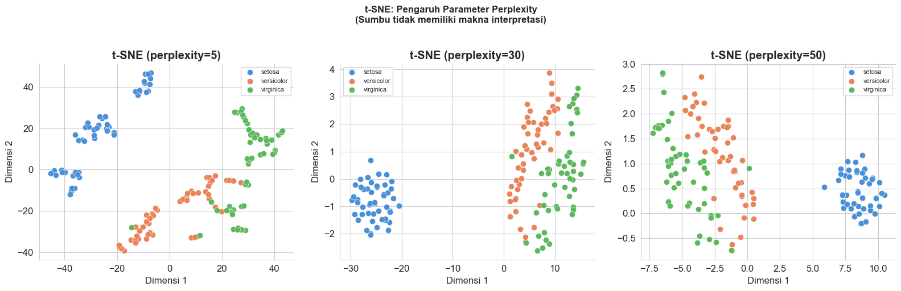
    


```python
# Perbandingan langsung PCA vs t-SNE
fig, axes = plt.subplots(1, 2, figsize=(14, 5))

# PCA
for i, name in enumerate(target_names):
    mask = y_iris == i
    axes[0].scatter(X_pca[mask, 0], X_pca[mask, 1],
                    color=palette_iris[i], label=name,
                    s=60, edgecolors='white', linewidth=0.4)
axes[0].set_title(f'PCA\n({pca.explained_variance_ratio_.sum()*100:.1f}% variansi dipertahankan)',
                  fontweight='bold')
axes[0].set_xlabel('PC 1'); axes[0].set_ylabel('PC 2')
axes[0].legend()
axes[0].spines[['top', 'right']].set_visible(False)

# t-SNE (perplexity=30)
tsne_best = TSNE(n_components=2, perplexity=30, random_state=42, max_iter=1000)
X_tsne_best = tsne_best.fit_transform(X_iris_s)
for i, name in enumerate(target_names):
    mask = y_iris == i
    axes[1].scatter(X_tsne_best[mask, 0], X_tsne_best[mask, 1],
                    color=palette_iris[i], label=name,
                    s=60, edgecolors='white', linewidth=0.4)
axes[1].set_title('t-SNE (perplexity=30)\n(Hanya untuk visualisasi, bukan reduksi fitur)',
                  fontweight='bold')
axes[1].set_xlabel('Dimensi 1'); axes[1].set_ylabel('Dimensi 2')
axes[1].legend()
axes[1].spines[['top', 'right']].set_visible(False)

plt.suptitle('PCA vs t-SNE: Dua Pendekatan Dimensionality Reduction',
             fontsize=13, fontweight='bold', y=1.02)
plt.tight_layout()
plt.show()

print("Perhatikan:")
print("  PCA    : Cluster Setosa terpisah jelas, Versicolor dan Virginica sedikit tumpang tindih.")
print("  t-SNE  : Ketiga kelas terpisah lebih jelas, tapi posisi/jarak antar cluster tidak bermakna.")

```


    
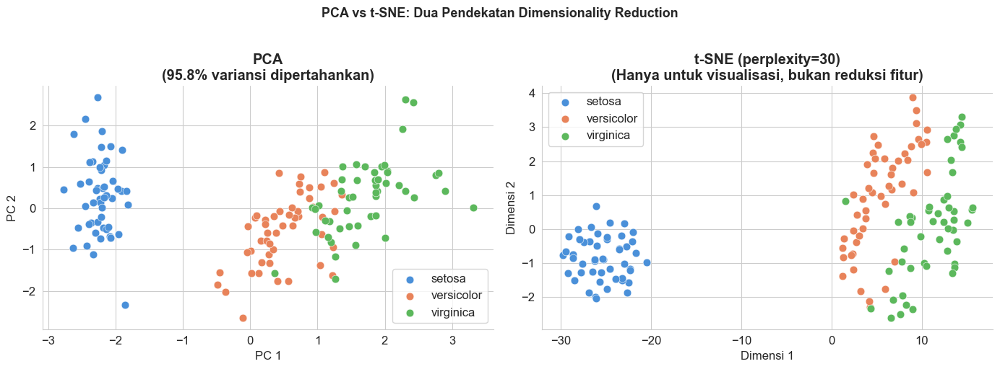
    


    Perhatikan:
      PCA    : Cluster Setosa terpisah jelas, Versicolor dan Virginica sedikit tumpang tindih.
      t-SNE  : Ketiga kelas terpisah lebih jelas, tapi posisi/jarak antar cluster tidak bermakna.
    

---

## 5. Kapan Menggunakan Supervised vs Unsupervised?

Ini adalah pertanyaan yang paling sering muncul dari praktisi ML pemula.
Jawabannya bergantung pada beberapa faktor kunci.


```python
# Flowchart pemilihan paradigma ML
fig, ax = plt.subplots(figsize=(14, 12))
ax.set_xlim(0, 14); ax.set_ylim(0, 12); ax.axis('off')

def draw_box(ax, x, y, w, h, text, color, text_color='white', fontsize=10, style='round,pad=0.1'):
    box = mpatches.FancyBboxPatch((x - w/2, y - h/2), w, h,
                                   boxstyle=style,
                                   facecolor=color, edgecolor='white',
                                   linewidth=1.5, zorder=3)
    ax.add_patch(box)
    ax.text(x, y, text, ha='center', va='center', fontsize=fontsize,
            fontweight='bold', color=text_color, zorder=4,
            multialignment='center', wrap=True)

def arrow(ax, x1, y1, x2, y2, label='', color='#555'):
    ax.annotate('', xy=(x2, y2), xytext=(x1, y1),
                arrowprops=dict(arrowstyle='->', color=color, lw=1.8))
    if label:
        mx, my = (x1+x2)/2, (y1+y2)/2
        ax.text(mx+0.15, my, label, fontsize=9, color=color, fontweight='bold')

# Node utama
draw_box(ax, 7, 11, 5, 0.9, 'Mulai: Apa yang ingin kamu lakukan?',
         '#2c3e50', fontsize=11)

# Pertanyaan 1
draw_box(ax, 7, 9.5, 6, 0.9,
         'Apakah data kamu sudah\nmemiliki label/jawaban?',
         '#7f8c8d', fontsize=10)
arrow(ax, 7, 10.55, 7, 9.95)

# Ya -> Supervised
draw_box(ax, 3, 8, 4, 0.9, 'SUPERVISED LEARNING', '#4A90D9', fontsize=11)
arrow(ax, 4, 9.5, 3, 8.45, 'Ya')

# Tidak -> Unsupervised
draw_box(ax, 11, 8, 4, 0.9, 'UNSUPERVISED LEARNING', '#E8835A', fontsize=11)
arrow(ax, 10, 9.5, 11, 8.45, 'Tidak')

# Supervised -> Klasifikasi / Regresi
draw_box(ax, 3, 6.5, 5.5, 0.9,
         'Apakah outputnya\nkategori atau angka?', '#7f8c8d', fontsize=10)
arrow(ax, 3, 7.55, 3, 6.95)

draw_box(ax, 1.2, 5.0, 2.2, 0.85, 'Klasifikasi', '#27ae60', fontsize=10)
arrow(ax, 2.0, 6.5, 1.5, 5.42, 'Kategori')

draw_box(ax, 4.8, 5.0, 2.2, 0.85, 'Regresi', '#27ae60', fontsize=10)
arrow(ax, 4.0, 6.5, 4.5, 5.42, 'Angka')

# Contoh Supervised
draw_box(ax, 1.2, 3.6, 2.6, 1.1,
         'Contoh:\n- Deteksi spam\n- Diagnosa penyakit\n- Pengenalan wajah',
         '#d5f5e3', '#1a5e35', fontsize=8, style='round,pad=0.1')
arrow(ax, 1.2, 4.57, 1.2, 4.16)

draw_box(ax, 4.8, 3.6, 2.6, 1.1,
         'Contoh:\n- Prediksi harga\n- Forecast penjualan\n- Estimasi umur',
         '#d5f5e3', '#1a5e35', fontsize=8, style='round,pad=0.1')
arrow(ax, 4.8, 4.57, 4.8, 4.16)

# Unsupervised -> Clustering / Dim Red
draw_box(ax, 11, 6.5, 5.5, 0.9,
         'Apa tujuan utamamu?', '#7f8c8d', fontsize=10)
arrow(ax, 11, 7.55, 11, 6.95)

draw_box(ax, 9, 5.0, 2.8, 0.85, 'Mengelompokkan\nData (Clustering)', '#9b59b6', fontsize=9)
arrow(ax, 10, 6.5, 9.3, 5.42, 'Temukan\nkelompok')

draw_box(ax, 12.8, 5.0, 2.8, 0.85, 'Menyederhanakan\nFitur (Dim. Red.)', '#9b59b6', fontsize=9)
arrow(ax, 12.0, 6.5, 12.5, 5.42, 'Kurangi\ndimensi')

# Contoh Unsupervised
draw_box(ax, 9, 3.6, 3.0, 1.1,
         'Contoh:\n- Segmentasi pelanggan\n- Deteksi anomali\n- Analisis pasar',
         '#f5eef8', '#6c3483', fontsize=8, style='round,pad=0.1')
arrow(ax, 9, 4.57, 9, 4.16)

draw_box(ax, 12.8, 3.6, 3.0, 1.1,
         'Contoh:\n- Visualisasi data\n- Kompresi gambar\n- Preprocessing ML',
         '#f5eef8', '#6c3483', fontsize=8, style='round,pad=0.1')
arrow(ax, 12.8, 4.57, 12.8, 4.16)

# RL note
draw_box(ax, 7, 2.0, 8, 1.0,
         'Paradigma Ketiga: REINFORCEMENT LEARNING\n'
         'Gunakan saat: Agent perlu belajar dari interaksi dengan lingkungan (game, robotika, optimasi)',
         '#c0392b', fontsize=9)

ax.set_title('Panduan Memilih Paradigma Machine Learning',
             fontsize=14, fontweight='bold', pad=15)
plt.tight_layout()
plt.show()

```


    
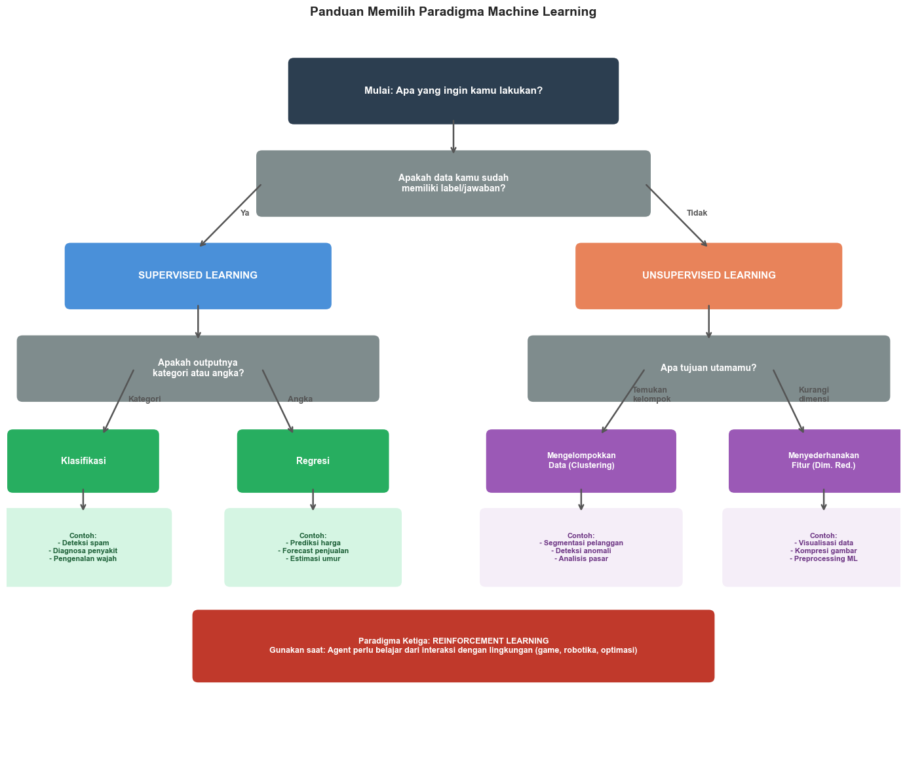
    


### 5.2 Contoh Kasus Nyata: Supervised vs Unsupervised

Mari kita lihat satu contoh konkret untuk mempertegas perbedaannya.


```python
# Contoh konkret: Analisis Pelanggan E-Commerce
np.random.seed(7)
n_cust = 200

df_cust = pd.DataFrame({
    'total_belanja_juta'  : np.round(np.random.exponential(2, n_cust), 2),
    'frekuensi_beli'      : np.random.randint(1, 30, n_cust),
    'hari_sejak_terakhir' : np.random.randint(1, 365, n_cust),
})

# ---- SKENARIO 1: Supervised ----
# "Apakah pelanggan ini akan churn (berhenti)?"
# -> Butuh label historis (churn atau tidak)
df_cust['churn'] = (
    (df_cust['hari_sejak_terakhir'] > 180) &
    (df_cust['frekuensi_beli'] < 5)
).astype(int)

# ---- SKENARIO 2: Unsupervised ----
# "Siapa saja segmen pelanggan kita?"
# -> Tidak butuh label, temukan sendiri
X_cust = StandardScaler().fit_transform(
    df_cust[['total_belanja_juta', 'frekuensi_beli', 'hari_sejak_terakhir']]
)
km_cust = KMeans(n_clusters=3, random_state=42, n_init=10)
df_cust['segmen'] = km_cust.fit_predict(X_cust)
seg_labels = {0: 'Pelanggan Aktif', 1: 'Pelanggan Pasif', 2: 'Pelanggan Premium'}
df_cust['nama_segmen'] = df_cust['segmen'].map(seg_labels)

fig, axes = plt.subplots(1, 2, figsize=(14, 6))

# Panel Supervised: Prediksi Churn
colors_churn = {0: '#5CB85C', 1: '#d9534f'}
for c in [0, 1]:
    mask = df_cust['churn'] == c
    axes[0].scatter(df_cust.loc[mask, 'frekuensi_beli'],
                    df_cust.loc[mask, 'hari_sejak_terakhir'],
                    color=colors_churn[c], s=55, alpha=0.75,
                    edgecolors='white', linewidth=0.4,
                    label='Churn' if c == 1 else 'Tidak Churn')
axes[0].axvline(5, color='gray', linestyle='--', linewidth=1.5, alpha=0.6)
axes[0].axhline(180, color='gray', linestyle='--', linewidth=1.5, alpha=0.6)
axes[0].set_xlabel('Frekuensi Beli (kali)')
axes[0].set_ylabel('Hari Sejak Terakhir Beli')
axes[0].set_title('Supervised: Prediksi Churn Pelanggan\n(Butuh label historis)', fontweight='bold')
axes[0].legend()
axes[0].spines[['top', 'right']].set_visible(False)

# Panel Unsupervised: Segmentasi
colors_seg = {'Pelanggan Aktif': '#4A90D9', 'Pelanggan Pasif': '#E8835A', 'Pelanggan Premium': '#5CB85C'}
for seg, color in colors_seg.items():
    mask = df_cust['nama_segmen'] == seg
    axes[1].scatter(df_cust.loc[mask, 'frekuensi_beli'],
                    df_cust.loc[mask, 'total_belanja_juta'],
                    color=color, s=55, alpha=0.75,
                    edgecolors='white', linewidth=0.4, label=seg)
axes[1].set_xlabel('Frekuensi Beli (kali)')
axes[1].set_ylabel('Total Belanja (juta Rp)')
axes[1].set_title('Unsupervised: Segmentasi Pelanggan\n(Tanpa label, temukan pola sendiri)',
                  fontweight='bold')
axes[1].legend()
axes[1].spines[['top', 'right']].set_visible(False)

plt.suptitle('Satu Dataset, Dua Pendekatan Berbeda',
             fontsize=13, fontweight='bold', y=1.02)
plt.tight_layout()
plt.show()

# Ringkasan segmen
print("Profil Rata-rata Tiap Segmen Pelanggan (Unsupervised):")
print(df_cust.groupby('nama_segmen')[
    ['total_belanja_juta', 'frekuensi_beli', 'hari_sejak_terakhir']
].mean().round(1).to_string())

```


    
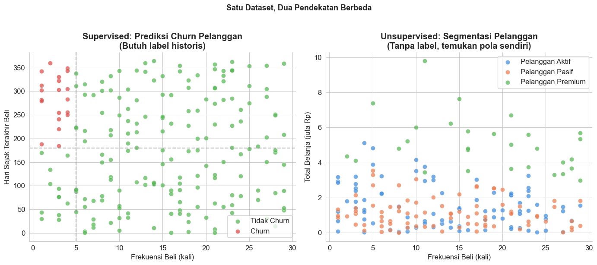
    


    Profil Rata-rata Tiap Segmen Pelanggan (Unsupervised):
                       total_belanja_juta  frekuensi_beli  hari_sejak_terakhir
    nama_segmen                                                               
    Pelanggan Aktif                   1.5            13.6                292.2
    Pelanggan Pasif                   1.1            13.5                 90.9
    Pelanggan Premium                 5.0            18.2                132.1
    

### Ringkasan: Kapan Menggunakan Paradigma yang Mana?

| Kondisi                                                      | Paradigma                     |
| ------------------------------------------------------------ | ----------------------------- |
| Punya data berlabel, ingin prediksi kelas                    | Supervised - Klasifikasi      |
| Punya data berlabel, ingin prediksi angka                    | Supervised - Regresi          |
| Tidak punya label, ingin temukan kelompok                    | Unsupervised - Clustering     |
| Data berdimensi tinggi, ingin visualisasi atau preprocessing | Unsupervised - Dim. Reduction |
| Agent harus belajar dari trial-error di lingkungan dinamis   | Reinforcement Learning        |
| Punya sedikit data berlabel dan banyak data tanpa label      | Semi-supervised Learning*     |


\**Semi-supervised Learning* adalah pendekatan hybrid yang menggabungkan sedikit data berlabel dengan banyak data tanpa label. Ini dibahas di topik lanjutan.



---