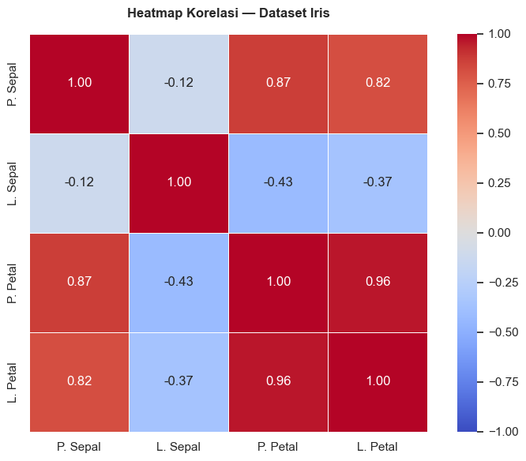

# Exploratory Data Analysis (EDA)


## 1. Definisi dan Tujuan EDA

**Exploratory Data Analysis (EDA)** adalah salah satu tahapan dalam analisis data yang bertujuan untuk **mengenal dan memahami data** sebelum melakukan pemodelan lebih lanjut. Proses mengenal dan memahami data ini dilakukan dengan mengeksplorasi dan memvisualisasikan data. EDA pertama kali diperkenalkan oleh statistikawan John Tukey pada tahun 1977[^1].

Analoginya sama seperti membaca buku baru. Untuk memahami apa yang dibahas dalam sebuah buku, hal pertama yang mungkin Anda lakukan adalah melihat sampul dan judul, membaca daftar isi, membalik halamannya secara acak, atau membaca ringkasan di bagian belakang buku. Sama halnya dengan data mentah, Anda dapat melakukan EDA untuk mendapatkan gambaran kasar tentang data yang Anda akan analisis. Tanpa EDA, Anda bisa saja menggunakan asumsi yang salah sehingga model yang Anda bangun menjadi tidak valid.

Berdasarkan deskripsi di atas, maka setidaknya ada beberapa tujuan seorang analis melakukan EDA:

1. **Memahami struktur data**: berapa banyak variabel, berapa banyak observasi, tipe data apa saja
2. **Menemukan pola**: apakah ada tren, musiman, atau hubungan antar variabel
3. **Menguji kualitas data dan mendeteksi anomali**: *outlier*, *missing values*, data yang tidak konsisten
4. **Menguji asumsi**: apakah data memenuhi asumsi yang diperlukan untuk analisis tertentu
5. **Memandu analisis selanjutnya**: menentukan metode yang paling sesuai


## 2. Jenis-Jenis EDA

Terdapat dua jenis EDA berdasarkan jumlah variabelnya, yaitu:

- **Analisis Univariat** mengeksplorasi satu variabel pada satu waktu untuk memahami karakteristiknya. Jenis EDA ini dapat digunakan untuk menjawab pertanyaan-pertanyaan seperti:
  - Bagaimana distribusi nilai variabel ini?
  - Berapa nilai rata-rata, median, dan modusnya?
  - Apakah ada nilai yang sangat ekstrem (outlier)?
  - Apakah distribusinya simetris atau condong ke satu sisi?
- **Analisis Bivariat/Multivariat** mengeksplorasi hubungan dari dua atau lebih variabel untuk memahami bagaimana variabel-variabel tersebut saling berinteraksi. Jenis EDA ini dapat digunakan untuk menjawab pertanyaan-pertanyaan seperti:
  - Apakah variabel A dan variabel B berkorelasi?
  - Jika A naik, apakah B cenderung naik atau turun?
  - Apakah ada kelompok/cluster yang terbentuk?
  - Variabel mana yang paling mempengaruhi variabel target?

Karena tujuan analisis univariat, bivariat, dan multivariat berbeda, maka tentu saja jenis visualisasi yang digunakan juga berbeda. Analisis univariate bisa menggunakan [histogram](#contoh-histogram), boxplot, atau barplot untuk memvisualisasikan distribusi sebuah variabel. Sementara itu, analisis bivariate/multivariate bisa menggunakan [scatter plot](#contoh-scatter-plot), line plot, atau pair plot.


## 3. Persiapan: Memuat Dataset

Tutorial ini akan menggunakan **[dataset iris](https://doi.org/10.24432/C56C76)**[^2] untuk mengilustrasikan proses EDA. Dataset ini terdiri atas 5 variabel yang mendeskripsikan tentang spesies bunga iris.

| Variabel       | Tipe         | Keterangan                                   |
| -------------- | ------------ | -------------------------------------------- |
| `sepal_length` | Numerik (cm) | Panjang kelopak luar bunga                   |
| `sepal_width`  | Numerik (cm) | Lebar kelopak luar bunga                     |
| `petal_length` | Numerik (cm) | Panjang kelopak dalam bunga                  |
| `petal_width`  | Numerik (cm) | Lebar kelopak dalam bunga                    |
| `species`      | Kategorikal  | Spesies bunga: setosa, versicolor, virginica |

Dataset ini terdiri dari **150 observasi** dengan **3 spesies** yang masing-masing memiliki 50 sampel.


```python
# ============================================================
# PERSIAPAN: Import library dan memuat dataset
# ============================================================

import pandas as pd
import numpy as np
import matplotlib.pyplot as plt
import seaborn as sns
from sklearn.datasets import load_iris

# Pengaturan tampilan
plt.rcParams['figure.figsize'] = (8, 5)
plt.rcParams['font.size'] = 12
sns.set_theme(style='whitegrid')

# Memuat dataset Iris dari sklearn (built-in, tidak butuh koneksi internet)
iris = load_iris()
df = pd.DataFrame(
    iris.data,
    columns=['sepal_length', 'sepal_width', 'petal_length', 'petal_width']
)
df['species'] = pd.Categorical.from_codes(iris.target, iris.target_names)

print("Dataset berhasil dimuat!")
print(f"Jumlah baris   : {df.shape[0]}")
print(f"Jumlah kolom   : {df.shape[1]}")
print(f"Nama kolom     : {list(df.columns)}")

```

    Dataset berhasil dimuat!
    Jumlah baris   : 150
    Jumlah kolom   : 5
    Nama kolom     : ['sepal_length', 'sepal_width', 'petal_length', 'petal_width', 'species']
    

Setelah memuat data yang akan dianalisis, salah satu langkah pertama yang perlu dilakukan adalah mencetak beberapa baris awal/akhir. Langkah ini dilakukan untuk memahami "bentuk" data yang telah dimuat, serta merupakan bentu *sanity check* untuk memastikan bahwa data yang dimuat sesuai dengan asumsi Anda sebagai analis.

Tabel berikut mengilustrasikan 5 baris pertama dataset iris.
```python
df.head()
```


<div>
<style scoped>
    .dataframe tbody tr th:only-of-type {
        vertical-align: middle;
    }

    .dataframe tbody tr th {
        vertical-align: top;
    }

    .dataframe thead th {
        text-align: right;
    }
</style>
<table border="1" class="dataframe">
  <thead>
    <tr style="text-align: right;">
      <th></th>
      <th>sepal_length</th>
      <th>sepal_width</th>
      <th>petal_length</th>
      <th>petal_width</th>
      <th>species</th>
    </tr>
  </thead>
  <tbody>
    <tr>
      <th>0</th>
      <td>5.1</td>
      <td>3.5</td>
      <td>1.4</td>
      <td>0.2</td>
      <td>setosa</td>
    </tr>
    <tr>
      <th>1</th>
      <td>4.9</td>
      <td>3.0</td>
      <td>1.4</td>
      <td>0.2</td>
      <td>setosa</td>
    </tr>
    <tr>
      <th>2</th>
      <td>4.7</td>
      <td>3.2</td>
      <td>1.3</td>
      <td>0.2</td>
      <td>setosa</td>
    </tr>
    <tr>
      <th>3</th>
      <td>4.6</td>
      <td>3.1</td>
      <td>1.5</td>
      <td>0.2</td>
      <td>setosa</td>
    </tr>
    <tr>
      <th>4</th>
      <td>5.0</td>
      <td>3.6</td>
      <td>1.4</td>
      <td>0.2</td>
      <td>setosa</td>
    </tr>
  </tbody>
</table>
</div>

Misalnya, dari contoh tabel di atas dapat dilihat bahwa empat kolom pertama merupakan angka, sementara kolom terakhir merupakan string, sehingga sudah sesuai dengan ekspektasi awal.

Selain itu, Anda juga dapat menggunakan method `info()` untuk mendapatkan informasi yang lebih detail terkait data yang sudah dimuat.

```python
df.info()
```

    <class 'pandas.core.frame.DataFrame'>
    RangeIndex: 150 entries, 0 to 149
    Data columns (total 5 columns):
     #   Column        Non-Null Count  Dtype   
    ---  ------        --------------  -----   
     0   sepal_length  150 non-null    float64 
     1   sepal_width   150 non-null    float64 
     2   petal_length  150 non-null    float64 
     3   petal_width   150 non-null    float64 
     4   species       150 non-null    category
    dtypes: category(1), float64(4)
    memory usage: 5.1 KB
    

Dari output `df.info()` di atas, apa yang bisa kita ketahui tentang dataset ini? Perhatikan tipe data setiap kolom dan apakah ada missing values.


Selain method `info()`, ada juga method `describe()` yang memberikan statistik deskriptif dari data yang dimuat.

```python
df.describe()
```


<div>
<style scoped>
    .dataframe tbody tr th:only-of-type {
        vertical-align: middle;
    }

    .dataframe tbody tr th {
        vertical-align: top;
    }

    .dataframe thead th {
        text-align: right;
    }
</style>
<table border="1" class="dataframe">
  <thead>
    <tr style="text-align: right;">
      <th></th>
      <th>sepal_length</th>
      <th>sepal_width</th>
      <th>petal_length</th>
      <th>petal_width</th>
    </tr>
  </thead>
  <tbody>
    <tr>
      <th>count</th>
      <td>150.000000</td>
      <td>150.000000</td>
      <td>150.000000</td>
      <td>150.000000</td>
    </tr>
    <tr>
      <th>mean</th>
      <td>5.843333</td>
      <td>3.057333</td>
      <td>3.758000</td>
      <td>1.199333</td>
    </tr>
    <tr>
      <th>std</th>
      <td>0.828066</td>
      <td>0.435866</td>
      <td>1.765298</td>
      <td>0.762238</td>
    </tr>
    <tr>
      <th>min</th>
      <td>4.300000</td>
      <td>2.000000</td>
      <td>1.000000</td>
      <td>0.100000</td>
    </tr>
    <tr>
      <th>25%</th>
      <td>5.100000</td>
      <td>2.800000</td>
      <td>1.600000</td>
      <td>0.300000</td>
    </tr>
    <tr>
      <th>50%</th>
      <td>5.800000</td>
      <td>3.000000</td>
      <td>4.350000</td>
      <td>1.300000</td>
    </tr>
    <tr>
      <th>75%</th>
      <td>400000</td>
      <td>3.300000</td>
      <td>5.100000</td>
      <td>1.800000</td>
    </tr>
    <tr>
      <th>max</th>
      <td>7.900000</td>
      <td>4.400000</td>
      <td>900000</td>
      <td>2.500000</td>
    </tr>
  </tbody>
</table>
</div>



Perhatikan output `df.describe()`. Kolom mana yang memiliki rentang nilai (max - min) paling besar? Apa artinya secara praktis?



## 4. Analisis Univariat

Seperti yang sudah diuraikan sebelumnya, **analisis univariat** berfokus pada **satu variabel saja** dengan tujuan untuk memahami karakteristik dan distribusi variabel tersebut. Dalam konteks ilustrasi data iris, analisis univariat dapat digunakan untuk menjawab beberapa pertanyaan, seperti:

- berapa rata-rata panjang sepal bunga iris?
- seberapa menyebar panjang sepal bunga iris?
- apakah distribusinya simetris atau condong (*skewed*)?
- apakah terdapat *outlier*?

Beberapa pertanyaan tersebut sudah terjawab dari tabel-tabel ringkasan sebelumnya. Misalnya, rata-rata tiap variabel sudah ditunjukkan pada tabel statistik deskriptif sebelumnya. Meskipun begitu, tabel tidak terlalu baik dalam menunjukkan pola, sehingga analis seringkali menggunakan plot/visualisasi untuk menunjukkan pola. 

Sebagai ilustrasi, berikut ini adalah histogram dan kurva KDE (*kernel density estimation*) dari variabel `sepal_length`.


```python
# ============================================================
# HISTOGRAM: Distribusi panjang kelopak (sepal_length)
# ============================================================

fig, axes = plt.subplots(1, 2, figsize=(12, 5))

# Histogram sederhana
axes[0].hist(df['sepal_length'], bins=20, color='steelblue', edgecolor='white')
axes[0].set_title('Histogram: Panjang Sepal', fontweight='bold')
axes[0].set_xlabel('Panjang Sepal (cm)')
axes[0].set_ylabel('Frekuensi')

# Tambahkan garis mean dan median
mean_val = df['sepal_length'].mean()
median_val = df['sepal_length'].median()
axes[0].axvline(mean_val, color='red', linestyle='--', linewidth=2, label=f'Mean: {mean_val:.2f}')
axes[0].axvline(median_val, color='orange', linestyle='--', linewidth=2, label=f'Median: {median_val:.2f}')
axes[0].legend()

# Histogram dengan kurva distribusi (KDE)
sns.histplot(df['sepal_length'], bins=20, kde=True, color='steelblue', ax=axes[1])
axes[1].set_title('Histogram + Kurva KDE: Panjang Sepal', fontweight='bold')
axes[1].set_xlabel('Panjang Sepal (cm)')
axes[1].set_ylabel('Densitas')

plt.tight_layout()
plt.show()

print(f"\nStatistik sepal_length:")
print(f"  Mean   : {mean_val:.2f} cm")
print(f"  Median : {median_val:.2f} cm")
print(f"  Std Dev: {df['sepal_length'].std():.2f} cm")
```


<a id="contoh-histogram"></a>    

    


    
    Statistik sepal_length:
      Mean   : 5.84 cm
      Median : 5.80 cm
      Std Dev: 0.83 cm
    

Berikut adalah cara untuk membaca histogram di atas.
- **Sumbu X** = nilai variabel (panjang sepal dalam cm)
- **Sumbu Y** = berapa banyak data yang jatuh pada rentang nilai tersebut
- **Batang tinggi** = nilai tersebut sering muncul
- **Garis merah (mean)** vs **garis orange (median)**: jika keduanya berdekatan, distribusi cenderung simetris


Apakah distribusi sepal_length terlihat simetris? Mean dan median berada di posisi yang hampir sama, apa artinya?



Berikut adalah contoh histogram dan KDE dari keempat variabel numerik.
```python
# ============================================================
# HISTOGRAM: Semua variabel numerik sekaligus
# ============================================================

variabel_numerik = ['sepal_length', 'sepal_width', 'petal_length', 'petal_width']
label_variabel = ['Panjang Sepal (cm)', 'Lebar Sepal (cm)', 'Panjang Petal (cm)', 'Lebar Petal (cm)']
warna = ['steelblue', 'coral', 'mediumseagreen', 'mediumpurple']

fig, axes = plt.subplots(2, 2, figsize=(12, 8))
axes = axes.flatten()

for i, (var, label, warna_) in enumerate(zip(variabel_numerik, label_variabel, warna)):
    sns.histplot(df[var], bins=20, kde=True, color=warna_, ax=axes[i])
    axes[i].set_title(f'Distribusi {label}', fontweight='bold')
    axes[i].set_xlabel(label)
    axes[i].set_ylabel('Frekuensi')
    axes[i].axvline(df[var].mean(), color='red', linestyle='--', linewidth=1.5, label='Mean')
    axes[i].legend()

plt.suptitle('Distribusi Seluruh Variabel Numerik — Dataset Iris', 
             fontsize=14, fontweight='bold', y=1.02)
plt.tight_layout()
plt.show()
```


    

    

Perhatikan perbedaan bentuk distribusi antar variabel:
- `sepal_length` dan `sepal_width` → distribusi mendekati normal (lonceng)
- `petal_length` dan `petal_width` → distribusi **bimodal** (dua puncak)

Apa yang kira-kira menyebabkan distribusi petal terlihat seperti itu? *(Petunjuk: ingat bahwa ada 3 spesies bunga dalam dataset ini)*



Selain histogram dan KDE, beberapa jenis plot lain yang umum digunakan untuk analisis univariat adalah boxplot dan violin plot, bar plot, count plot, pie chart, dan lollipop plot.


Apa perbedaan histogram dan barplot?



## 5. Analisis Bivariat/Multivariat

**Analisis bivariat** melihat **hubungan antara dua variabel** secara bersamaan. Ini membantu kita memahami apakah perubahan pada satu variabel berhubungan dengan perubahan pada variabel lain. Berikut adalah beberapa jenis hubungan yang mungkin terjadi.

| Jenis Hubungan        | Deskripsi                         | Contoh                        |
| --------------------- | --------------------------------- | ----------------------------- |
| **Korelasi positif**  | Jika A naik, B cenderung naik     | Tinggi badan dan berat badan  |
| **Korelasi negatif**  | Jika A naik, B cenderung turun    | Suhu dan penjualan jaket      |
| **Tidak berkorelasi** | A dan B tidak saling mempengaruhi | Ukuran sepatu dan nilai ujian |

Analisis bivariat dapat divisualisasikan dengan beberapa jenis plot, seperti scatter plot, heatmap korelasi, boxplot per kategori. Lebih lanjut, ada juga jenis pair plot yang dapat digunakan untuk melihat pola hubungan pada lebih dari dua variabel.


### 5.1 Scatter Plot
Scatter plot atau diagram pencar digunakan untuk menampilkan hubungan dua variabel **numerik**.
```python
# ============================================================
# SCATTER PLOT: Hubungan antara panjang dan lebar petal
# ============================================================

fig, axes = plt.subplots(1, 2, figsize=(14, 5))

# Scatter plot sederhana (tanpa informasi spesies)
axes[0].scatter(df['petal_length'], df['petal_width'], 
                color='steelblue', alpha=0.6, edgecolors='white', s=60)
axes[0].set_title('Scatter Plot: Panjang vs Lebar Petal\n(tanpa label spesies)', fontweight='bold')
axes[0].set_xlabel('Panjang Petal (cm)')
axes[0].set_ylabel('Lebar Petal (cm)')

# Scatter plot dengan warna per spesies
warna_spesies = {'setosa': '#e74c3c', 'versicolor': '#2ecc71', 'virginica': '#3498db'}
for spesies, warna_ in warna_spesies.items():
    subset = df[df['species'] == spesies]
    axes[1].scatter(subset['petal_length'], subset['petal_width'],
                   label=spesies, color=warna_, alpha=0.7, edgecolors='white', s=60)

axes[1].set_title('Scatter Plot: Panjang vs Lebar Petal\n(dengan label spesies)', fontweight='bold')
axes[1].set_xlabel('Panjang Petal (cm)')
axes[1].set_ylabel('Lebar Petal (cm)')
axes[1].legend(title='Spesies')

plt.tight_layout()
plt.show()
```


<a id="contoh-scatter-plot"></a>    

    


Berikut adalah cara membaca scatter plot di atas.
- Setiap **titik** mewakili satu observasi (satu bunga)
- **Sumbu X** = nilai variabel pertama (panjang petal)
- **Sumbu Y** = nilai variabel kedua (lebar petal)
- Jika titik-titik membentuk **pola diagonal naik** → korelasi positif
- Jika titik-titik **tersebar acak** → tidak ada korelasi


Apa perbedaan informasi yang bisa diperoleh dari scatter plot kiri dan kanan? Spesies mana yang paling mudah dipisahkan dari dua spesies lainnya?



### 5.2 Heatmap korelasi
Selain menggunakan scatter plot, Anda juga dapat memvisualisasikan korelasi antar variabel menggunakan heatmap. **Heatmap korelasi** menampilkan kekuatan korelasi semua pasang variabel sekaligus.

```python
# ============================================================
# HEATMAP KORELASI: Melihat korelasi semua pasang variabel
# ============================================================

# Hitung matriks korelasi
korelasi = df[variabel_numerik].corr()

print("Matriks Korelasi:")
print(korelasi.round(2))
```

    Matriks Korelasi:
                  sepal_length  sepal_width  petal_length  petal_width
    sepal_length          1.00        -0.12          0.87         0.82
    sepal_width          -0.12         1.00         -0.43        -0.37
    petal_length          0.87        -0.43          1.00         0.96
    petal_width           0.82        -0.37          0.96         1.00
    


```python
# Visualisasikan sebagai heatmap
plt.figure(figsize=(8, 6))
sns.heatmap(
    korelasi,
    annot=True,          # Tampilkan angka korelasi
    fmt='.2f',           # Format 2 desimal
    cmap='coolwarm',     # Skema warna: merah = positif, biru = negatif
    vmin=-1, vmax=1,     # Skala dari -1 hingga 1
    square=True,
    linewidths=0.5,
    xticklabels=['P. Sepal', 'L. Sepal', 'P. Petal', 'L. Petal'],
    yticklabels=['P. Sepal', 'L. Sepal', 'P. Petal', 'L. Petal']
)
plt.title('Heatmap Korelasi — Dataset Iris', fontweight='bold', pad=15)
plt.tight_layout()
plt.show()
```


    

    


Untuk memahami heatmap korelasi di atas, Anda perlu ingat bahwa nilai korelasi (r) berkisar antara **-1 hingga +1**, dengan rincian:

| Nilai r           | Interpretasi              |
| ----------------- | ------------------------- |
| r = 1.00          | Korelasi positif sempurna |
| 0.70 ≤ r < 1.00   | Korelasi positif kuat     |
| 0.40 ≤ r < 0.70   | Korelasi positif sedang   |
| 0.00 ≤ r < 0.40   | Korelasi positif lemah    |
| r = 0.00          | Tidak ada korelasi        |
| -0.40 < r ≤ 0.00  | Korelasi negatif lemah    |
| -0.70 < r ≤ -0.40 | Korelasi negatif sedang   |
| -1.00 < r ≤ -0.70 | Korelasi negatif kuat     |
| r = -1.00         | Korelasi negatif sempurna |

Maka dari itu, heatmap di atas dapat dipahami dengan poin-poin berikut.
- **Warna merah** = korelasi positif (semakin merah, semakin kuat)
- **Warna biru** = korelasi negatif (semakin biru, semakin kuat)
- **Diagonal utama** selalu bernilai 1.00 (variabel berkorelasi sempurna dengan dirinya sendiri)



Pasangan variabel mana yang memiliki korelasi paling kuat? Pasangan variabel mana yang berkorelasi negatif? Mengapa korelasi antara `petal_length` dan `petal_width` sangat tinggi?


### 5.3 Boxplot per kategori
**Boxplot per kelompok** digunakan untuk membandingkan distribusi satu variabel antar kelompok. Plot jenis ini dapat pula digunakan untuk mendeteksi *outlier*.

**Outlier** adalah nilai yang **sangat berbeda** dari sebagian besar data. Outlier bisa terjadi karena beberapa alasan, diantaranya:
- Kesalahan pencatatan data (*human error*)
- Kesalahan pengukuran (*alat rusak*)
- Kejadian yang memang benar-benar ekstrem (gempa bumi, krisis ekonomi)

Outlier penting untuk dibahas karena dapat **mendistorsi hasil analisis**. Misalnya, satu nilai yang sangat besar bisa membuat rata-rata menjadi jauh lebih tinggi dari nilai yang sebenarnya representatif. Berikut adalah contoh ilustrasi menggunakan boxplot per variabel (univariat).


```python
# ============================================================
# BOXPLOT: Mendeteksi outlier pada semua variabel numerik
# ============================================================

fig, axes = plt.subplots(1, 4, figsize=(14, 6))

for i, (var, label, warna_) in enumerate(zip(variabel_numerik, label_variabel, warna)):
    axes[i].boxplot(df[var], patch_artist=True,
                   boxprops=dict(facecolor=warna_, alpha=0.6),
                   medianprops=dict(color='black', linewidth=2),
                   flierprops=dict(marker='o', markerfacecolor='red', 
                                  markersize=8, label='Outlier'))
    axes[i].set_title(label, fontweight='bold', fontsize=10)
    axes[i].set_ylabel('Nilai (cm)')
    axes[i].set_xticks([])

plt.suptitle('Boxplot: Deteksi Outlier — Dataset Iris', 
             fontsize=13, fontweight='bold')
plt.tight_layout()
plt.show()
```


    

    


Berikut adalah beberapa hal yang perlu diperhatikan untuk memahami boxplot di atas.

```
   ───  ← Nilai maksimum (batas atas whisker)
    │
   ┌─┐  ← Q3 (kuartil ketiga / 75%)
   │─│  ← Median (Q2 / 50%)
   └─┘  ← Q1 (kuartil pertama / 25%)
    │
   ───  ← Nilai minimum (batas bawah whisker)
    ○   ← OUTLIER (titik di luar whisker)
```

- **Kotak (box)** merupakan rentang nilai 50% data di tengah (IQR = Q3 - Q1)
- **Garis tebal di dalam kotak** adalah nilai median
- **Garis vertikal (whisker)** merupakan rentang nilai yang masih dianggap normal (1.5 × IQR)
- **Titik di luar whisker** adalah outlier



Variabel mana yang memiliki *outlier*? Apakah *outlier* tersebut perlu dihapus atau ditangani dengan cara lain?


Perlu diingat pula bahwa terdapat tiga kelas dalam data iris, sehingga boxplot dapat dipisah berdasarkan kelas.
```python
# ============================================================
# BOXPLOT PER SPESIES: Perbandingan distribusi antar kelompok
# ============================================================

fig, axes = plt.subplots(2, 2, figsize=(12, 8))
axes = axes.flatten()

for i, (var, label) in enumerate(zip(variabel_numerik, label_variabel)):
    sns.boxplot(data=df, x='species', y=var,
               hue='species', palette='Set2', legend=False, ax=axes[i])
    axes[i].set_title(f'{label} per Spesies', fontweight='bold')
    axes[i].set_xlabel('Spesies')
    axes[i].set_ylabel(label)

plt.suptitle('Perbandingan Distribusi per Spesies — Dataset Iris',
             fontsize=13, fontweight='bold')
plt.tight_layout()
plt.show()

```


    

    


Variabel mana yang paling jelas **membedakan** ketiga spesies? Spesies mana yang memiliki variasi nilai paling kecil (kotak paling kecil)? Jika Anda hanya boleh memilih **satu variabel** untuk membedakan spesies Iris, variabel mana yang Anda pilih?



### 5.4 Pair plot
Pair plot memasang-masangkan semua variabel dan divisualisasikan menggunakan scatter plot dan KDE.

```python
# ============================================================
# PAIR PLOT: Visualisasi komprehensif semua kombinasi variabel
# ============================================================

g = sns.pairplot(
    df, 
    hue='species',           # Warnai titik berdasarkan spesies
    palette='Set1',
    diag_kind='kde',         # Diagonal: kurva KDE
    plot_kws={'alpha': 0.6}
)
g.fig.suptitle('Pair Plot: Semua Kombinasi Variabel — Dataset Iris', 
               fontsize=13, fontweight='bold', y=1.02)
plt.show()
```


    

    


Pada pair plot di atas, perhatikan beberapa hal berikut.
- **Diagonal** merupakan distribusi setiap variabel (dalam bentuk KDE)
- **Di luar diagonal** merupakan scatter plot untuk setiap pasang variabel
- **Warna** menandakan spesies yang berbeda



Berdasarkan seluruh proses EDA yang telah Anda lakukan, jawablah pertanyaan berikut:
1. Variabel apa yang paling informatif untuk membedakan spesies Iris?
2. Apakah dataset ini cukup bersih untuk langsung dianalisis lebih lanjut?
3. Jika Anda ingin membangun model klasifikasi spesies, fitur mana yang akan Anda prioritaskan?



[^1]: Tukey, J. W. (1977). Exploratory data analysis (Vol. 2, pp. 131-160). Reading, MA: Addison-wesley.
[^2]: Fisher, R. (1936). Iris [Dataset]. UCI Machine Learning Repository. https://doi.org/10.24432/C56C76.
